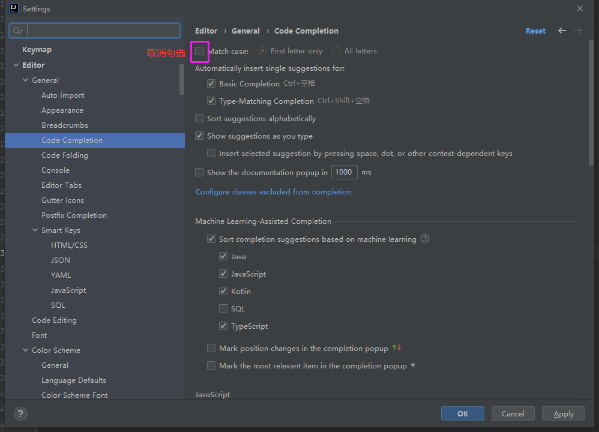
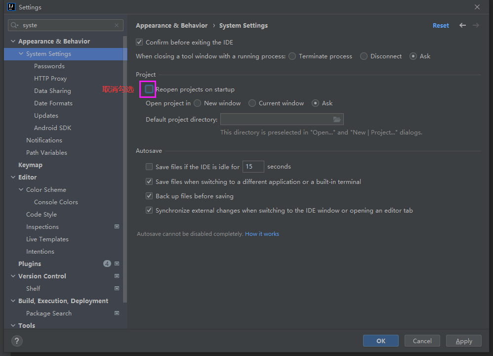

# IDEA

---

## 常用配置

### 代码提示

#### 不区分大小写

### 启动设置

#### 启动时不打开项目

## 快捷键

### 代码补全（Alt + /）

**修改代码补全的快捷键：**

- 进入 `File -> Settings ->  KeyMap` ，复制一份快捷键，并选中。

  

- 进入 `Main Menu –> Code –> Code Completion` 。

- 移除原来的 `Cycle Expand Word` 的 `Alt+/` 快捷键。

- 右击 `Basic` ，去除原来的 `Ctrl+空格` 快捷键，添加 `Alt+/` 快捷键。
