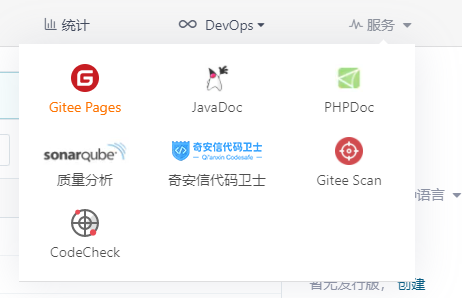

# hexo入门

---

## 部署

### 部署到 gitee 和 github

1. 本地执行先执行 `npm install` 以下载项目所需依赖。

2. 修改 `\node_modules\hexo-asset-image\index.js` 文件的内容为（因为支持 markdown 图片语法的插件 `hexo-asset-image` 原代码不生效，所以作此修改以支持原生的 markdown 图片语法)：

   ```js
   'use strict';
   var cheerio = require('cheerio');
   
   // http://stackoverflow.com/questions/14480345/how-to-get-the-nth-occurrence-in-a-string
   function getPosition(str, m, i) {
     return str.split(m, i).join(m).length;
   }
   
   hexo.extend.filter.register('after_post_render', function(data){
     var config = hexo.config;
     if(config.post_asset_folder){
       var link = data.permalink;
       var beginPos = getPosition(link, '/', 3) + 1;
       var appendLink = '';
       // In hexo 3.1.1, the permalink of "about" page is like ".../about/index.html".
       // if not with index.html endpos = link.lastIndexOf('.') + 1 support hexo-abbrlink
       if(/.*\/index\.html$/.test(link)) {
         // when permalink is end with index.html, for example 2019/02/20/xxtitle/index.html
         // image in xxtitle/ will go to xxtitle/index/
         appendLink = 'index/';
         var endPos = link.lastIndexOf('/');
       }
       else {
         var endPos = link.length-1;
       }
       link = link.substring(beginPos, endPos) + '/' + appendLink;
   
       var toprocess = ['excerpt', 'more', 'content'];
       for(var i = 0; i < toprocess.length; i++){
         var key = toprocess[i];
   
         var $ = cheerio.load(data[key], {
           ignoreWhitespace: false,
           xmlMode: false,
           lowerCaseTags: false,
           decodeEntities: false
         });
   
         $('img').each(function(){
           if ($(this).attr('src')){
             // For windows style path, we replace '\' to '/'.
             var src = $(this).attr('src').replace('\\', '/');
             if(!(/http[s]*.*|\/\/.*/.test(src)
               || /^\s+\//.test(src)
               || /^\s*\/uploads|images\//.test(src))) {
               // For "about" page, the first part of "src" can't be removed.
               // In addition, to support multi-level local directory.
               var linkArray = link.split('/').filter(function(elem){
                 return elem != '';
               });
               var srcArray = src.split('/').filter(function(elem){
                 return elem != '' && elem != '.';
               });
               if(srcArray.length > 1)
               srcArray.shift();
               src = srcArray.join('/');
   
               $(this).attr('src', config.root + link + src);
               console.info&&console.info("update link as:-->"+config.root + link + src);
             }
           }else{
             console.info&&console.info("no src attr, skipped...");
             console.info&&console.info($(this));
           }
         });
         data[key] = $.html();
       }
     }
   });
   ```

3. 在 `gitee` 上新建一个与用户名同名的仓库，在 `github` 上新建一个名为 `用户名.github.io` 的仓库。

4. 执行 `npm install hexo-deployer-git --save` 以安装 **一键部署** 插件 `hexo-deployer-git` 。

5. 项目根目录下配置文件 `_config.yml` 加上如下配置：

   ```yml
   deploy:
   - type: git
     repo: https://gitee.com/nigream/nigream
     branch: gitee-pages
     message: Site updated:({{ now('YYYY-MM-DD HH:mm:ss') }})
   - type: git
     repo: https://github.com/nigream/nigream.github.io
     branch: gh-pages
     message: Site updated:({{ now('YYYY-MM-DD HH:mm:ss') }})
   ```

6. 根目录下执行 `hexo deploy` 可以将生成的静态文件（即生成的 `public` 目录下的内容，在 `.deploy_git` 目录下有备份，并有本地 git 仓库）分别推送到两个库的对应分支（若从未存储过 github 和 gitee 的账号密码可能需要输入）。

7. github 会默认将 `gh-pages` 分支作为静态页面部署的分支，所以不要做其他操作，可以直接访问 `https://nigream.github.io` ；而 gitee 没有这种设定，需要在仓库的服务中进入 `Gitee Pages` ，将 **部署分支** 设为上面配置的 `gitee-pages` ，**部署目录** 不填，点击 **启动** （以后每次提交，都需要点击 **更新** 才能生效），访问地址为 `https://nigream.gitee.io`。

   

8. gitee 和 github 都分别创建一个新的仓库 `hexo-nigream` （用于存储正在编辑的 hexo 项目，以避免与部署 hexo 的仓库混淆）。

9. 本地项目根目录执行 `git init` 初始化项目。

10. 在项目根目录下添加 `.gitignore` 文件，内容如下：

    ```sh
    .DS_Store
    Thumbs.db
    db.json
    *.log
    node_modules/
    public/
    .deploy*/
    ```

11. 执行 `git add .` 和 `git commit -a` 以将项目提交到本地仓库。

12. 分别执行 `git remote add github https://github.com/nigream/hexo-nigream.git` 与 `git remote add gitee https://gitee.com/nigream/hexo-nigream.git`  。

13. 执行 `git push github` 与 `git push gitee` 即可将本地代码推送到两个仓库的 `master` 分支。

## 配置文件

### 项目配置 `_config.yml`

```yml
# Hexo Configuration
## Docs: https://hexo.io/docs/configuration.html
## Source: https://github.com/hexojs/hexo/

# Site
title: 痴人呓语
subtitle: ''
description: '做一个全世界独一无二的人！'
keywords: 后端 Java
author: 北林
language: zh-CN
timezone: ''

# URL
## Set your site url here. For example, if you use GitHub Page, set url as 'https://username.github.io/project'

#url: http://nigream.github.io/
url: http://nigream.gitee.io

permalink: :year/:month/:day/:title/
permalink_defaults:
pretty_urls:
  trailing_index: true # Set to false to remove trailing 'index.html' from permalinks
  trailing_html: true # Set to false to remove trailing '.html' from permalinks

# Directory
source_dir: source
public_dir: public
tag_dir: tags
archive_dir: archives
category_dir: categories
code_dir: downloads/code
i18n_dir: :lang
skip_render:

# Writing
new_post_name: :title.md # File name of new posts
default_layout: post
titlecase: false # Transform title into titlecase
external_link:
  enable: true # Open external links in new tab
  field: site # Apply to the whole site
  exclude: ''
filename_case: 0
render_drafts: false
post_asset_folder: true
marked:
  prependRoot: true
  postAsset: true
relative_link: false
future: true
highlight:
  enable: true
  line_number: true
  auto_detect: false
  tab_replace: ''
  wrap: true
  hljs: false
prismjs:
  enable: true
  preprocess: true
  line_number: true
  tab_replace: ''

# Home page setting
# path: Root path for your blogs index page. (default = '')
# per_page: Posts displayed per page. (0 = disable pagination)
# order_by: Posts order. (Order by date descending by default)
index_generator:
  path: ''
  per_page: 10
  order_by: -date

# Category & Tag
default_category: uncategorized
category_map:
tag_map:

# Metadata elements
## https://developer.mozilla.org/en-US/docs/Web/HTML/Element/meta
meta_generator: true

# Date / Time format
## Hexo uses Moment.js to parse and display date
## You can customize the date format as defined in
## http://momentjs.com/docs/#/displaying/format/
date_format: YYYY-MM-DD
time_format: HH:mm:ss
## updated_option supports 'mtime', 'date', 'empty'
updated_option: 'mtime'

# Pagination
## Set per_page to 0 to disable pagination
per_page: 10
pagination_dir: page

# Include / Exclude file(s)
## include:/exclude: options only apply to the 'source/' folder
include:
exclude:
ignore:

# Extensions
## Plugins: https://hexo.io/plugins/
## Themes: https://hexo.io/themes/
# theme: landscape
theme: next

# Deployment
## Docs: https://hexo.io/docs/one-command-deployment

#deploy:
  #type: git
  #repo: https://github.com/nigream/nigream.github.io
  #branch: gh-pages-localImages

deploy:
- type: git
  repo: https://gitee.com/nigream/nigream
  branch: gitee-pages
  message: Site updated:({{ now('YYYY-MM-DD HH:mm:ss') }})
- type: git
  repo: https://github.com/nigream/nigream.github.io
  branch: gh-pages
  message: Site updated:({{ now('YYYY-MM-DD HH:mm:ss') }})

  
feed:
  type: atom
  path: atom.xml
  limit: 20
  hub:
  content:
  content_limit: 140
  content_limit_delim: ' '
  order_by: -date
  icon: icon.png
  autodiscovery: true
  template:

symbols_count_time:
  # 文章字数
  symbols: false
  # 阅读时长
  time: false
  # 总文章字数
  total_symbols: false
  # 阅读总时长
  total_time: false
  # 是否排除代码统计
  exclude_codeblock: false
  # 平均字长 即将多少个字符统计为1个字数
  awl: 100
  # 每分钟的字数 阅读速度
  wpm: 275
  # 统计单位 这里是分钟
  suffix: "mins."
```