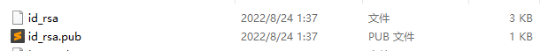

# Git

---

## 常用命令

```shell
# 初始化git
git init

# 展示要删除的文件预览
git rm -r -n --cached "bin/"
git rm -r -n --cached "*.iml"

# 将文件移出版本控制
git rm -r --cached  "bin/"
git rm -r --cached  "*.iml"

# 展示仓库中的所有文件
git ls-files


```

### 本地分支相关

```sh
# 从当前分支新建分支
git checkout -b xxx

# 删除分支（带警告）
git branch -d xxx
# 删除分支（不带警告，强行删除）
git branch -D xxx
```


### 远程分支相关

```sh
# 设置远程分支
git remote add origin https://github.com/nigream/learning-notes.git
# 修改远程分支地址
git remote set-url origin https://github.com/nigream/learning-notes.git

# 刷新分支
git remote update origin --prune

# 获取远程分支 xxx
git fetch origin xxx

# 拉取所有分支
git fetch

# 拉取远程的某个分支到本地
git checkout -b xxxx origin/xxxx
```

### 提交相关

```sh
# 修改本地上一次提交的信息（该commit必须还未push到远程仓库）
git commit --amend -m "New commit message."
```

### Config

```sh
# 获取用户名
git config user.name

# 设置用户名
git config user.name 'nigream'
```

## ssh配置

```sh
# 生成公钥秘钥
ssh-keygen -t rsa -C "xxxx@gmail.com"
```

- 生成 公钥（`id_rsa`）、私钥（`id_rsa.pub`）两个文件在 `%homepath%/.ssh` 目录下

  

- 将 **公钥** 配置到 gitee、github、gitlab等平台即可使用 ssh url 进行 clone。

## 常见问题


## .gitignore

### 优先级(precedence)

参考：https://git-scm.com/docs/gitignore


### pattern format

#### 空行

- **空行** 不匹配任何文件，它可用于增强可读性。

#### # 符号

- **#** 用于注释，转义用 `\#` 。

#### / slash

1. 如果 `pattern` 的 **开头** 或 **中间** 有 `/` ( eg: `doc/frotz/` )，则 表明这个  `pattern` 只能匹配 `.gitignore` 所在目录的相对目录；如果 `pattern` 的 **开头** 或 **中间** 没有 `/` ，即 只可能在末尾有 `/` ( eg: `frotz/` ) ，则可以匹配 **任意层级** 的目录。
2. 如果 `pattern` 的 末尾 有 `/` (不管 **开头** 或 **中间** 有没有 `/` )，则表明 **只能匹配目录** ；如果 `pattern` 的 末尾 没有 `/` (不管 **开头** 或 **中间** 有没有 `/` )，则表明 **既能匹配目录，又能匹配文件** 。

