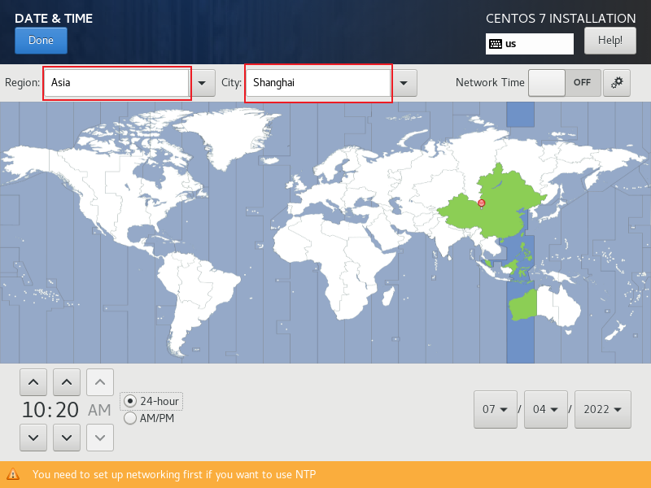
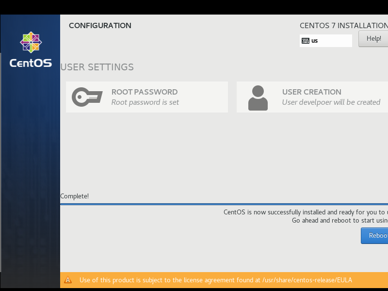
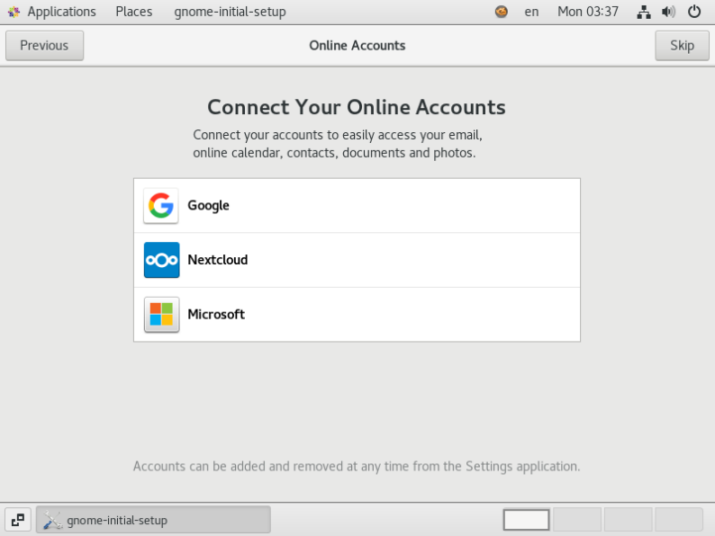

# 安装CentOS

---

## 宿主机为Windows

- 分为以下几个步骤

### 1、开启虚拟化

- 打开 **任务管理器** -> 打开 **性能** 标签页，若查看 **虚拟化** 是否 **已启用** 。
- 如果不是 **已启用** 状态，需要在 **BIOS** 中开启。

### 2、更新VMware

- 最好点击 **帮助** -> **软件更新** ，更新下 **VMware** ，以确保系统与 **VMware** 兼容，避免开启虚拟机时 **蓝屏** 。

### 3、新建虚拟机

1. 点击 **文件** -> **新建虚拟机** -> **自定义** -> **下一步** -> **（默认选项不动）下一步** -> **稍后安装操作系统** -> **下一步**

2. 选择 **Linux** -> 选择 **CentOS 7 64位** -> **下一步**

3. 编辑 **虚拟机名称** -> 选择存放 **位置** -> **下一步**

   - 这里我 **虚拟机名称** 设置为: `CentOS7_start01`
   - 这里我存放 **位置** 设置为: `E:\vm\vms\centos7`

4. 选择 **处理器数量** 和 **每个处理器的内核数量** -> **下一步**

   - 注意：二者的乘积不要超过宿主机的 **逻辑处理器** 数量。

     

   - 这里我选择 **处理器数量** 为 2， **每个处理器的内核数量** 为 4。

5. 配置 **此虚拟机的内存** -> **下一步**

   - 我电脑32G内存，这里配置为4G

6. 选择 **网络类型** -> **下一步**

   

   - **桥接** ：即在网络层面，将 **客户机** 与 **宿主机** 当成同样级别的主机看待，客户机与宿主机同属一个局域网。
   - **NAT** ：即在 **宿主机** 内部虚拟出一个局域网， **客户机** 访问网络需要通过 **宿主机** 的 **IP** 。
   - 这里我们一般选择 **NAT** 。

7. 选择 **I/O控制器类型** ：默认 **LSI Logic** -> **下一步**

8. 选择 **磁盘类型** ：默认选择 **SCSI** -> **下一步**

9. 选择 **磁盘** -> **下一步**

   - 建议：选择 **创建新虚拟磁盘**

10. 指定 **磁盘容量** -> 选择 **将磁盘拆分成多个文件** -> **下一步**

    - 这里 **磁盘容量** 我设置为 50.0G

11. 指定 **磁盘文件** -> **下一步**

    - 这里我设置路径为: `E:\vm\vmdk\centos7\CentOS7_start01.vmdk` 。

12. 最终出现如下内容，点击 **完成** 。

    

13. 

### 4、安装操作系统

1. 点击刚才创建的虚拟机 -> **编辑虚拟机设置** 

   

2. 点击 **CD/DVD (IDE)** -> 选择 **ISO映像文件位置** -> 点击 **确定**

   

3. 点击 **开启此虚拟机** 

   - 若开启虚拟机时，发现电脑 **蓝屏** ，请检查1、2步是否有执行。

4. 使用键盘 **上下方向键** 选择 **Install CentOS 7**

   

### 5、初始设置

#### 设置语言

选择 **语言** -> **Continue**

- 建议选择 **English (United States)** ，以避免使用 **中文** 时出现问题。

#### 设置其他

- 如下图所示，需要设置如下内容

##### 设置 DATE & TIME

- Region 选择 Aisa，City 选择 Shanghai，其他不要动，点击 Done 。

##### 设置 KEYBOARD

- 点击 + 号，选择 Chinese 和 Chinese (Hanyu Pinyin (altgr))，点击 Done 。

##### 设置 LANGUAGE SUPPORT 

- 勾选 **简体中文 (中国)** ，点击 Done 。

##### 设置 INSTALLATION SOURCE

- 保持默认值为 **Local media** 即可，不用点开它。

##### 设置 SOFTWARE SELECTION

- 默认值为 **Minimal Install** ，此处我们选择 **GNOME Desktop** ，以安装待桌面的系统，点击 Done 。
- KDE 桌面更为华丽，但也更耗资源，所以不选它。

- 点击 Done 之后，界面先是有感叹号，需要稍等片刻。

  

##### 设置 INSTALLLATION DESTINATION

- 选择 I will configure partitioning ，点击 Done

- 点击Done 之后，出现如下界面

  

- 选择 **Standard Partion** ，创建 `/boot` 挂载点，设置大小为 1G，点击 **Add mount point** ；此目录用于安装系统。

  

- 点击 + 号，创建 `swap` 挂载点，设置大小为 4G（为内存的1倍或2倍），点击 **Add mount point** ；类似于 Windows 中的虚拟内存。

  

- 点击 + 号，创建 `/` 挂载点，即根分区，设置大小为 45G，点击 **Add mount point** 

  

- 点击 Done ，点击 **Accept Changes** 。

  

##### 设置 KDUMP

- 用于记录系统崩溃日志，需要占用移动的内存
- 在实际服务器上最好还是开启，但我们这里为了性能先把它关闭，即取消勾选 **Enable kdump** 。

##### 设置 NETWORK & HOST NAME

- 设置 Host name ，这里设置为 **CentOS7-start01** ；点击 Apply ，验证主机名称；注意 **_** 下划线为特殊字符，Apply 不会通过。

- 开启右上角的网络，点击 Done ；若点击 Done 不能跳转，很可能是 Host name 没验证通过，修改名称 Apply 之后，再点击 Done 。

  

##### 设置 SECURITY POLICY

- 这里不做设置。

#### 设置完成

- 点击 Begin Installation ，开始安装。

### 6、设置用户

- 设置 root 用户密码。
- 新建一个 developer 用户，并设置密码。

### 7、重启系统

- 进行完上诉操作后，需要等待系统安装完成。

- 点击 Reboot，重启系统 。

  

- 启动界面中，选择第一项，回车即可

  

### 8、同意许可

- 进入系统后，出现如下界面。

  

- 点击 LICENSE INFORMATION ，勾选 I accept the license agreement ；点击 Done 。

  

- 然后回到上一个界面，NETWORK & HOST NAME 已经设置过，点击 FINISH CONFIGURATION 。

  

### 9、登录账号

- 可以直接点击 developer，输入密码登录。
- 也可以点击 Not listed? 登录其他账号。

### 10、欢迎界面

- 设置语言为 English ，点击 Next 。

- Typing 选择 English (US) ，点击 Next

  

- 关闭 Location Services ，点击 Next 。

  

- Skip Online Accounts

  

- 点击 Start Using CentOS Linux

  

- 直接关闭 Getting Started 即可。

  

- 这样，我们就来到了桌面。

  

### 11、验证是否能访问互联网

- 点击左上角的 Application ，然后打开 Firefox 。

  

- 访问 www.baidu.com ，发现可以正常访问。

  

---

**参考：**

1. 尚硅谷官方课程
