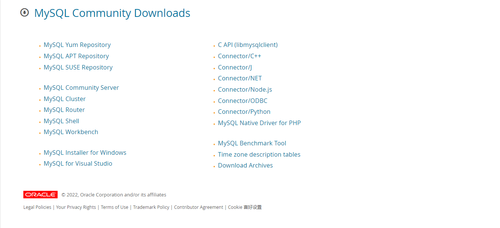
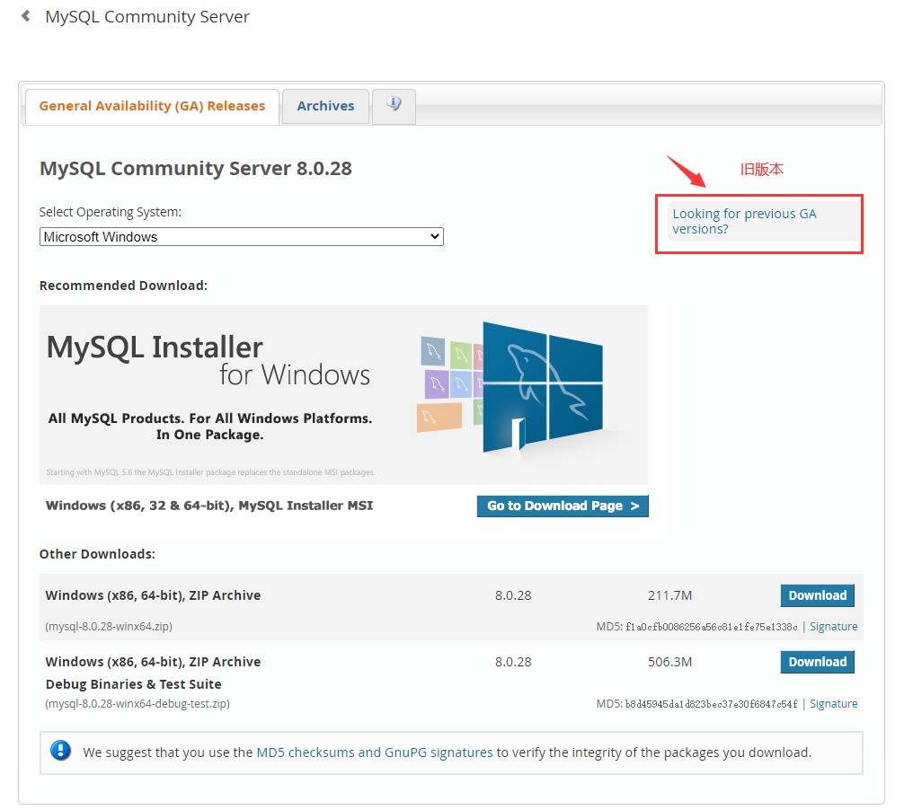
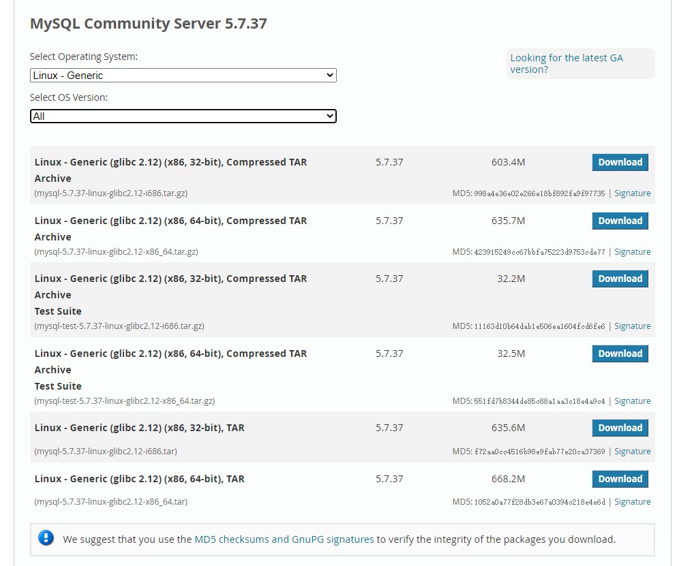

# MySQL基础

---

## 在 Linux 中安装 MySQL

**参考：**

```crystal
https://www.cnblogs.com/doumenwangjian/p/15465723.html
```


### 使用 wget 命令下载

```sh
# 文件下载到了命令执行时的目录
wget https://dev.mysql.com/get/Downloads/MySQL-5.7/mysql-5.7.37-linux-glibc2.12-x86_64.tar.gz
```


### 访问官网下载

#### 下载地址

> 官方下载地址：https://dev.mysql.com/downloads/



#### MySQL Installer 与 MySQL Community Server

前者是用于在 Windows 平台下载 MySQL 相关软件的下载管理器；后者才是我们仅仅需要的 MySQL 社区版服务器。

#### 如何下载旧版本

下拉菜单选择自己想要下载的版本，图中标识部分是旧版本的下载链接。



#### 选择系统对应的版本

在 Linux 系统中执行 `uname -r` 可以得到类似 `5.10.60-9.al8.x86_64` 的系统信息，所以这里我们选择 `Linux - Generic (glibc 2.12) (x86, 64-bit), Compressed TAR Archive` 。



### 解压

- 将文件上传至 `/usr/local/` 目录下；
- 执行 `tar xzvf mysql-5.7.37-linux-glibc2.12-x86_64.tar.gz` 命令，解压；
- 执行 `mv mysql-5.7.37-linux-glibc2.12-x86_64 /usr/local/mysql-5.7.37` 命令，对文件重命名为 `mysql-5.7.37` 。

