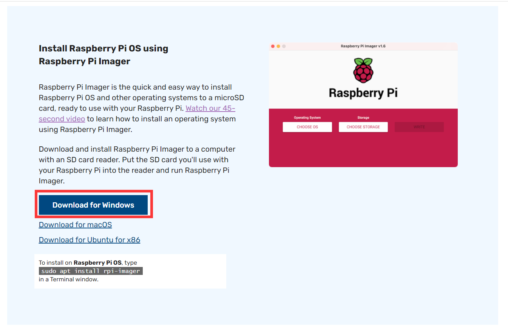
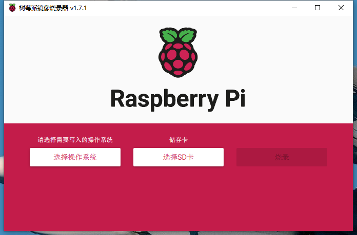
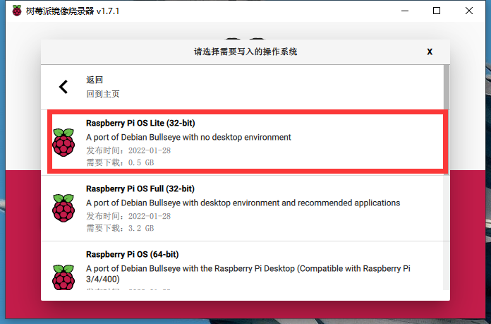
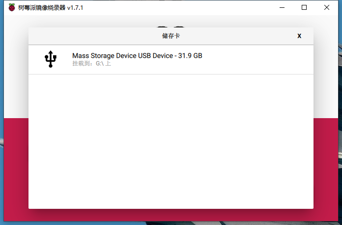
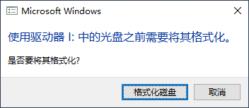
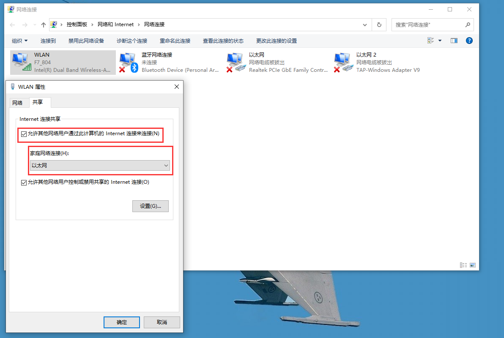
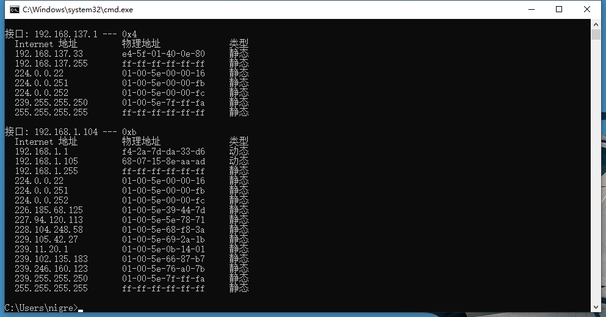
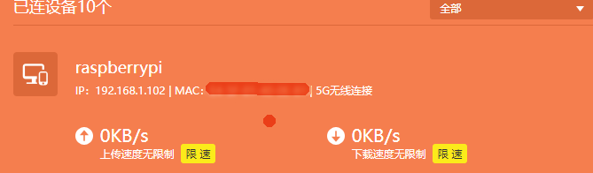
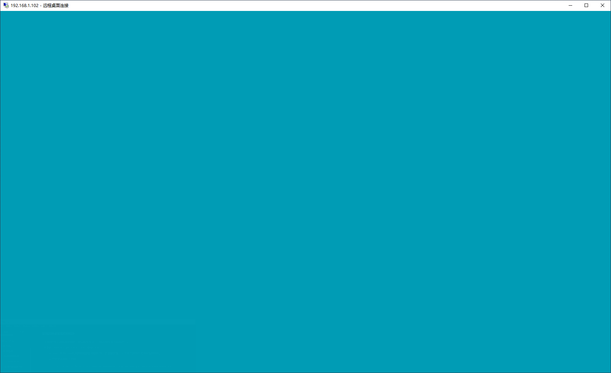

# 树莓派基础

---

## 第一次开机

### 烧录系统

**使用官方烧录工具**

1. 将SD卡插入读卡器，将读卡器插到自己的电脑上。

2. 电脑访问 https://www.raspberrypi.com/software/ ，点击下载烧录工具。
   

3. 双击在电脑上安装烧录工具。

4. 打开烧录工具。

   

5. 选择操作系统，选择存储卡。

   

   

6. 点击 `烧录` 按钮。

### 使用ssh工具连接树莓派

#### 使用网线连接

1. 将树莓派关机。

2. 取出 **SD卡** ，使用读卡器连接到电脑上；点击取消。

   

3. 开启树莓派的ssh端口：在已烧录系统的SD卡的根目录中，新建一个名为 `ssh` 的文件(无后缀)。

4. 将SD卡插到树莓派上，给树莓派插上电源，打开电源开关。

5. 用网线一端连接树莓派，一端连接我们已有的电脑。

6. 勾选如图所示选项，并选择一个 `家庭网络连接` 。

   

7. 命令行输入 `arp -a` 查看  ARP 缓存，根据上一步选择的接口的ip易知， `192.168.137.33` 即是树莓派的ip。

   

8. 使用ssh工具连接树莓派，默认账号为 `pi` ，默认密码为 `raspberry` 。


#### 使用无线网连接

1. 将树莓派关机。

2. 取出 **SD卡** ，使用读卡器连接到电脑上；点击取消。

   

3. 开启树莓派的ssh端口：在已烧录系统的SD卡的根目录中，新建一个名为 `ssh` 的文件(无后缀)。

4. 连接无线网：在已烧录系统的SD卡的根目录中，新建一个名为 `wpa_supplicant.conf` 的文件(无后缀)。

   ```properties
   country=CN
   ctrl_interface=DIR=/var/run/wpa_supplicant GROUP=netdev
   update_config=1
   network={
   	ssid="无线网名称"
   	psk="无线网密码"
   	priority=10
   }
   ```

5. 将SD卡插到树莓派上，给树莓派插上电源，打开电源开关。

6. 在路由器上查看树莓派 ip 

   

7. 使用ssh工具连接树莓派，默认账号为 `pi` ，默认密码为 `raspberry` 。

### 使用远程桌面连接树莓派

1. 使用ssh工具连接树莓派，默认账号为 `pi` ，默认密码为 `raspberry` 。

2. 执行 `sudo apt-get install xrdp` 安装 `xrdp` 

   - `xrdp` 是 Microsoft **远程桌面协议 (RDP)** 的一个 **开源实现** ，它允许以图形方式控制远程系统。

   - 若安装出现如下问题：

     ```sh
     E: Failed to fetch http://raspbian.raspberrypi.org/raspbian/pool/main/x/xterm/xterm_366-1_armhf.deb  404  Not Found [IP: 93.93.128.193 80]
     E: Unable to fetch some archives, maybe run apt-get update or try with --fix-missing?
     ```

   - 则先执行 `sudo apt-get update` 更新，再执行上述安装命令即可。

3. 执行 `mstsc -admin` ，打开 Windows 自带的远程桌面连接软件。

4. 输入ip后进入如下界面，默认账号为 `pi` ，默认密码为 `raspberry` 。

### 蓝屏问题

- 可能在使用远程桌面连接树莓派时，会出现蓝屏问题：

  

**解决方法如下：**

参考：https://blog.csdn.net/Yolanda_Salvatore/article/details/106439903

1. 蓝屏问题：

https://superuser.com/questions/1701464/xrdp-only-showing-blue-green-background-screen-after-login

## 参考

1. 树小悉：https://www.bilibili.com/video/BV16U4y1879Q?vd_source=f1fbb083ddef12dcff3388779faac201

```sh
deb http://mirrors.ustc.edu.cn/raspbian/raspbian/ buster main contrib non-free rpi
deb-src http://mirrors.ustc.edu.cn/raspbian/raspbian/ buster main contrib non-free rpi
```

