# 装机

---

```crystal
参考：

新手装机相关 ----- 天才赵德柱： https://space.bilibili.com/151155077/video
PCIE相关 ----- 硬件茶谈： https://space.bilibili.com/14871346/search/video?keyword=pcie
USB相关 ----- 天才赵德柱： https://www.bilibili.com/video/BV12q4y1a7Q2?spm_id_from=333.337.search-card.all.click
有关接口、总线与协议 ----- 硬件茶谈： https://www.bilibili.com/video/BV1Qv411t7ZL?spm_id_from=333.999.0.0
硬盘相关 ----- 硬件茶谈： https://space.bilibili.com/14871346/search/video?keyword=%E7%A1%AC%E7%9B%98

本笔记记录时间 2022.05
```

## 购买建议

### 在哪购买

1. **显卡** 和 **电源** 在 **京东** 购买，更放心。
2. **京东** 开通plus会员很划算。
3. 其他配件比较 **京东** 和 **淘宝** 价格后购买，二手平台慎考虑。

## 主机

### 显卡

#### 御两家

- NVIDIA
- AMD

**Intel目前只生产集成在CPU中的显卡**

#### 公版显卡与非公显卡

- 如御两家类似的厂家，生产的各型号 **显卡核心** 称为 **公版显卡** 。

  - 如 NVIDIA 的 **RTX 3060Ti** 、 **RTX 3070** 、 **RTX 3070Ti** 等（其中 RTX 意为 Ray Tracing Texel eXtreme）
  - 如 AMD 的 **RX 6600 XT** 、 **RX 6700 XT** 、 **RX 6800** 等

- 基于 **公版显卡** 生产的各种款式的显卡称为 **非公显卡** 。

  - NVIDIA 称生产 **非公显卡** 的合作伙伴为 AIC（Add-In-Cards），如  **华硕** **微星** **七彩虹** 等
  - AMD 称生产 **非公显卡** 的合作伙伴为 AIB （Add-In-Board），如  **华硕** **微星** **七彩虹** 等

- 基于同一  **公版显卡** 生产 **非公显卡** 可能有不同的价格档次，但是由于显卡核心相同，所以即便是旗舰款和丐版，性能差别也不是很大；所以如果没有对这方面追求不是太高或预算有限，可以直接选择丐版，丐版性价比很高。

  

#### 显卡天梯图

- 快科技显卡天梯图网址：https://www.mydrivers.com/zhuanti/tianti/gpu/
- 秋刀鱼半藏显卡天梯图网址：https://tieba.baidu.com/p/6133450546?see_lz=1#135699450528l

#### 主流显卡


#### 如何选择

##### 游戏玩家

###### 按需选择

- 根据想玩的 **游戏** 和 **显示器** 选择，前提是 CPU 与 内存 都不短板。（绝地求生三极致是指： **纹理** 、 **抗锯齿** 和 **可视距离** 调到极致）

  

###### 按预算选择


###### A卡还是N卡

- 如果追求极致光追体验，选N卡（因为N卡在硬件层面实现的光追技术，比A卡软件层面实现的光追更强）
- 如果不追求光追，选性价比高的即可。

##### 专业需求人群

- 生产力需求建议买 N卡。


### CPU

#### 御两家

- Intel
- AMD

#### 核心数与线程数

- 8核16线程 **约等于** 10核（超线程提升约20~25%）

#### CPU频率

- 基础频率：
- 加速频率：
- 并非所有线程都能达到 **加速频率** ，同一时间最多 1~2个线程。
- 主频：正常频率，如浏览网页
- 睿频：高负荷频率，如打大型游戏、3D渲染等
- 超频：加电压让所有线程都达到加速频率（提升并不大，新手建议不要考虑这个）

#### IPC

- IPC：可以理解为效率，与CPU架构（指令设计）相关。

#### CPU型号

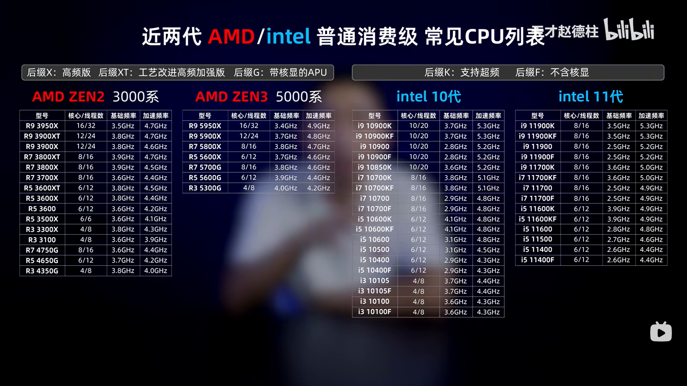

- AMD ZEN2 不推荐，预算有限的可以考虑 2700X以上的。
- AMD ZEN3 游戏性能不错，推荐！
- intel 10代，游戏性能不差，专业需求也能胜任，推荐！
- intel 11代，甚至不如10代，不推荐！
- intel 型号解释：http://www.360doc.com/content/22/0501/15/75017606_1029271320.shtml

#### 盒装与散片

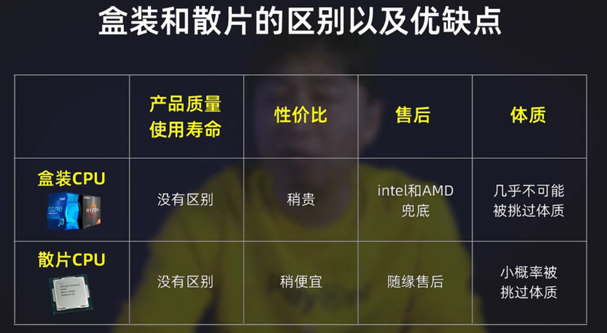

#### 购买建议

##### 游戏玩家

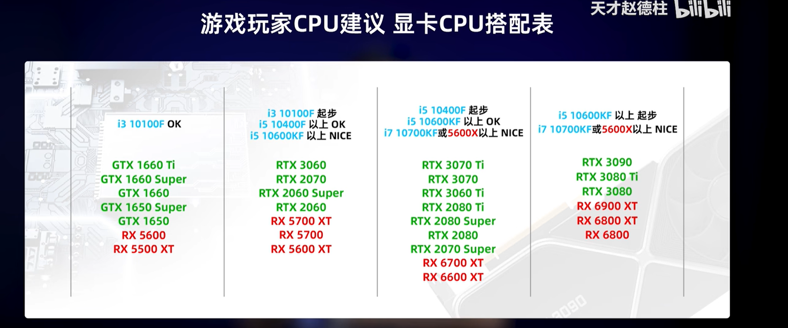

##### 专业需求人群

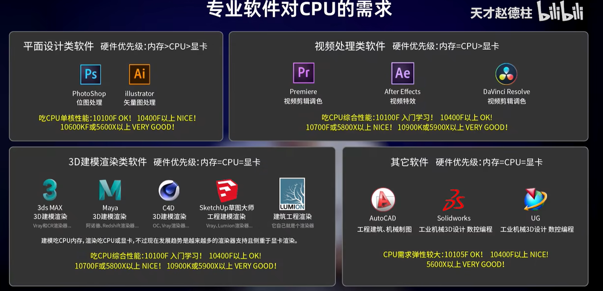

### 主板

#### 御两家

- 华硕
- 微星

#### 版型

- ATX （大板）
- MATX
  - 标准MATX（中板）
  - 阉割MATX（小板，阉割了两个内存插槽和一个PCIE插槽）
- ITX（迷你板，特殊版型）

- **一般 高端芯片组做大板，中端芯片组做中板，低端芯片组做小板 ，但也有例外。**
- **AMD和intel每发布一代新的CPU，都会随之发布新的芯片组**
- **芯片组决定了主办的级别和档次。**

####   常见芯片组

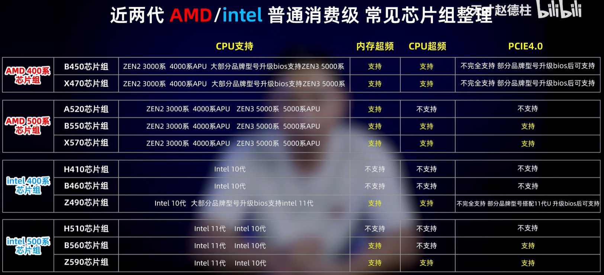

#### 搭配建议

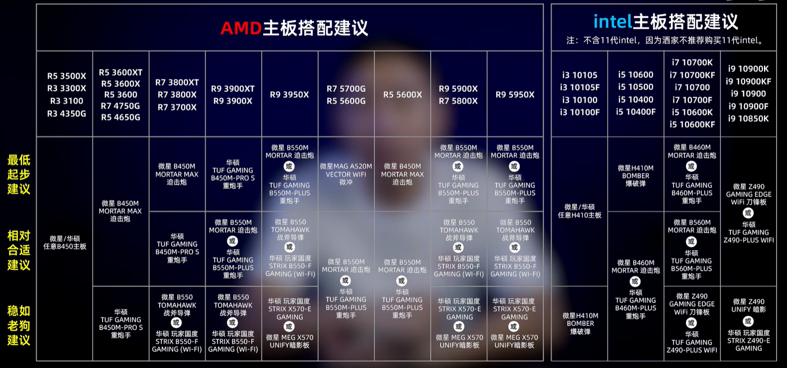

#### 主板总线

- 除了黄色部分是与 **CPU** **直连** ，其他线路都是通过 **南桥芯片组** 与间接与 **CPU** 连接。
- **CPU** 与 **南桥芯片组** 通过 **DMI总线** 连接，目前流行的 **DMI总线** 也是使用 **PCIE** 通道。

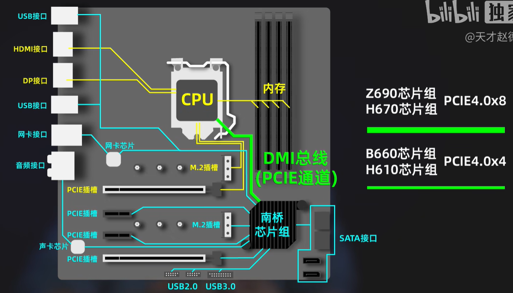

- PCIE长度是物理长度。
- 而实际使用的通道数，是由 **实际使用的触电数** 决定（所以，即便有X16的物理长度、且有X4的触点，但可能只用了X1的通道数）。

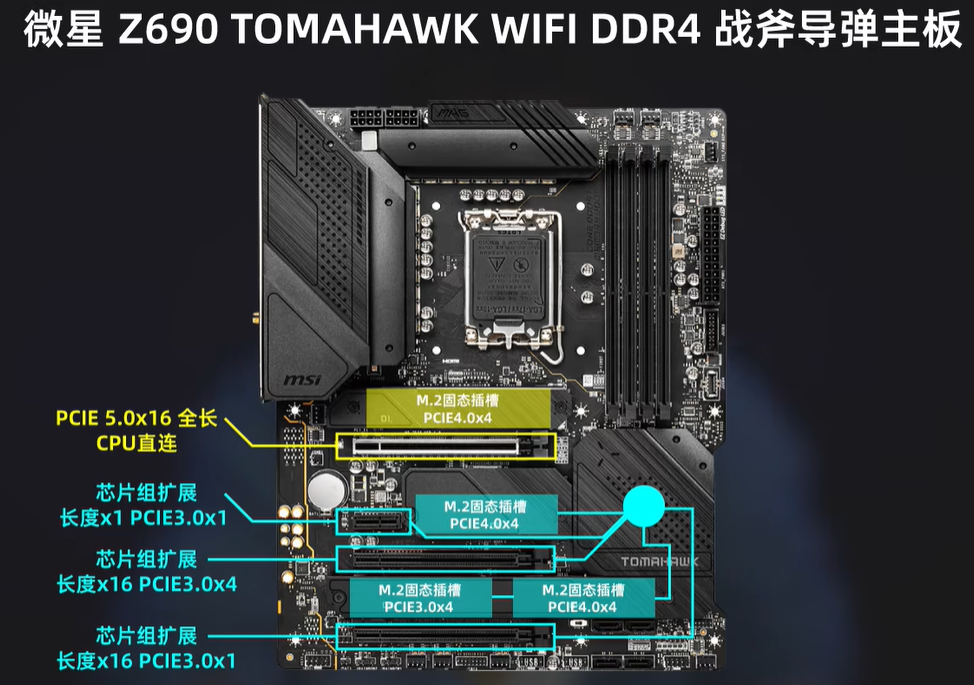

#### USB

##### 混乱的命名

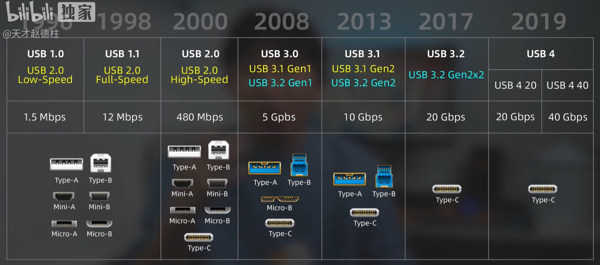

##### 统一图标

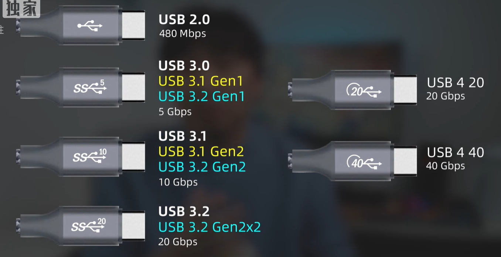

#### intel600系芯片组

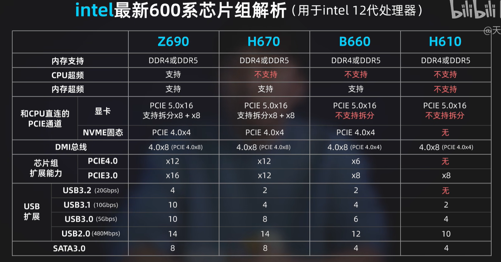

#### 接口、总线与协议

- 传输速率取决于 **总线**

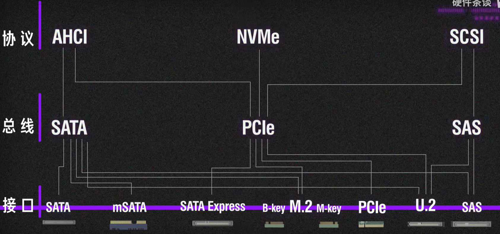

### 内存

#### 内存颗粒御三家

- 三星
- 镁光
- 海力士

#### 颗粒

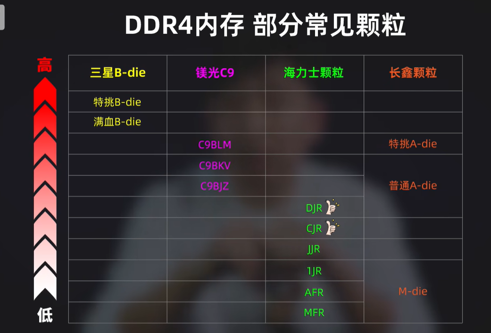

#### 新手购买建议

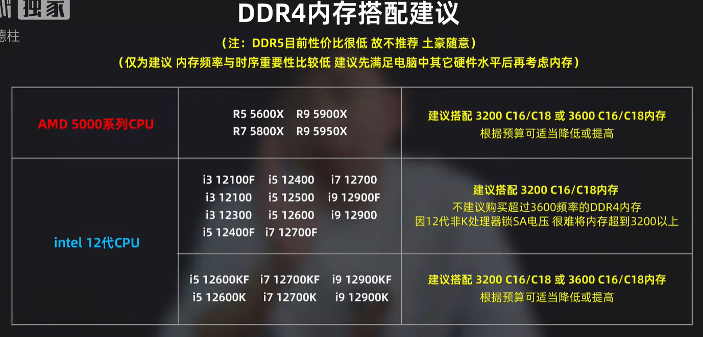

### 硬盘

#### 固态硬盘分类

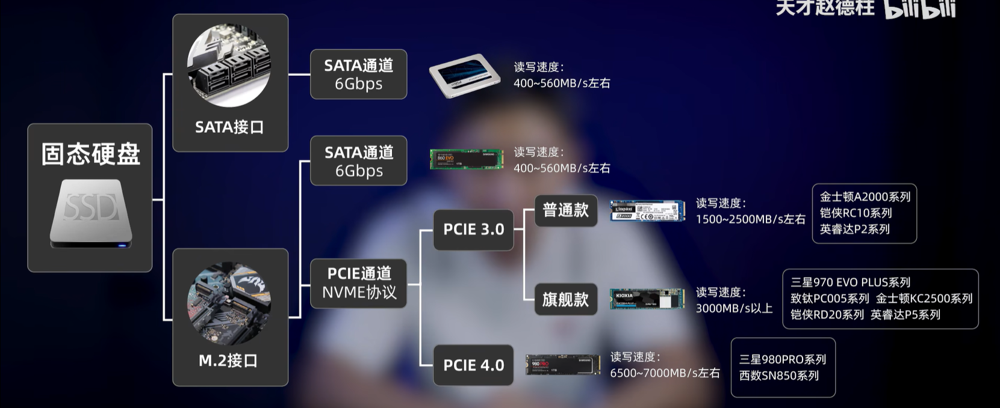

- TLC颗粒

#### 机械硬盘

- 只买CMR

### 电源

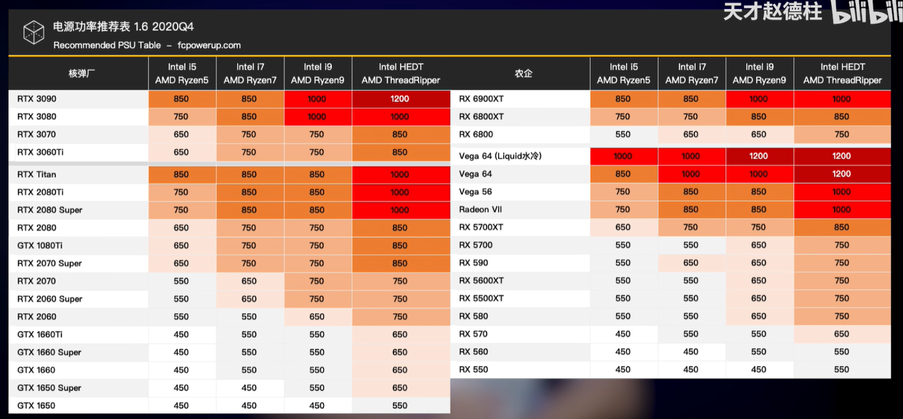

### 散热器


### 机箱

### 


## 外设

### 显示器

#### 尺寸


### 键盘

### 鼠标


