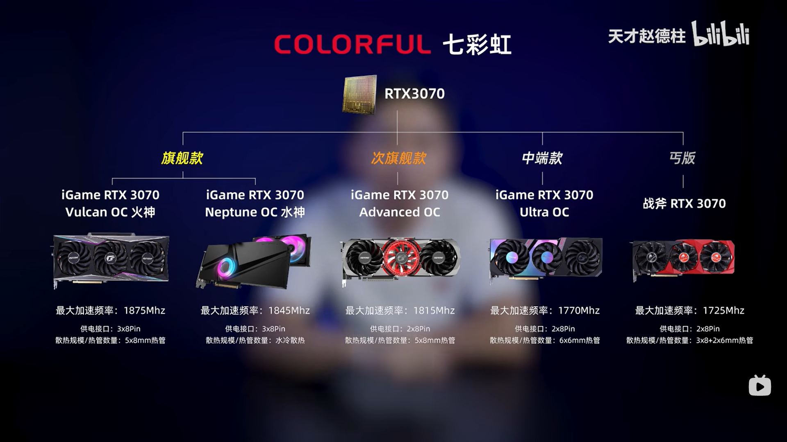
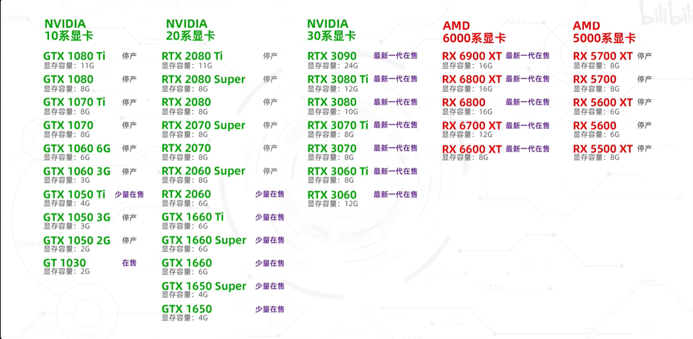
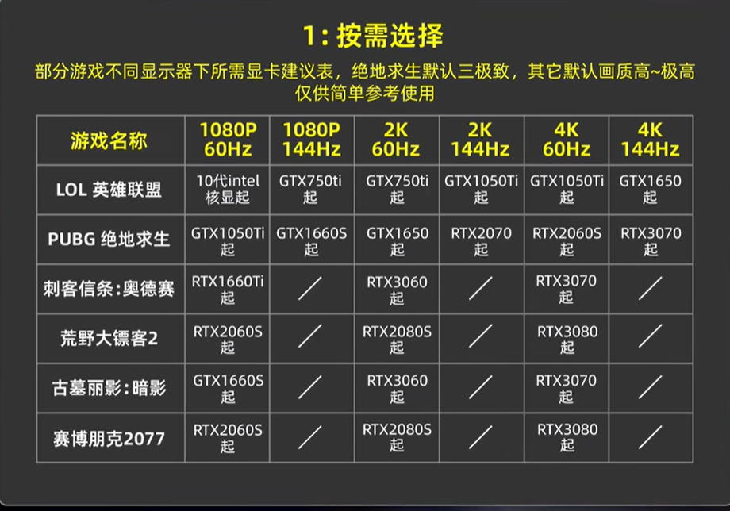
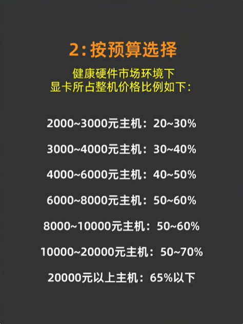
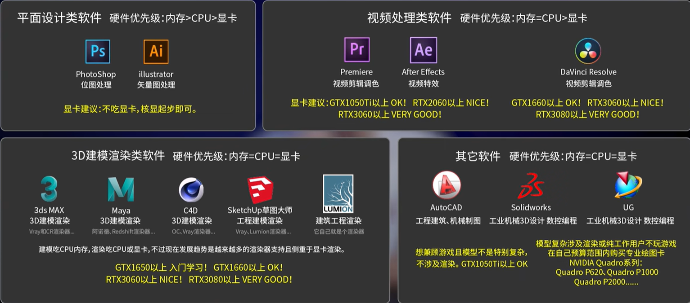

# 装机

---

```wiki
参考：

天才赵德柱：https://www.bilibili.com/video/BV1k64y1h7QP?spm_id_from=333.999.0.0 
视频发布时间 2021.09

本笔记写稿时间 2022.05
```

## 购买建议

### 在哪购买

1. **显卡** 和 **电源** 在 **京东** 购买，更放心。
2. **京东** 开通plus会员很划算。
3. 其他配件比较 **京东** 和 **淘宝** 价格后购买，二手平台慎考虑。

## 主机

### 机箱

### 主板

### CPU

### 显卡

#### 御两家

- NVIDIA
- AMD

**Intel目前只生产集成在CPU中的显卡**

#### 公版显卡与非公显卡

- 如御两家类似的厂家，生产的各型号 **显卡核心** 称为 **公版显卡** 。

  - 如 NVIDIA 的 **RTX 3060Ti** 、 **RTX 3070** 、 **RTX 3070Ti** 等（其中 RTX 意为 Ray Tracing Texel eXtreme）
  - 如 AMD 的 **RX 6600 XT** 、 **RX 6700 XT** 、 **RX 6800** 等

- 基于 **公版显卡** 生产的各种款式的显卡称为 **非公显卡** 。

  - NVIDIA 称生产 **非公显卡** 的合作伙伴为 AIC（Add-In-Cards），如  **华硕** **微星** **七彩虹** 等
  - AMD 称生产 **非公显卡** 的合作伙伴为 AIB （Add-In-Board），如  **华硕** **微星** **七彩虹** 等

- 基于同一  **公版显卡** 生产 **非公显卡** 可能有不同的价格档次，但是由于显卡核心相同，所以即便是旗舰款和丐版，性能差别也不是很大；所以如果没有对这方面追求不是太高或预算有限，可以直接选择丐版，丐版性价比很高。

  

#### 显卡天梯图

- 快科技显卡天梯图网址：https://www.mydrivers.com/zhuanti/tianti/gpu/
- 秋刀鱼半藏显卡天梯图网址：https://tieba.baidu.com/p/6133450546?see_lz=1#135699450528l

#### 主流显卡



#### 如何选择

##### 游戏玩家

###### 按需选择

- 根据想玩的 **游戏** 和 **显示器** 选择，前提是 CPU 与 内存 都不短板。（绝地求生三极致是指： **纹理** 、 **抗锯齿** 和 **可视距离** 调到极致）

  

###### 按预算选择



###### A卡还是N卡

- 如果追求极致光追体验，选N卡（因为N卡在硬件层面实现的光追技术，比A卡软件层面实现的光追更强）
- 如果不追求光追，选性价比高的即可。

##### 专业需求人群

- 生产力需求建议买 N卡。



### 内存

### 散热器


## 外设

### 显示器

#### 尺寸


### 键盘

### 鼠标


