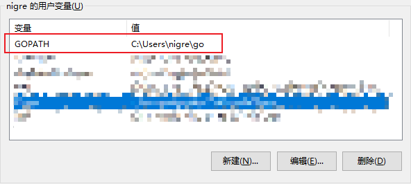
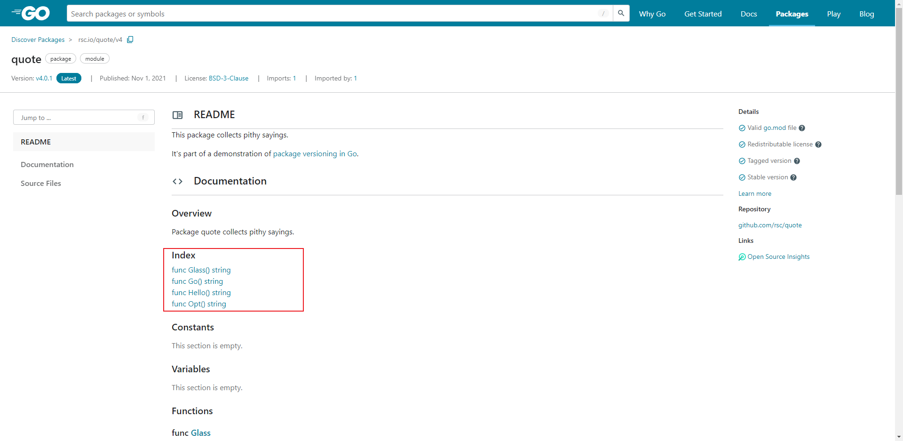

# Go入门

---

## Go资料

### 学习教程

1. 官方文档：https://go.dev/doc/
1. Go语言中文网：https://studygolang.com/

### 已发布的模块

http://pkg.go.dev/

## 安装Go

**参考：** Go官方文档：https://go.dev/doc/install

### Windows

#### 使用安装程序安装

1. 到此页：https://go.dev/dl/ 下载安装程序

2. 双击下载的 `gox.xx.windows-amd64.msi` ，选择安装路径，无脑下一步。

3. 安装完成后，命令行输入 `go version` 即可查看安装的版本（安装程序已经帮我们自动配置好了 **环境变量** ）。

   ```go
   C:\Users\nigre>go version
   go version go1.18 windows/amd64
   ```

#### 编译源代码安装

参考：https://go.dev/doc/install/source

## Go环境配置

### 镜像配置

不安装镜像，就无法下载 **外部的依赖包** 。

1. 执行如下命令：

   ```go
   go env -w GO111MODULE=on
   // 首选 https://goproxy.cn ，其他镜像可能出现问题
   go env -w GOPROXY=https://goproxy.cn
   ```

2. 执行 `go env` 可以查看所有的环境配置，用户的环境配置保存在 `C:\Users\{用户名}\AppData\Roaming\go\env`  。

**可用镜像：**

1. 官方：https://goproxy.io
2. <font color="red">首选</font> 七牛云CDN：https://goproxy.cn (项目地址：https://github.com/goproxy/goproxy.cn)    
3. 阿里云：https://mirrors.aliyun.com/goproxy/

### 本地依赖库配置

1. 安装程序帮我们设置了一个用户级的环境变量 `GOPATH` ，我们可以修改它为自定地址： `E:\devtools\repos\go\public` 。

   

2. 以防万一，我们可以再设置一个系统级的环境变量 `GOPATH` （实际是用户的环境变量优先级更高）。

3. 执行 `go env` 可以查看配置是否成功。


## Hello World

**参考：** Go官方文档：https://go.dev/doc/tutorial/getting-started

1. 新建一个 `hello` 文件夹。

2. 在 `hello/` 下执行 `go mod init example/hello` ，以声明自身的 `模块路径` 。

   ```go
   E:\codes\go\learn\hello>go mod init example/hello
   go: creating new go.mod: module example/hello
   ```

   - 执行后会在目录下生成一个 `go.mod` 文件，内容如下：

     ```go
     module example/hello
     
     go 1.18
     ```

3. 新建 `hello.go` 文件，输入如下内容：

   ```go
   package main
   
   import "fmt"
   
   func main() {
       fmt.Println("Hello, World!")
   }
   ```

   以上代码主要干了这几件事：

   - 声明了该文件 ( `hello.go` ) 所属的包为 `main` 。
   - 导入了 `fmt` 包（包含了 **格式化文本** 的函数，当然包括了 **打印文本到控制台** ）。
   - 实现了一个打印文本到控制台的 `main` 函数（当运行一个包时，会默认执行它的 `main` 函数）。

4. 执行 `go run .` 或者 `go run hello.go` 即可运行上述代码。

   ```go
   E:\codes\go\learn\hello>go run .
   Hello, World!
   ```

   - `go run .` 表示执行当前目录下的 `main` 函数，若有其他文件也定义了 `main` 函数，则会报错。

## 调用外部函数

**参考：** Go官方文档：https://go.dev/doc/tutorial/getting-started

1. 访问 http://pkg.go.dev/ ，搜索 `rsc.io/quote` ，进入 https://pkg.go.dev/rsc.io/quote/v4 ，可以看到页面中显示了我们可以调用的函数。

   

2. 新建 `quote.go` 文件，输入如下内容：

   ```go
   package main
   
   import "fmt"
   
   import "rsc.io/quote"
   
   func main() {
       fmt.Println(quote.Go())
   }
   ```

   - 导入 `rsc.io/quote` 包，并调用 `Go()` 方法。

3. 执行 `go mod tidy` 以下载依赖包（在国内需要先设置镜像）。

   ```go
   E:\codes\go\learn\hello>go mod tidy
   go: finding module for package rsc.io/quote
   go: downloading rsc.io/quote v1.5.2
   go: found rsc.io/quote in rsc.io/quote v1.5.2
   ```

   - 执行后，在当前目录下生成了一个 `go.sum` 文件。

4. 执行 `go run quote.go` 以执行上述代码。

   ```go
   E:\codes\go\learn\hello>go run quote.go
   Don't communicate by sharing memory, share memory by communicating.
   ```

## 创建一个Go模块

