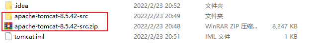
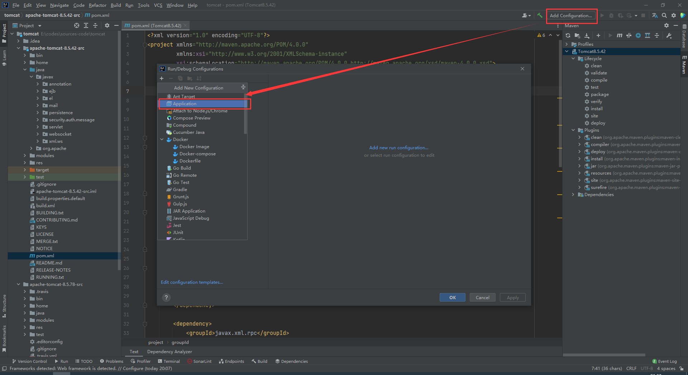
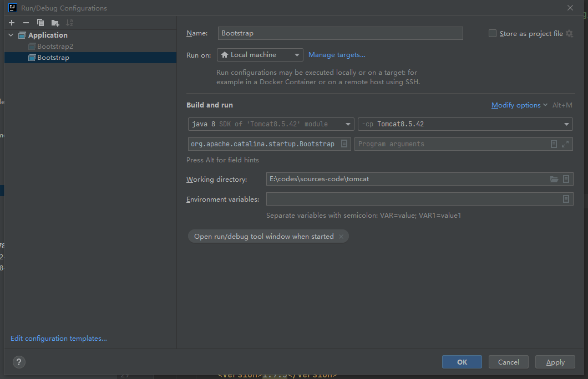
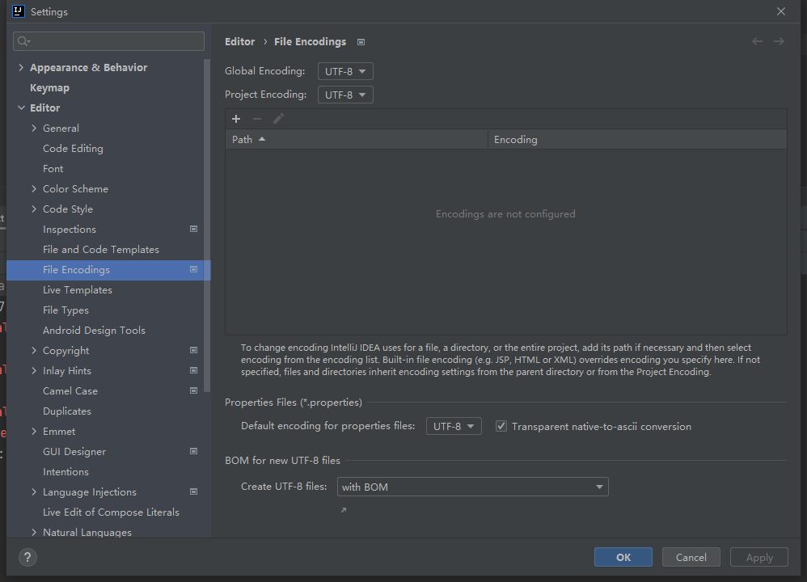
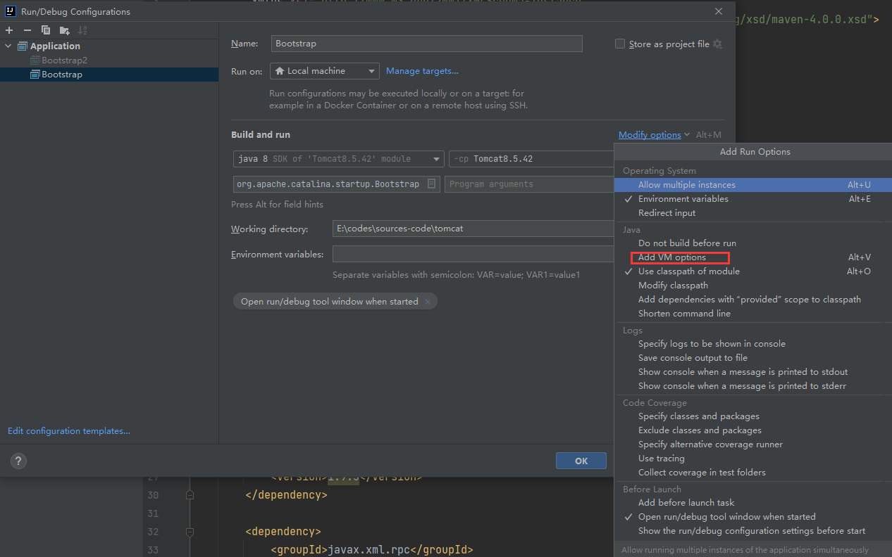
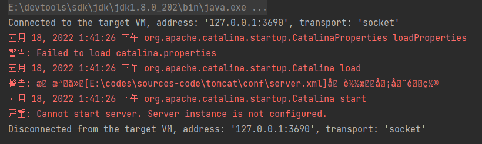
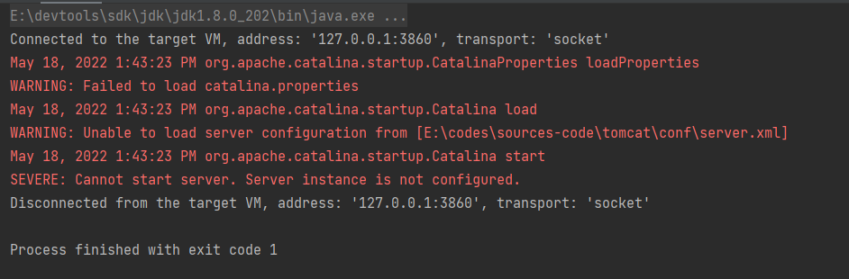
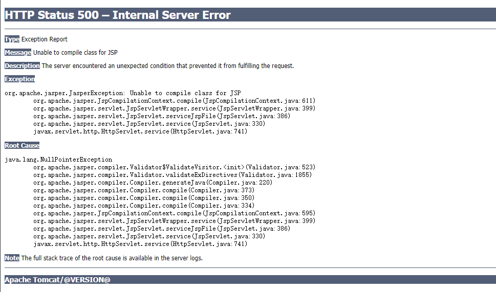
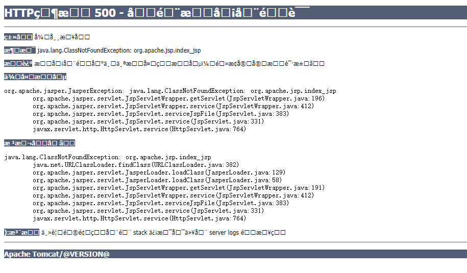
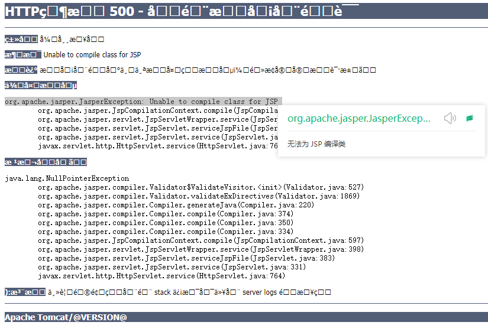

# Tomcat基础

---

## 如何运行源码

```wiki
参考：
https://programmer.group/tomcat-source-analysis-i-compiling-tomcat-source-code.html
https://www.cnblogs.com/jhxxb/p/10768580.html
https://gongxufan.github.io/2017/10/20/tomcat-source-debug/
```

1. 在该地址下载相应版本的带源码的 Tomcat ：https://archive.apache.org/dist/tomcat/

2. 在IDEA中新建一个空项目，并将带源码的 Tomcat 解压到该目录下。

   

3. 在源码根目录下新建一个 `home` 目录，并将 `conf` 目录 和 `webapps` 目录移入 `home` 目录中。

4. 在源码根目录下创建一个 `pom.xml` 文件，引入 `Tomcat` 的依赖。

   ```xml
   <?xml version="1.0" encoding="UTF-8"?>
   <project xmlns="http://maven.apache.org/POM/4.0.0"
            xmlns:xsi="http://www.w3.org/2001/XMLSchema-instance"
            xsi:schemaLocation="http://maven.apache.org/POM/4.0.0 http://maven.apache.org/xsd/maven-4.0.0.xsd">
   
       <modelVersion>4.0.0</modelVersion>
       <groupId>org.apache.tomcat</groupId>
       <artifactId>Tomcat8.5.42</artifactId>
       <name>Tomcat8.5.42</name>
       <version>8.5.42</version>
   
       <dependencies>
           <dependency>
               <groupId>junit</groupId>
               <artifactId>junit</artifactId>
               <version>4.12</version>
               <scope>test</scope>
           </dependency>
   
           <dependency>
               <groupId>org.easymock</groupId>
               <artifactId>easymock</artifactId>
               <version>3.4</version>
           </dependency>
   
           <dependency>
               <groupId>org.apache.ant</groupId>
               <artifactId>ant</artifactId>
               <version>1.9.5</version>
           </dependency>
   
           <dependency>
               <groupId>javax.xml.rpc</groupId>
               <artifactId>javax.xml.rpc-api</artifactId>
               <version>1.1</version>
           </dependency>
   
           <dependency>
               <groupId>wsdl4j</groupId>
               <artifactId>wsdl4j</artifactId>
               <version>1.6.2</version>
           </dependency>
   
           <dependency>
               <groupId>org.eclipse.jdt.core.compiler</groupId>
               <artifactId>ecj</artifactId>
               <version>4.5.1</version>
           </dependency>
       </dependencies>
   
       <build>
           <finalName>Tomcat8.5.42</finalName>
           <sourceDirectory>java</sourceDirectory>
           <resources>
               <resource>
                   <directory>java</directory>
               </resource>
           </resources>
           <plugins>
               <plugin>
                   <groupId>org.apache.maven.plugins</groupId>
                   <artifactId>maven-compiler-plugin</artifactId>
                   <version>3.1</version>
                   <configuration>
                       <encoding>UTF-8</encoding>
                       <source>1.8</source>
                       <target>1.8</target>
                   </configuration>
               </plugin>
           </plugins>
       </build>
   </project>
   ```

5. 新增一个运行配置

   

6. 选择模块，选择主类：org.apache.catalina.startup.Bootstrap

   

7. 建议先把项目的文件编码格式改为 `UTF-8` ，避免出现乱码。

   

8.  Add VM options。

   

   - 若不添加任何 VM options ，此时直接运行，有些版本的tomcat可能会出现乱码。（如下是8.5.78）

     

   - 添加如下 VM options ，以避免乱码（注意下面所有的 `-` 最好手动敲，否则可能出现 `找不到或无法加载主类` 的错误）。

   ```properties
   -Duser.language=en
   -Duser.region=US
   -Dfile.encoding=UTF-8
   ```

   - 此时直接运行会报错，需要添加如下 VM options ，以指定 `CATALINA_HOME` 和 `CATALINA_BASE` 。

     

   ```properties
   -Dcatalina.home=E:\codes\sources-code\tomcat\apache-tomcat-8.5.42-src\home
   -Dcatalina.base=E:\codes\sources-code\tomcat\apache-tomcat-8.5.42-src\home
   ```

   - 此时直接运行仍会报错，添加如下 VM options ，错误消失。

     ```crystal
     SEVERE: Error configuring application listener of class [listeners.ContextListener]
     java.lang.ClassNotFoundException: listeners.ContextListener
     	at org.apache.catalina.loader.WebappClassLoaderBase.loadClass(WebappClassLoaderBase.java:1364)
     	at org.apache.catalina.loader.WebappClassLoaderBase.loadClass(WebappClassLoaderBase.java:1185)
     	at org.apache.catalina.core.DefaultInstanceManager.loadClass(DefaultInstanceManager.java:546)
     	at org.apache.catalina.core.DefaultInstanceManager.loadClassMaybePrivileged(DefaultInstanceManager.java:527)
     	at org.apache.catalina.core.DefaultInstanceManager.newInstance(DefaultInstanceManager.java:150)
     	at org.apache.catalina.core.StandardContext.listenerStart(StandardContext.java:4692)
     	at org.apache.catalina.core.StandardContext.startInternal(StandardContext.java:5236)
     	at org.apache.catalina.util.LifecycleBase.start(LifecycleBase.java:150)
     	at org.apache.catalina.core.ContainerBase.addChildInternal(ContainerBase.java:754)
     	at org.apache.catalina.core.ContainerBase.addChild(ContainerBase.java:730)
     	at org.apache.catalina.core.StandardHost.addChild(StandardHost.java:744)
     	at org.apache.catalina.startup.HostConfig.deployDirectory(HostConfig.java:1135)
     	at org.apache.catalina.startup.HostConfig$DeployDirectory.run(HostConfig.java:1869)
     	at java.util.concurrent.Executors$RunnableAdapter.call(Executors.java:511)
     	at java.util.concurrent.FutureTask.run$$$capture(FutureTask.java:266)
     	at java.util.concurrent.FutureTask.run(FutureTask.java)
     	at java.util.concurrent.ThreadPoolExecutor.runWorker(ThreadPoolExecutor.java:1149)
     	at java.util.concurrent.ThreadPoolExecutor$Worker.run(ThreadPoolExecutor.java:624)
     	at java.lang.Thread.run(Thread.java:748)
     
     May 18, 2022 1:51:36 PM org.apache.catalina.core.StandardContext listenerStart
     SEVERE: Error configuring application listener of class [listeners.SessionListener]
     java.lang.ClassNotFoundException: listeners.SessionListener
     	at org.apache.catalina.loader.WebappClassLoaderBase.loadClass(WebappClassLoaderBase.java:1364)
     	at org.apache.catalina.loader.WebappClassLoaderBase.loadClass(WebappClassLoaderBase.java:1185)
     	at org.apache.catalina.core.DefaultInstanceManager.loadClass(DefaultInstanceManager.java:546)
     	at org.apache.catalina.core.DefaultInstanceManager.loadClassMaybePrivileged(DefaultInstanceManager.java:527)
     	at org.apache.catalina.core.DefaultInstanceManager.newInstance(DefaultInstanceManager.java:150)
     	at org.apache.catalina.core.StandardContext.listenerStart(StandardContext.java:4692)
     	at org.apache.catalina.core.StandardContext.startInternal(StandardContext.java:5236)
     	at org.apache.catalina.util.LifecycleBase.start(LifecycleBase.java:150)
     	at org.apache.catalina.core.ContainerBase.addChildInternal(ContainerBase.java:754)
     	at org.apache.catalina.core.ContainerBase.addChild(ContainerBase.java:730)
     	at org.apache.catalina.core.StandardHost.addChild(StandardHost.java:744)
     	at org.apache.catalina.startup.HostConfig.deployDirectory(HostConfig.java:1135)
     	at org.apache.catalina.startup.HostConfig$DeployDirectory.run(HostConfig.java:1869)
     	at java.util.concurrent.Executors$RunnableAdapter.call(Executors.java:511)
     	at java.util.concurrent.FutureTask.run$$$capture(FutureTask.java:266)
     	at java.util.concurrent.FutureTask.run(FutureTask.java)
     	at java.util.concurrent.ThreadPoolExecutor.runWorker(ThreadPoolExecutor.java:1149)
     	at java.util.concurrent.ThreadPoolExecutor$Worker.run(ThreadPoolExecutor.java:624)
     	at java.lang.Thread.run(Thread.java:748)
     
     May 18, 2022 1:51:36 PM org.apache.catalina.core.StandardContext listenerStart
     SEVERE: Error configuring application listener of class [async.AsyncStockContextListener]
     java.lang.ClassNotFoundException: async.AsyncStockContextListener
     	at org.apache.catalina.loader.WebappClassLoaderBase.loadClass(WebappClassLoaderBase.java:1364)
     	at org.apache.catalina.loader.WebappClassLoaderBase.loadClass(WebappClassLoaderBase.java:1185)
     	at org.apache.catalina.core.DefaultInstanceManager.loadClass(DefaultInstanceManager.java:546)
     	at org.apache.catalina.core.DefaultInstanceManager.loadClassMaybePrivileged(DefaultInstanceManager.java:527)
     	at org.apache.catalina.core.DefaultInstanceManager.newInstance(DefaultInstanceManager.java:150)
     	at org.apache.catalina.core.StandardContext.listenerStart(StandardContext.java:4692)
     	at org.apache.catalina.core.StandardContext.startInternal(StandardContext.java:5236)
     	at org.apache.catalina.util.LifecycleBase.start(LifecycleBase.java:150)
     	at org.apache.catalina.core.ContainerBase.addChildInternal(ContainerBase.java:754)
     	at org.apache.catalina.core.ContainerBase.addChild(ContainerBase.java:730)
     	at org.apache.catalina.core.StandardHost.addChild(StandardHost.java:744)
     	at org.apache.catalina.startup.HostConfig.deployDirectory(HostConfig.java:1135)
     	at org.apache.catalina.startup.HostConfig$DeployDirectory.run(HostConfig.java:1869)
     	at java.util.concurrent.Executors$RunnableAdapter.call(Executors.java:511)
     	at java.util.concurrent.FutureTask.run$$$capture(FutureTask.java:266)
     	at java.util.concurrent.FutureTask.run(FutureTask.java)
     	at java.util.concurrent.ThreadPoolExecutor.runWorker(ThreadPoolExecutor.java:1149)
     	at java.util.concurrent.ThreadPoolExecutor$Worker.run(ThreadPoolExecutor.java:624)
     	at java.lang.Thread.run(Thread.java:748)
     
     May 18, 2022 1:51:36 PM org.apache.catalina.core.StandardContext listenerStart
     SEVERE: Error configuring application listener of class [websocket.drawboard.DrawboardContextListener]
     java.lang.ClassNotFoundException: websocket.drawboard.DrawboardContextListener
     	at org.apache.catalina.loader.WebappClassLoaderBase.loadClass(WebappClassLoaderBase.java:1364)
     	at org.apache.catalina.loader.WebappClassLoaderBase.loadClass(WebappClassLoaderBase.java:1185)
     	at org.apache.catalina.core.DefaultInstanceManager.loadClass(DefaultInstanceManager.java:546)
     	at org.apache.catalina.core.DefaultInstanceManager.loadClassMaybePrivileged(DefaultInstanceManager.java:527)
     	at org.apache.catalina.core.DefaultInstanceManager.newInstance(DefaultInstanceManager.java:150)
     	at org.apache.catalina.core.StandardContext.listenerStart(StandardContext.java:4692)
     	at org.apache.catalina.core.StandardContext.startInternal(StandardContext.java:5236)
     	at org.apache.catalina.util.LifecycleBase.start(LifecycleBase.java:150)
     	at org.apache.catalina.core.ContainerBase.addChildInternal(ContainerBase.java:754)
     	at org.apache.catalina.core.ContainerBase.addChild(ContainerBase.java:730)
     	at org.apache.catalina.core.StandardHost.addChild(StandardHost.java:744)
     	at org.apache.catalina.startup.HostConfig.deployDirectory(HostConfig.java:1135)
     	at org.apache.catalina.startup.HostConfig$DeployDirectory.run(HostConfig.java:1869)
     	at java.util.concurrent.Executors$RunnableAdapter.call(Executors.java:511)
     	at java.util.concurrent.FutureTask.run$$$capture(FutureTask.java:266)
     	at java.util.concurrent.FutureTask.run(FutureTask.java)
     	at java.util.concurrent.ThreadPoolExecutor.runWorker(ThreadPoolExecutor.java:1149)
     	at java.util.concurrent.ThreadPoolExecutor$Worker.run(ThreadPoolExecutor.java:624)
     	at java.lang.Thread.run(Thread.java:748)
     ```

   ```properties
   -Djava.util.logging.manager=org.apache.juli.ClassLoaderLogManager
   -Djava.util.logging.config.file=E:\codes\sources-code\tomcat\apache-tomcat-8.5.42-src\home\conf\logging.properties
   ```

7. 此时我们运行时，会发现日志中有如下错误，删除 `\home\webapps\examples` 目录后，错误消失；报错原因是这个项目有问题，若想保留这个项目，可以复制非源码版本的tomcat中的 examples 项目过来再运行。

   ```crystal
   18-May-2022 13:54:00.510 SEVERE [localhost-startStop-1] org.apache.catalina.core.StandardContext.startInternal One or more listeners failed to start. Full details will be found in the appropriate container log file
   18-May-2022 13:54:00.510 SEVERE [localhost-startStop-1] org.apache.catalina.core.StandardContext.startInternal Context [/examples] startup failed due to previous errors
   ```
   
7. 如果将根目录下的 `test` 目录标为 `测试目录` ，运行项目时报如下错误；如果不想将其标为 `测试目录` ，idea 就不会编译它，也就不会报错。

   ```crystal
   E:\codes\sources-code\tomcat\apache-tomcat-8.5.42-src\test\util\TestCookieFilter.java:29:36
   java: 找不到符号
     符号:   变量 CookieFilter
     位置: 类 util.TestCookieFilter
   ```

   解决方法：将如下这个类，放到 E:\codes\sources-code\tomcat\apache-tomcat-8.5.42-src\test\util 目录下

   https://github.com/apache/tomcat/blob/57bdf5866acad9679b71e1875e92a3ef9fe83d90/webapps/examples/WEB-INF/classes/util/CookieFilter.java

11. 再次运行项目，项目可以运行成功，发现如下日志，我们可以访问 `http://localhost:8080` ，发现如下问题：

    ```crystal
    18-May-2022 14:03:12.317 INFO [main] org.apache.coyote.AbstractProtocol.start Starting ProtocolHandler ["http-nio-8080"]
    18-May-2022 14:03:12.336 INFO [main] org.apache.coyote.AbstractProtocol.start Starting ProtocolHandler ["ajp-nio-8009"]
    18-May-2022 14:03:12.341 INFO [main] org.apache.catalina.startup.Catalina.start Server startup in 1184 ms
    ```

    

    ```java
    webConfig();
    
    // 将JSP解析器初始化
    context.addServletContainerInitializer(new JasperInitializer(), null);
    
    if (!context.getIgnoreAnnotations()) {
        applicationAnnotationsConfig();
    }
    if (ok) {
        validateSecurityRoles();
    }

5. 






## Jar 和 War 的区别

其实他们的主要内容都是class文件，不同的是： War 包会被 Tomcat 识别为一个 Web 项目，从而被 Tomcat 部署；而 Jar 包不会。


## Tomcat配置


