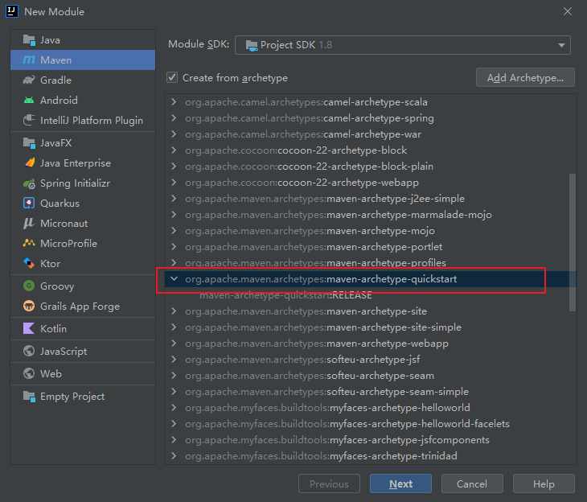

# WebService的Java实现

---

参考：

```crystal

```


## Java中的WebService规范

### JAX-WS

**JAX-WS（Java API For XML-WebService）**

- JDK 自带 JAX-WS ，其底层支持为 JAXB[^JAXB] 。
- JAX-WS（JSR 224）规范的 API 位于 `javax.xml.ws.*` 包，其中大部分都是注解，提供 API 操作 Web 服务（通常在客户端使用的较多，由于客户端可以借助SDK 生成，因此这个包中的API 我们较少会直接使用）。
- JAX-RPC（Java API For XML-RPC） 1.1 升级到2.0版本后，更名为 JAX-WS ，即 JAX-RPC 是 JAX-WS 的前身。[JAX-RPC 与 JAX-WS 的比较 ](https://www.cnblogs.com/soul-wonder/p/8884975.html)
- 基于 soap 协议。

> [^JAXB]: JAXB（Java Architecture for XML Binding) 是一个业界的标准，是一项可以根据XML Schema产生Java类的技术。该过程中，JAXB也提供了将XML实例文档反向生成Java对象树的方法，并能将Java对象树的内容重新写到XML实例文档。从另一方面来讲，JAXB提供了快速而简便的方法将XML模式绑定到Java表示，从而使得Java开发者在Java应用程序中能方便地结合XML数据和处理函数。（参考：https://blog.csdn.net/wn084/article/details/80853587 ）

### JAXM&SAAJ

**JAXM（JAVA API For XML Message）**

- 主要定义了包含了 **发送和接收消息** 所需的API，主要用于 Web 服务的 **服务器端** ，其 API 位于 `javax.messaging.*`包。
- 它是 JAVA EE 的可选包，因此需要单独下载。
- 基于 soap 协议

**SAAJ (SOAP with Attachments API for JAVA)**

- 其API 位于 `javax.xml.soap.*` 包。
- 它是与 JAXM 搭配使用的API，为 **构建 SOAP 包** 和 **解析 SOAP 包** 提供了重要的支持，支持 **附件传输** 。
- 它在 **服务器端、客户端** 都需要使用。
- 基于 soap 协议。

### JAXM&SAAJ 与  JAX-WS 的比较

都是基于SOAP 的 Web 服务。

- 相比之下 JAXM&SAAJ 暴露 了 SOAP 更多的 底层细节 ，编码比较麻烦。
- 而 JAX-WS 更加抽象，隐藏了更多的细节，更加面向对象，实现起来你基本上不需要关心SOAP 的任何细节。
- 如果你想控制SOAP 消息的更多细节，可以使用 JAXM&SAAJ 。

### JAX-RS

**JAX-RS（Java API for RESTful Web Services）** 

- 是 JAVA 针对 REST (Representation State Transfer) 风格制定的一套 WebService 规范。
- 其 API 位于JAVA EE 的 javax.ws.rs.* 包。

## WebService规范的实现

1. 对于 JAX-WS 和 JAX-RS 规范，可以采用 **Apache CXF** 作为实现。
   - CXF 是 Objectweb Celtix 和 Codehaus XFire 两个项目合并而成。
   - CXF 的核心是 org.apache.cxf.Bus (总线)，类似于 Spring 的 ApplicationContext ，Bus 由 BusFactory 创建，默认是 SpringBusFactory 类，可见默认 CXF 是依赖于 Spring 的， Bus 都有一个 ID ，默认的 BUS 的 ID 是 cxf 。
   - 你要注意的是 ApacheCXF2.2 的发行包中的 jar 你如果直接全部放到 lib 目录，那么你必须使用JDK1.6，否则会报JAX-WS 版本不一致的问题。
2. 对于 JAXM&SAAJ 规范，可以采用 JDK 中自带的默认实现。


## ApacheCXF 实现 JAX-WS

### 服务端

1. 使用 maven-archetype-quickstart 骨架，创建 jaxws-server 的 maven 模块。

   

2. 添加依赖。

   ```xml
   <dependencies>
       <!-- 要进行jaxws 服务开发 -->
       <dependency>
           <groupId>org.apache.cxf</groupId>
           <artifactId>cxf-rt-frontend-jaxws</artifactId>
           <version>3.0.1</version>
       </dependency>
   
       <!-- 内置jetty web服务器  -->
       <dependency>
           <groupId>org.apache.cxf</groupId>
           <artifactId>cxf-rt-transports-http-jetty</artifactId>
           <version>3.0.1</version>
       </dependency>
   
       <!-- 日志实现 -->
       <dependency>
           <groupId>org.slf4j</groupId>
           <artifactId>slf4j-log4j12</artifactId>
           <version>1.7.12</version>
       </dependency>
       <dependency>
           <groupId>junit</groupId>
           <artifactId>junit</artifactId>
           <version>4.10</version>
           <scope>test</scope>
       </dependency>
   </dependencies>
   
   <build>
       <plugins>
           <plugin>
               <groupId>org.apache.maven.plugins</groupId>
               <artifactId>maven-compiler-plugin</artifactId>
               <version>3.2</version>
               <configuration>
                   <source>1.8</source>
                   <target>1.8</target>
                   <encoding>UTF-8</encoding>
                   <showWarnings>true</showWarnings>
               </configuration>
           </plugin>
       </plugins>
   </build>
   ```

   

3. 添加 `HelloService.java` 、 `HelloServiceImpl.java` 和 `Server.java` ，以及 `log4j.properties` 。

   ```java
   @WebService
   public interface HelloService {
   	/**
   	 * 对外发布服务的接口的方法
   	 */
   	String sayHello(String name);
   
   	String sayHello2(String name);
   }
   ```

   ```java
   public class HelloServiceImpl implements HelloService {
   	@Override
   	public String sayHello(String name) {
   		return name + ",Welcome to WebService!";
   	}
   
   	@Override
   	public String sayHello2(String name) {
   		return name + ",Welcome to WebService2!";
   	}
   }
   ```

   ```java
   public class Server {
       public static void main(String[] args) {
           //  发布服务的工厂
           JaxWsServerFactoryBean factory = new JaxWsServerFactoryBean();
   
           //  设置服务地址
           factory.setAddress("http://localhost:8000/ws/hello");
   
           //  设置服务类
           factory.setServiceBean(new HelloServiceImpl());
   
           //  添加日志输入、输出拦截器，观察soap请求、soap响应内容
           factory.getInInterceptors().add(new LoggingInInterceptor());
           factory.getOutInterceptors().add(new LoggingOutInterceptor());
   
           //  发布服务
           factory.create();
   
           System.out.println("发布服务成功，端口8000.....");
   
       }
   }
   ```

   ```properties
   # Set root category priority to INFO and its only appender to CONSOLE.
   #log4j.rootCategory=INFO, CONSOLE            debug   info   warn error fatal
   log4j.rootCategory=info, CONSOLE, LOGFILE
   
   # Set the enterprise logger category to FATAL and its only appender to CONSOLE.
   log4j.logger.org.apache.axis.enterprise=FATAL, CONSOLE
   
   # CONSOLE is set to be a ConsoleAppender using a PatternLayout.
   log4j.appender.CONSOLE=org.apache.log4j.ConsoleAppender
   log4j.appender.CONSOLE.layout=org.apache.log4j.PatternLayout
   log4j.appender.CONSOLE.layout.ConversionPattern=%d{ISO8601} %-6r [%15.15t] %-5p %30.30c %x - %m\n
   
   # LOGFILE is set to be a File appender using a PatternLayout.
   log4j.appender.LOGFILE=org.apache.log4j.FileAppender
   log4j.appender.LOGFILE.File=d:\axis.log
   log4j.appender.LOGFILE.Append=true
   log4j.appender.LOGFILE.layout=org.apache.log4j.PatternLayout
   log4j.appender.LOGFILE.layout.ConversionPattern=%d{ISO8601} %-6r [%15.15t] %-5p %30.30c %x - %m\n
   ```

   

4. 启动 `Server.java` 中的 `main` 方法即可启动服务端，发布WebService，控制台可以查看相关日志信息。


### 客户端

1. 使用 maven-archetype-quickstart 骨架，创建 jaxws-client的 maven 模块。
2. 添加依赖 (与服务端的依赖一致) 。
3. 
