## JVM 、 JRE 和 JDK

### JVM

> **JVM** （Java Virtual Machine ）：Java虚拟机，简称JVM，是运行所有Java程序的假想计算机，是Java程序的运行环境，是Java 最具吸引力的特性之一。我们编写的Java代码，都运行在他之上。

**跨平台** ：任何软件的运行，都必须要运行在操作系统之上，而我们用Java编写的软件可以运行在任何的操作系统上，这个特性称为 **Java语言的跨平台特性** 。该特性是由JVM实现的，我们编写的程序运行在JVM上，而JVM 运行在操作系统上。

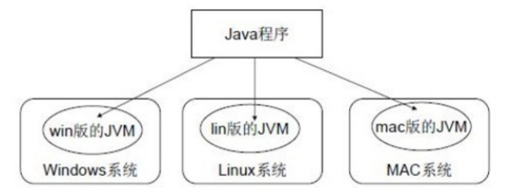

> 如图所示，Java的虚拟机本身不具备跨平台功能的，每个操作系统下都有不同版本的虚拟机。

### JRE和JDK

**JRE**  ( Java Runtime Environment) ：是Java程序的运行时环境，包含 `JVM` 和运行时所需要的 `核心类库` 。

**JDK**  ( Java Development Kit)：是Java程序开发工具包，包含 `JRE` 和开发人员使用的工具。

> 我们想要运行一个已有的Java程序，那么只需安装 `JRE` 即可。
>
> 我们想要开发一个全新的Java程序，那么必须安装`JDK`。

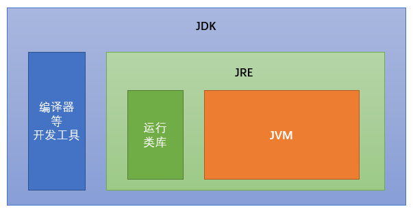

> 三者关系： JDK \> JRE \> JVM

## JDK安装配置

### JDK安装图解

① 点击【下一步】。

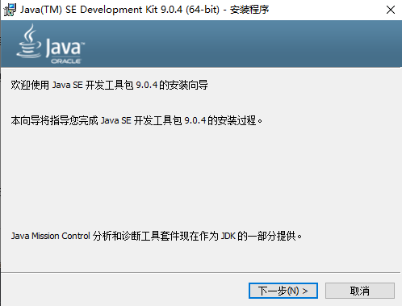

② 这里可以不安装【公共JRE】。

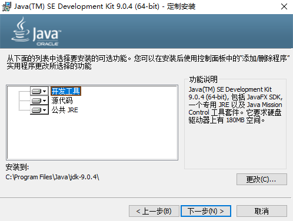

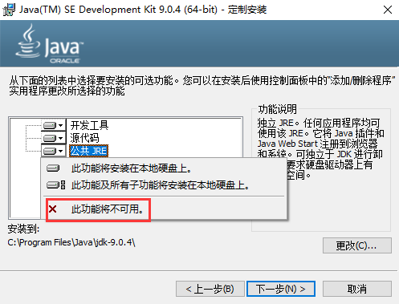

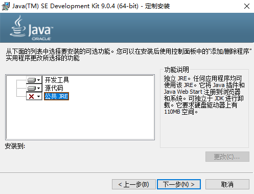

③ 更改安装路径（ **安装路径中，不要包含中文和空格** ），点击下一步。

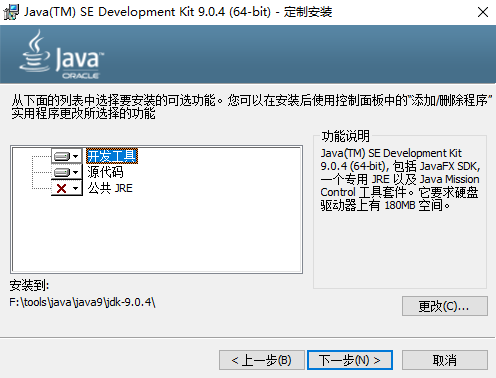

④ 安装成功，点击【关闭】。

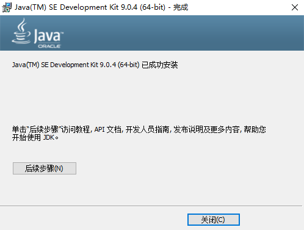

### 配置环境变量

> 作为程序员，建议勾选【文件扩展名】，即可看到文件后缀

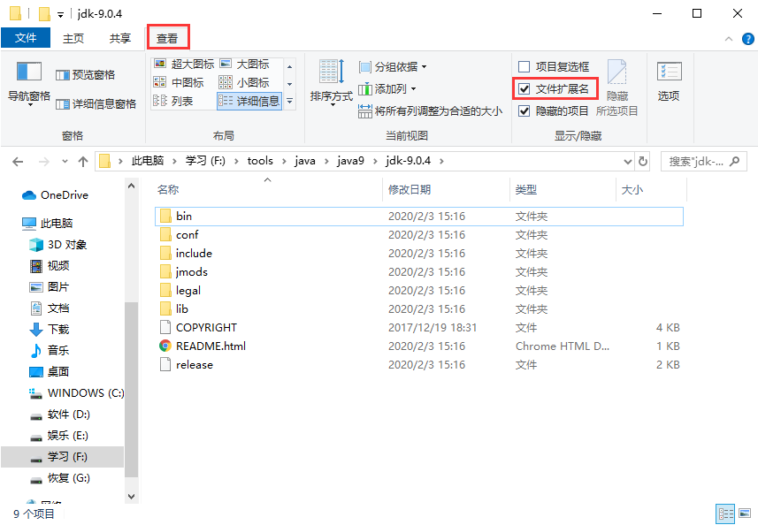

#### 配置环境变量作用

> 开发Java程序，需要使用JDK中提供的工具，工具在JDK安装目录的 目录下。在DOS命令行下使用这些工具，就要先进入到JDK的bin目录下，这个过程就会非常的麻烦。不进入JDK的 目录，这些工具就不能使用，会报错。为了开发方便，我们想 **在任意的目录下都可以使用JDK的开发工具** ，则必须要配置环境变量，配置环境变量的意义 在于告诉操作系统，我们使用的JDK开发工具在哪个目录下。

#### 配置环境变量步骤

① 通过【控制面板】到达如下路径，并点击【高级系统设置】。

② 点击【环境变量】。

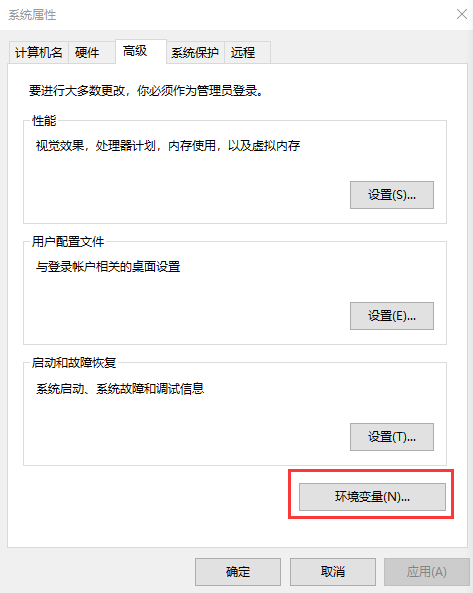

③ 如果【系统变量】中不存在 **JAVA_HOME** 则点击【新建】，【变量名】填写 **JAVA_HOME** ，【变量值】填写 **JDK安装的根目录** ；如果存在 **JAVA_HOME** ，则直接修改【变量值】即可。

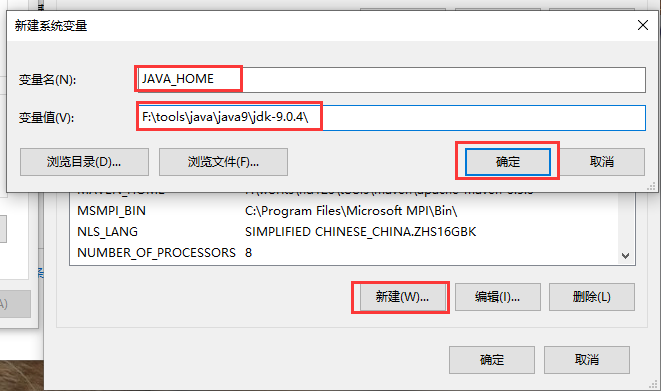

④ 同理，在 **Path** 变量值的最前端加上 `%JAVA_HOME%\bin;`

⑤ 当在命令提示符窗口输入 `java` 、 `javac` 、 `java -version` 都有信息出现且不报错时，即可视为配置成功。