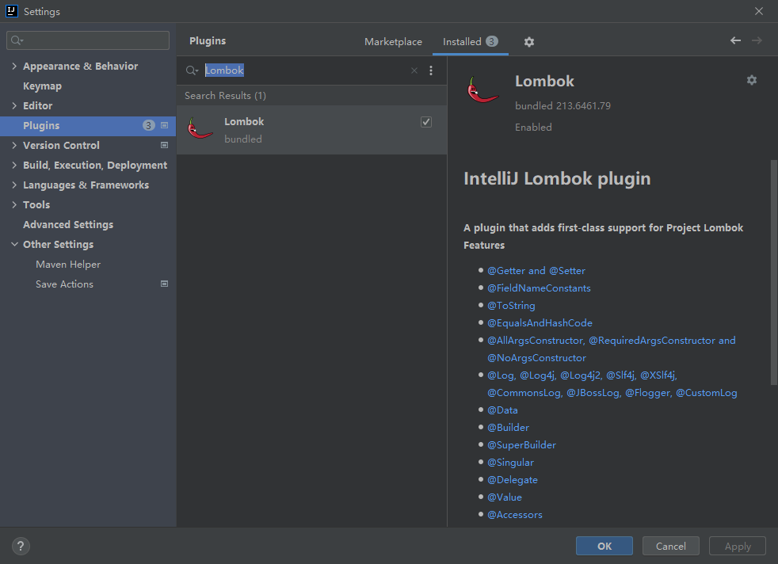

# Lombok入门

---

## 概述

- 官网：https://projectlombok.org/ （需要关掉代理才能访问）。
- Lombok 是一个 java 库，它可以插入 **编辑器** 和 **构建工具** 。
- Lombok 可以在代码编译时生成 getter 、setter 、 hashCode、 equals 、 toString 等方法，而在编写时我们只需要加几个注解就可以，代码足够清爽。
- 但这样也有弊端：也就是无法从源码中直接看到相应的方法。

## 如何使用

1. 导入依赖。

   ```xml
   <dependency>
       <groupId>org.projectlombok</groupId>
       <artifactId>lombok</artifactId>
   </dependency>
   ```

   

2. 安装 `Lombok` 插件（ IDEA 2020.3 开始内置Lombok插件(bundled)）

   

3. 使用 `Lombok` 的注解即可。

3. 由于 `Lombok` 插件已集成在 IDE 中，所以直接运行项目 `Lombok` 插件会为我们处理那些注解。

## 注解

- 官方文档：https://projectlombok.org/features/all

### @Data

`@Data` = `@ToString` + `@EqualsAndHashCode` + `@Getter` on all fields + `@Setter` on all non-final fields + `@RequiredArgsConstructor` 

### Log

#### @Slf4j

- 相当于 `private static final org.slf4j.Logger log = org.slf4j.LoggerFactory.getLogger(LogExample.class);`
