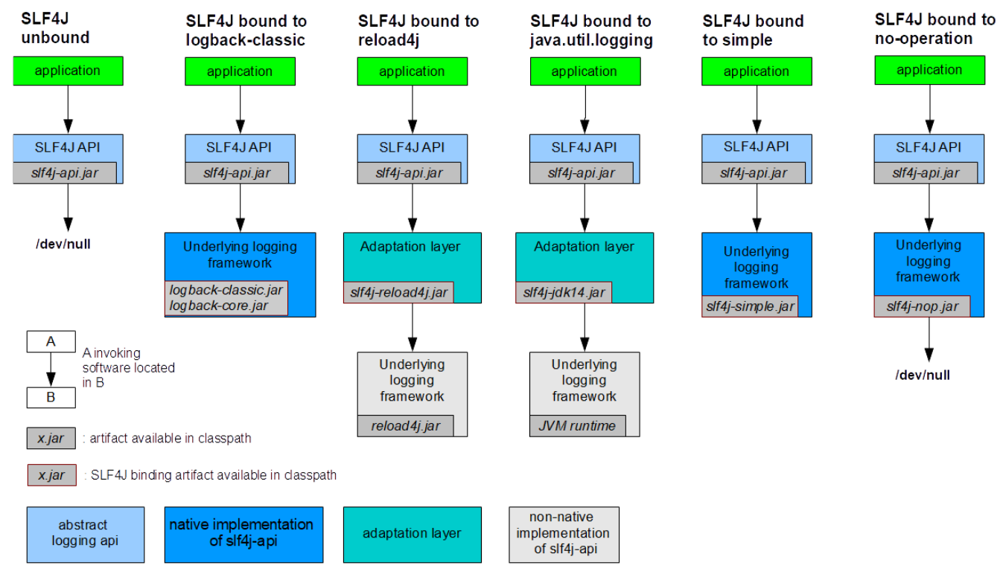
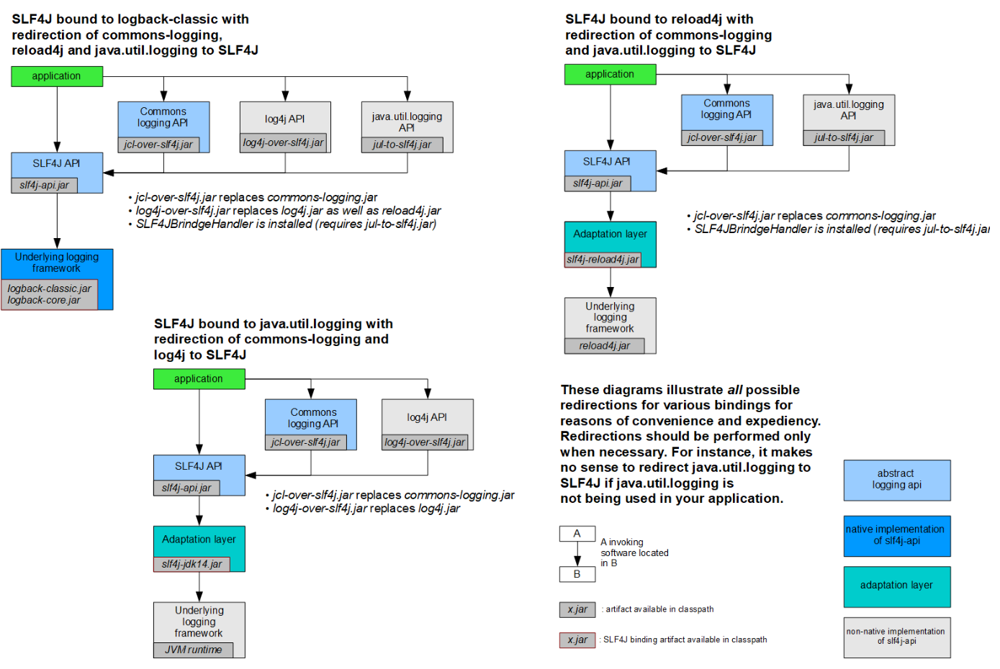

# 日志系统

---

## 架构

目前流行的日志库使用方式，是在代码中引入以下两个部分：

- Facade (门面)     *Facade 设计模式(外观模式): https://refactoringguru.cn/design-patterns/facade*
- Implementation (实现)

**门面** 提供简单、统一的操作，而 **实现** 则可以使用不同的库。

（比如，使用日志功能需要初始化一系列的对象，而门面则提供了方法将这些动作包装成了方法供程序调用；应用程序不用关注底层实现具体用的哪个日志库，门面会根据实际情况选择相应库去执行）

## 常见日志库

### Facade

| 名称                                                    | 说明             |
| ------------------------------------------------------- | ---------------- |
| Apache Commons Logging (原JCL: Jakarta Commons Logging) | 有点陈旧         |
| SLF4J (Simple Logging Facade for Java)                  |                  |
| jboss-logging                                           | 特殊专业领域使用 |

### Implementation

| 名称                    | 说明                                                    |
| ----------------------- | ------------------------------------------------------- |
| Log4j                   |                                                         |
| JUL (java.util.logging) | JDK 自带                                                |
| Log4j2                  | Apache 收购 Log4j 后全面重构，内部实现和 Log4j 完全不同 |
| Logback                 | 优雅、强大                                              |

- SLF4J 、Log4j、 Logback 三个库的作者为同一个人。

### 流行搭配

- SLF4J  + Logback （首选）
- SLF4J  + Log4j2

## SLF4J

官网：https://www.slf4j.org/

### 适配

- SLF4J 如何适配 具体实现。




### 桥接

- 如何将其他 **门面** 框架桥接成 SLF4J 。



## Logback

官网：https://logback.qos.ch/


## Log4j2

官网：https://logging.apache.org/log4j/2.x/


## 使用 log4j

引入以下依赖：

```xml
<!-- slf4j：日志系统的接口 -->
<dependency>
    <groupId>org.slf4j</groupId>
    <artifactId>slf4j-api</artifactId>
</dependency>
<!-- log4j -->
<dependency>
    <groupId>org.apache.logging.log4j</groupId>
    <artifactId>log4j-core</artifactId>
</dependency>
<!-- log4j的适配器 -->
<dependency>
    <groupId>org.slf4j</groupId>
    <artifactId>slf4j-log4j12</artifactId>
</dependency>
```

在 `src/main/resources` 下新建 `log4j.properties` 进行配置:

```properties
# Set root category priority to INFO and its only appender to CONSOLE.
#log4j.rootCategory=INFO, CONSOLE            debug   info   warn error fatal
# 包消息级别
log4j.rootCategory=debug, CONSOLE, LOGFILE

# Set the enterprise logger category to FATAL and its only appender to CONSOLE.
log4j.logger.org.apache.axis.enterprise=FATAL, CONSOLE

# CONSOLE is set to be a ConsoleAppender using a PatternLayout.
log4j.appender.CONSOLE=org.apache.log4j.ConsoleAppender
log4j.appender.CONSOLE.layout=org.apache.log4j.PatternLayout
log4j.appender.CONSOLE.layout.ConversionPattern=%d{ISO8601} %-6r [%15.15t] %-5p %30.30c %x - %m\n

# LOGFILE is set to be a File appender using a PatternLayout.
log4j.appender.LOGFILE=org.apache.log4j.FileAppender
log4j.appender.LOGFILE.File=src/main/resources/log.txt
log4j.appender.LOGFILE.Append=true
log4j.appender.LOGFILE.layout=org.apache.log4j.PatternLayout
log4j.appender.LOGFILE.layout.ConversionPattern=%d{ISO8601} %-6r [%15.15t] %-5p %30.30c %x - %m\n

# 输出消息编码 GB2312
log4j.appender.LOGFILE.encoding=UTF-8
```

## 使用 logBack

### 排除 commons-logging

> 注意：不排除也可以用，嫌麻烦可以不进行这步。

首先引入如下依赖：

```xml
<!-- spring-core（引入 core，core 依赖于 commons-logging ） -->
<dependency>
    <groupId>org.springframework</groupId>
    <artifactId>spring-core</artifactId>
    <version>${spring.version}</version>
    <exclusions>
        <exclusion>
            <groupId>commons-logging</groupId>
            <artifactId>commons-logging</artifactId>
        </exclusion>
    </exclusions>
</dependency>
```

因为这里直接依赖了 `spring-core` ，根据依赖传递的 `就近优先原则` ，其他 `jar包` 依赖的 `spring-core` 都不会传入，所以只要 `spring-core` 本身排除了`commons-logging` 依赖，就不会再有其他包传入该依赖。

### 使用 jcl

引入如下依赖：

```xml
<!-- slf4j -->
<dependency>
    <groupId>org.slf4j</groupId>
    <artifactId>slf4j-api</artifactId>
    <version>${slf4j.version}</version>
</dependency>
<!-- slf4j 的实现 -->
<dependency>
    <groupId>ch.qos.logback</groupId>
    <artifactId>logback-classic</artifactId>
    <version>${logback.version}</version>
</dependency>
<!-- jcl 替换掉 Spring 自带的 commons-logging -->
<dependency>
    <groupId>org.slf4j</groupId>
    <artifactId>jcl-over-slf4j</artifactId>
    <version>${jcl.version}</version>
</dependency>
```

在 `src/main/resources` 下新建 `logback.xml` 进行配置:

```xml
<?xml version="1.0" encoding="UTF-8"?>
<configuration debug="true">
	<!-- 指定日志输出的位置 -->
	<appender name="STDOUT"
		class="ch.qos.logback.core.ConsoleAppender">
		<encoder>
			<!-- 日志输出的格式 -->
			<!-- 按照顺序分别是：时间、日志级别、线程名称、打印日志的类、日志主体 内容、换行 -->
			<pattern>[%d{HH:mm:ss.SSS}] [%-5level] [%thread] [%logger] [%msg]%n</pattern>
		</encoder>
	</appender>
	<!-- 设置全局日志级别。日志级别按顺序分别是：DEBUG、INFO、WARN、ERROR -->
	<!-- 指定任何一个日志级别都只打印当前级别和后面级别的日志。 -->
	<root level="DEBUG">
		<!-- 指定打印日志的 appender，这里通过“STDOUT”引用了前面配置的 appender -->
		<appender-ref ref="STDOUT" />
	</root>
	<!-- 根据特殊需求指定局部日志级别 -->
	<logger name="com.nigream.crowdfunding.dao" level="DEBUG" />
</configuration>
```


## 参考

1、尚硅谷官方教程：https://www.bilibili.com/video/BV1bE411T7oZ/?p=27&vd_source=f1fbb083ddef12dcff3388779faac201
