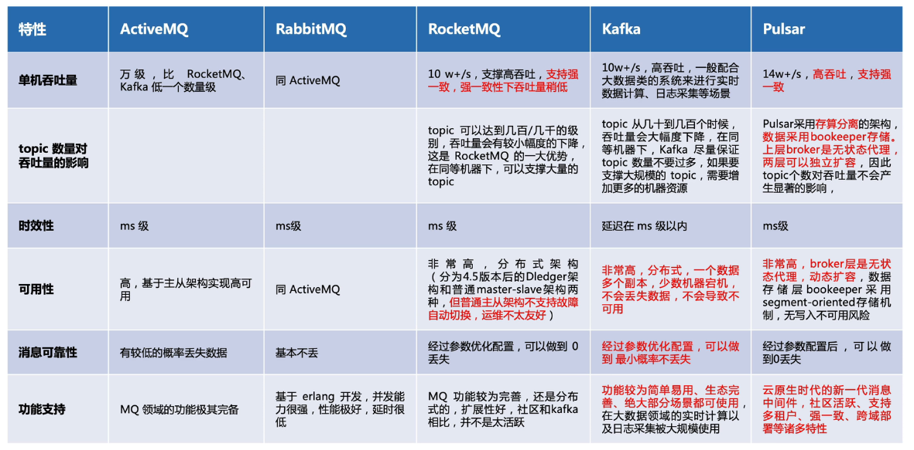

# 概念

---

## 三大场景

- 异步
- 解耦
- 削峰

## 主流消息队列产品

### 官网

- Apache ActiveMQ：https://activemq.apache.org/
- RabbitMQ：https://www.rabbitmq.com/
- Apache Kafka：https://kafka.apache.org/
- Apache RocketMQ：https://rocketmq.apache.org/
- Apache Pulsar：https://pulsar.apache.org/

### 对比

​     

---
参考

1. https://www.bilibili.com/video/BV1ia411k7oo

