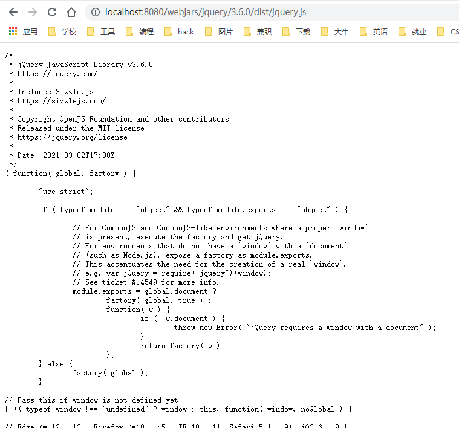

# Web开发

---

```wiki
参考：
1. https://docs.spring.io/spring-boot/docs/2.3.4.RELEASE/reference/html/spring-boot-features.html#boot-features-developing-web-applications
2. https://www.yuque.com/atguigu/springboot/
```

## 对SpringMVC的自动化配置

**大多场景我们都无需自定义配置**

**SpringBoot对SpringMVC的默认配置：**

```crystal
# 内容协商视图解析器 和 BeanName视图解析器
- Inclusion of `ContentNegotiatingViewResolver` and `BeanNameViewResolver` beans.

# 静态资源（包括webjars）
- Support for serving static resources, including support for WebJars.

# 自动注册 `Converter，GenericConverter，Formatter `
- Automatic registration of `Converter`, `GenericConverter`, and `Formatter` beans.

# 支持 `HttpMessageConverters` （配合内容协商理解原理）
- Support for `HttpMessageConverters`.

# 自动注册 `MessageCodesResolver` （国际化用）
- Automatic registration of `MessageCodesResolver` .

# 静态 index.html 页支持
- Static `index.html` support.

#  自定义 `Favicon` 
- Custom `Favicon` support .
 
# 自动使用 `ConfigurableWebBindingInitializer` ，（DataBinder负责将请求数据绑定到JavaBean上）
- Automatic use of a `ConfigurableWebBindingInitializer` bean .
```

## 静态资源

### 静态资源目录

#### 默认

**静态资源** 只要放在 **类路径** 下的以下目录下：

- `/static` 
- `/public` 
-  `/resources` 
-  `/META-INF/resources` 

就可被 `当前项目根路径 + / + 静态资源名`  访问到。

- 原理：请求进来，先去找 `Controller` 看能不能处理；不能处理的所有请求，又交给 `静态资源处理器` ； `静态资源处理器` 也找不到，则响应 `404` 。

#### 自定义

- 如下配置表示静态资源从类路径的 `haha` 目录下读取：

  ```yaml
  spring:
    resources:
      static-locations: [classpath:/haha/]
  ```

- 是一个数组，只填一个可以去掉中括号。

- 末尾斜杠可加可不加，但是官方默认配置是加了： `org.springframework.boot.autoconfigure.web.ResourceProperties`

  ```java
  private static final String[] CLASSPATH_RESOURCE_LOCATIONS = { "classpath:/META-INF/resources/",
  			"classpath:/resources/", "classpath:/static/", "classpath:/public/" };
  ```


### 静态资源访问前缀

- 默认是无前缀，即 `当前项目根路径 + / + 静态资源名` 

- 可通过以下配置设置前缀

  ```yaml
  spring:
    mvc:
      static-path-pattern: /res/**
  ```

-  `当前项目根路径 + / + static-path-pattern + / + 静态资源名` 映射了 `静态资源目录 + / + 静态资源名`

- 这样，如果想要放行静态资源时，就可以统一将前缀为 `/res` 的静态资源放行。

### webjars

#### 简介

- 官网：https://www.webjars.org/
- 将一些常用的静态资源库（如：jQuery）打包成 jar 包来使用。

#### 使用

- 引入Maven依赖:

  ```xml
  <dependency>
      <groupId>org.webjars.npm</groupId>
      <artifactId>jquery</artifactId>
      <version>3.6.0</version>
  </dependency>
  ```

- 引入的 `jar` 包结构如下图所示：

  

- 其中 `META-INF/resources` 目录正是 `SpringBoot` 为我们设置的默认 `静态资源目录` ，所以我们可以用类似这样的 url 访问：http://localhost:8080/webjars/jquery/3.6.0/dist/jquery.js

  

- 在 html 中引用：

  ```html
  <script src="/webjars/jquery/3.6.0/dist/jquery.js"></script>
  ```

### 欢迎页

有两种方式配置 **欢迎页** ，优先查找 `index页面` 方式，找不到则查找是否有 `/index` 请求。

#### index页面

- 默认解析 `静态资源目录` 下的 名称为 `index` 的页面，即通过  http://localhost:8080/ 直接访问 index 页面。

- 可以自定义 `静态资源目录` ，但是如果配置了 `静态资源访问前缀` 则无法正确解析到欢迎页。

  ```yaml
  spring:
    mvc:
      static-path-pattern: /res/**
  ```

  如果进行了这样的配置，则无法通过 http://localhost:8080/ 或者 http://localhost:8080/res 访问 欢迎页，但是可以用 http://localhost:8080/res/index.html 访问。

#### index请求

- 编写处理 `/index` 请求的 `controller` 。

### 网页图标

- 在 `静态资源目录` 下，名称为 `favicon.ico` 的图片，会被解析为网页图标（记得 禁用缓存 并 重启浏览器 重新访问）
- 配置了 `静态资源访问前缀` 也会影响该功能。

### 静态资源配置原理

#### WebMvcAutoConfiguration

- SpringMVC 功能的自动配置类是： `WebMvcAutoConfiguration`

  ```java
  @Configuration(proxyBeanMethods = false)
  @ConditionalOnWebApplication(type = Type.SERVLET)
  @ConditionalOnClass({ Servlet.class, DispatcherServlet.class, WebMvcConfigurer.class })
  @ConditionalOnMissingBean(WebMvcConfigurationSupport.class)
  @AutoConfigureOrder(Ordered.HIGHEST_PRECEDENCE + 10)
  @AutoConfigureAfter({ DispatcherServletAutoConfiguration.class, TaskExecutionAutoConfiguration.class,
  		ValidationAutoConfiguration.class })
  public class WebMvcAutoConfiguration {}
  ```

- 给容器中配了什么：

  ```java
  	@Configuration(proxyBeanMethods = false)
  	@Import(EnableWebMvcConfiguration.class)
  	@EnableConfigurationProperties({ WebMvcProperties.class, ResourceProperties.class })
  	@Order(0)
  	public static class WebMvcAutoConfigurationAdapter implements WebMvcConfigurer {}
  ```

  WebMvcProperties 的配置前缀是： **spring.mvc** ；

  ResourceProperties 的配置前缀是： **spring.resources**

#### WebMvcAutoConfigurationAdapter

```java
	// 有参构造器所有参数的值都会从容器中确定
    // ResourceProperties resourceProperties；获取和spring.resources绑定的所有的值的对象
    // WebMvcProperties mvcProperties 获取和spring.mvc绑定的所有的值的对象
    // ListableBeanFactory beanFactory Spring的beanFactory
    // HttpMessageConverters 找到所有的HttpMessageConverters
    // ResourceHandlerRegistrationCustomizer 找到 资源处理器的自定义器。=========
    // DispatcherServletPath  
    // ServletRegistrationBean   给应用注册Servlet、Filter....
	public WebMvcAutoConfigurationAdapter(ResourceProperties resourceProperties, WebMvcProperties mvcProperties,
				ListableBeanFactory beanFactory, ObjectProvider<HttpMessageConverters> messageConvertersProvider,
				ObjectProvider<ResourceHandlerRegistrationCustomizer> resourceHandlerRegistrationCustomizerProvider,
				ObjectProvider<DispatcherServletPath> dispatcherServletPath,
				ObjectProvider<ServletRegistrationBean<?>> servletRegistrations) {
			this.resourceProperties = resourceProperties;
			this.mvcProperties = mvcProperties;
			this.beanFactory = beanFactory;
			this.messageConvertersProvider = messageConvertersProvider;
			this.resourceHandlerRegistrationCustomizer = resourceHandlerRegistrationCustomizerProvider.getIfAvailable();
			this.dispatcherServletPath = dispatcherServletPath;
			this.servletRegistrations = servletRegistrations;
	}
```

#### 资源处理的默认规则

```java
		@Override
		public void addResourceHandlers(ResourceHandlerRegistry registry) {
			if (!this.resourceProperties.isAddMappings()) {
				logger.debug("Default resource handling disabled");
				return;
			}
			Duration cachePeriod = this.resourceProperties.getCache().getPeriod();
			CacheControl cacheControl = this.resourceProperties.getCache().getCachecontrol().toHttpCacheControl();
			//webjars的规则
            if (!registry.hasMappingForPattern("/webjars/**")) {
				customizeResourceHandlerRegistration(registry.addResourceHandler("/webjars/**")
						.addResourceLocations("classpath:/META-INF/resources/webjars/")
						.setCachePeriod(getSeconds(cachePeriod)).setCacheControl(cacheControl));
			}
            
            //
			String staticPathPattern = this.mvcProperties.getStaticPathPattern();
			if (!registry.hasMappingForPattern(staticPathPattern)) {
				customizeResourceHandlerRegistration(registry.addResourceHandler(staticPathPattern)
						.addResourceLocations(getResourceLocations(this.resourceProperties.getStaticLocations()))
						.setCachePeriod(getSeconds(cachePeriod)).setCacheControl(cacheControl));
			}
		}
```

```yaml
spring:
  resources:
    add-mappings: false   # 禁用所有静态资源规则
```

```java
@ConfigurationProperties(prefix = "spring.resources", ignoreUnknownFields = false)
public class ResourceProperties {

	private static final String[] CLASSPATH_RESOURCE_LOCATIONS = { "classpath:/META-INF/resources/",
			"classpath:/resources/", "classpath:/static/", "classpath:/public/" };

	/**
	 * Locations of static resources. Defaults to classpath:[/META-INF/resources/,
	 * /resources/, /static/, /public/].
	 */
	private String[] staticLocations = CLASSPATH_RESOURCE_LOCATIONS;
```

#### 欢迎页的处理规则

```java
	// HandlerMapping：处理器映射。保存了每一个Handler能处理哪些请求。	

	@Bean
		public WelcomePageHandlerMapping welcomePageHandlerMapping(ApplicationContext applicationContext,
				FormattingConversionService mvcConversionService, ResourceUrlProvider mvcResourceUrlProvider) {
			WelcomePageHandlerMapping welcomePageHandlerMapping = new WelcomePageHandlerMapping(
					new TemplateAvailabilityProviders(applicationContext), applicationContext, getWelcomePage(),
					this.mvcProperties.getStaticPathPattern());
			welcomePageHandlerMapping.setInterceptors(getInterceptors(mvcConversionService, mvcResourceUrlProvider));
			welcomePageHandlerMapping.setCorsConfigurations(getCorsConfigurations());
			return welcomePageHandlerMapping;
		}

	WelcomePageHandlerMapping(TemplateAvailabilityProviders templateAvailabilityProviders,
			ApplicationContext applicationContext, Optional<Resource> welcomePage, String staticPathPattern) {
		if (welcomePage.isPresent() && "/**".equals(staticPathPattern)) {
            // 要用欢迎页功能，必须是/**
			logger.info("Adding welcome page: " + welcomePage.get());
			setRootViewName("forward:index.html");
		}
		else if (welcomeTemplateExists(templateAvailabilityProviders, applicationContext)) {
            // 调用Controller  /index
			logger.info("Adding welcome page template: index");
			setRootViewName("index");
		}
	}

```

## 请求参数处理


