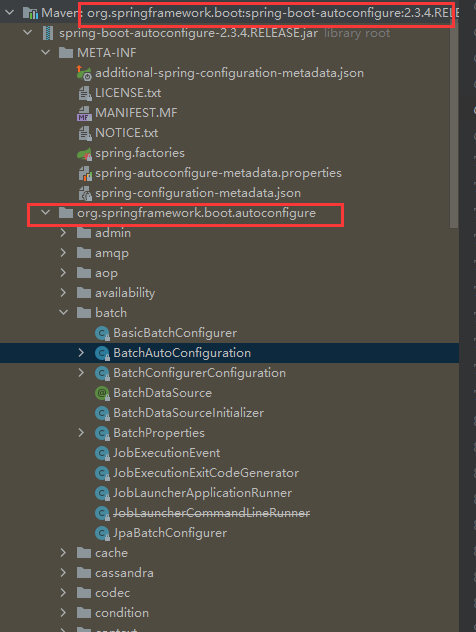
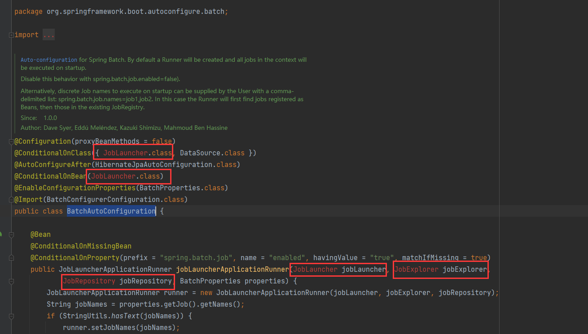
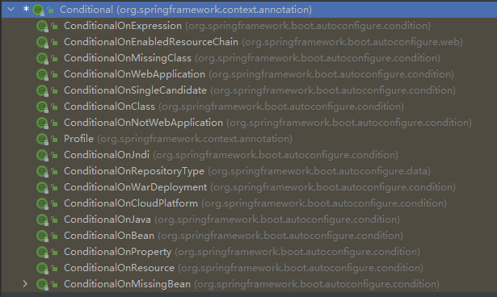
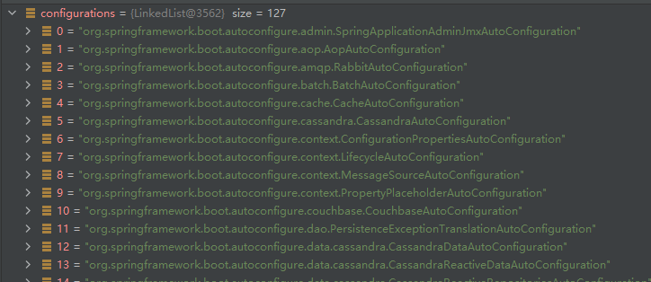

# 入门

---

参考：

```wiki
1. 尚硅谷官方学习笔记。
2. SpringBoot官方文档：https://docs.spring.io/spring-boot/docs/2.3.4.RELEASE/reference/html/
```


## 总览

- 相较于 **SpringBoot1.x** ， **SpringBoot2.x** 的配置和底层源码有了很大不同，同时 **SpringBoot2.x** 引入了 **响应式编程** 。
- SpringBoot 是整合 Spring 技术栈的一站式框架。
- SpringBoot 是简化 Spring 技术栈的快速开发脚手架。


##  POM文件

### 父项目

```xml
<parent>
    <groupId>org.springframework.boot</groupId>
    <artifactId>spring‐boot‐starter‐parent</artifactId>
    <version>2.3.4.RELEASE</version>
</parent>
```

我们在 pom 文件引用了 `spring‐boot‐starter‐parent` ，它的父项目是 `spring‐boot‐dependencies` 。

```xml
<parent>
    <groupId>org.springframework.boot</groupId>
    <artifactId>spring‐boot‐dependencies</artifactId>
    <version>2.3.4.RELEASE</version>
    <relativePath>../../spring‐boot‐dependencies</relativePath>
</parent>
```

- `spring‐boot‐dependencies` 用于管理 Spring Boot 应用里面的所有 **依赖版本** ，是 Spring Boot的 **版本仲裁中心** ；
- 以后我们导入依赖默认是不需要写版本（没有在 dependencies 标签里面管理的依赖自然需要声明版本号）。

### 修改依赖版本

如果我们需要引入 `spring‐boot‐dependencies` 已经管理的依赖的版本，则可以：

- 先在 `spring‐boot‐dependencies` 中找到对应依赖的版本变量；
- 然后在我们项目的 `pom` 文件中也定义这个变量，由于就近优先原则， 这个值将覆盖 `spring‐boot‐dependencies` 中的那个值；

如：

```xml
<properties>
    <mysql.version>8.0.21</mysql.version>
</properties>
```

### 启动器

如：

```xml
<dependency>
    <groupId>org.springframework.boot</groupId>
    <artifactId>spring-boot-starter-web</artifactId>
</dependency>
```

- Spring Boot 将所有的功能场景都抽取出来，做成一个个的 starters（启动器）依赖，需要什么功能便引入什么 starter 。

- 官方包的命名方式: `spring-boot-starter-*` ；第三方包的命名方式: `*-spring-boot-starter` 。

- Spring Boot 所有支持的场景: https://docs.spring.io/spring-boot/docs/current/reference/html/using-spring-boot.html#using-boot-starter

- 所有场景启动器最底层的依赖:

  ```xml
  <dependency>
      <groupId>org.springframework.boot</groupId>
      <artifactId>spring-boot-starter</artifactId>
      <version>2.3.4.RELEASE</version>
      <scope>compile</scope>
  </dependency>
  ```

## 主程序类

### SpringApplication.run()

`SpringApplication.run()` 方法会返回 bean 容器。

```java
ConfigurabelApplicationContext applicationContext = SpringApplication.run(MainApplication.class,args);
// 获取各个bean的名字
String[] beanDefinitionNames = applicationContext.getBeanDefinitionNames();
```

### 修改扫描的包

- **主程序所在包** 及其 **所有子包** 中的 **所有组件** 都会被默认扫描进来。

- 想要改变扫描路径，可以有以下两种配置：

  ```java
  @SpringBootApplication(scanBasePackages="com.atguigu")
  
  // 上下两个等价
  
  @SpringBootConfiguration
  @EnableAutoConfiguration
  @ComponentScan("com.atguigu")
  ```


### 自动配置

- `spring-boot-starter` 依赖 `spring-boot-autoconfigure` 。
-  `spring-boot-autoconfigure` 就是用于实现自动配置的。

```xml
<dependency>
    <groupId>org.springframework.boot</groupId>
    <artifactId>spring-boot-autoconfigure</artifactId>
    <version>2.3.4.RELEASE</version>
    <scope>compile</scope>
</dependency>
```



- 类似 `BatchAutoConfiguration` 这种以 `*Configuration` 结尾的类，就是用于自动配合的类。
- 我们看到有爆红的地方，这是因为我们没有引入相关的启动器（没有引入相关的启动器就不会进行相应的自动配置）。



## 底层注解

### @Conditional 相关注解

- 可以加在 **组件类（如@Component、@Configuration等）** 上，也可以加在 **带@Bean注解的方法** 上。
- 表明只有满足相应的条件是， `Bean` 才生效。



```java
// 如
@ConditionalOnMissingBean(name = "tom")
public class MyConfig {
   // xxxx
}
```


### @ImportResource

- 用于导入原生的 Spring 配置文件。

```java
@ImportResource("classpath:beans.xml")
public class MyConfig {
   // xxxx
}
```


### @ConfigurationPropertiess

#### @ConfigurationPropertiess + @Component

- 使用如下两个注解即可将配置文件中前缀为 `mycar` 的配置项注入 `Car` 类中，创建 `Car` 的 bean 对象。

```java
@Component
@ConfigurationProperties(prefix = "mycar")
public class Car {
    // xxxx
}
```

```properties
mycar.brand=YD
mycar.price=100000
```

#### @ConfigurationPropertiess + @EnableConfigurationProperties

```java
@ConfigurationProperties(prefix = "mycar")
public class Car {
    // xxxx
}
```

`@EnableConfigurationProperties` 需要加在配置类上。

```java
@Configuration
@EnableConfigurationProperties(Car.class)
public class MyConfig {
}
```

## 自动配置原理入门

### @SpringBootApplication

`@SpringBootApplication` 的底层注解。

```java
@SpringBootConfiguration
@EnableAutoConfiguration
@ComponentScan(excludeFilters = { @Filter(type = FilterType.CUSTOM, classes = TypeExcludeFilter.class),
		@Filter(type = FilterType.CUSTOM, classes = AutoConfigurationExcludeFilter.class) })
public @interface SpringBootApplication {
	@AliasFor(annotation = EnableAutoConfiguration.class)
	Class<?>[] exclude() default {};

	@AliasFor(annotation = EnableAutoConfiguration.class)
	String[] excludeName() default {};

	@AliasFor(annotation = ComponentScan.class, attribute = "basePackages")
	String[] scanBasePackages() default {};

	@AliasFor(annotation = ComponentScan.class, attribute = "basePackageClasses")
	Class<?>[] scanBasePackageClasses() default {};

	@AliasFor(annotation = ComponentScan.class, attribute = "nameGenerator")
	Class<? extends BeanNameGenerator> nameGenerator() default BeanNameGenerator.class;

	@AliasFor(annotation = Configuration.class)
	boolean proxyBeanMethods() default true;
}
```

#### @SpringBootConfiguration

`@SpringBootConfiguration` 的底层注解。

```java
@Configuration
public @interface SpringBootConfiguration {
    @AliasFor(annotation = Configuration.class)
    boolean proxyBeanMethods() default true;
}
```

与 `@Configuration` 功能一致，表明当前类是配置类。

#### @ComponentScan

指定扫描哪些包（是Spring原生注解）。

#### @EnableAutoConfiguration

`@EnableAutoConfiguration` 的底层注解。

```java
@AutoConfigurationPackage
@Import(AutoConfigurationImportSelector.class)
public @interface EnableAutoConfiguration {
	String ENABLED_OVERRIDE_PROPERTY = "spring.boot.enableautoconfiguration";

	Class<?>[] exclude() default {};

	String[] excludeName() default {};
}
```

##### @AutoConfigurationPackage

`@AutoConfigurationPackage` 的底层注解。

```java
@Import(AutoConfigurationPackages.Registrar.class)
public @interface AutoConfigurationPackage {
	String[] basePackages() default {};

	Class<?>[] basePackageClasses() default {};
}
```

`AutoConfigurationPackages.Registrar` 

```java
static class Registrar implements ImportBeanDefinitionRegistrar, DeterminableImports {
    @Override
    public void registerBeanDefinitions(AnnotationMetadata metadata, BeanDefinitionRegistry registry) {
        register(registry, new PackageImports(metadata).getPackageNames().toArray(new String[0]));
    }

    @Override
    public Set<Object> determineImports(AnnotationMetadata metadata) {
        return Collections.singleton(new PackageImports(metadata));
    }
}
```

- `AnnotationMetadata metadata` 表示 `@AutoConfigurationPackage` 注解的相关信息，获取到了主程序所在的包路径。
- 该注解的主要作用：指定了 SpringBoot 默认扫描的包。

##### @Import(AutoConfigurationImportSelector.class)

在 `AutoConfigurationImportSelector` 类中有个 `getAutoConfigurationEntry` 方法：

```java
protected AutoConfigurationEntry getAutoConfigurationEntry(AnnotationMetadata annotationMetadata) {
    if (!isEnabled(annotationMetadata)) {
        return EMPTY_ENTRY;
    }
    AnnotationAttributes attributes = getAttributes(annotationMetadata);
    List<String> configurations = getCandidateConfigurations(annotationMetadata, attributes);
    configurations = removeDuplicates(configurations);
    Set<String> exclusions = getExclusions(annotationMetadata, attributes);
    checkExcludedClasses(configurations, exclusions);
    configurations.removeAll(exclusions);
    configurations = getConfigurationClassFilter().filter(configurations);
    fireAutoConfigurationImportEvents(configurations, exclusions);
    return new AutoConfigurationEntry(configurations, exclusions);
}
```

打断点可以发现 `configurations` 列表中有不少组件。



**自动配置过程**

1. 调用 `getAutoConfigurationEntry(annotationMetadata);` 给容器中批量导入组件。

2. 底层：调用 `List<String> configurations = getCandidateConfigurations(annotationMetadata, attributes)` 获取到所有需要导入到容器中的组件。

3. 底层：调用 `Map<String, List<String>> loadSpringFactories(@Nullable ClassLoader classLoader);` 获取到所有的组件。

4. 底层：默认扫描所有依赖的 `META-INF/spring.factories` 文件（ `spring-boot-autoconfigure-2.3.4.RELEASE.jar` 包里面也有 `META-INF/spring.factories` ）。    

5. 虽然127个场景的所有自动配置（ `xxxxAutoConfiguration` ），在启动时会默认全部加载，但最终会按照条件装配规则（ `@Conditional` ），按需配置。

   ```crystal
   # 文件里面写死了spring-boot一启动就要给容器中加载的所有配置类
   # spring-boot-autoconfigure-2.3.4.RELEASE.jar/META-INF/spring.factories 
   # 共127个
   # Auto Configure
   org.springframework.boot.autoconfigure.EnableAutoConfiguration=\
   org.springframework.boot.autoconfigure.admin.SpringApplicationAdminJmxAutoConfiguration,\
   org.springframework.boot.autoconfigure.aop.AopAutoConfiguration,\
   org.springframework.boot.autoconfigure.amqp.RabbitAutoConfiguration,\
   org.springframework.boot.autoconfigure.batch.BatchAutoConfiguration,\
   org.springframework.boot.autoconfigure.cache.CacheAutoConfiguration,\
   org.springframework.boot.autoconfigure.cassandra.CassandraAutoConfiguration,\
   org.springframework.boot.autoconfigure.context.ConfigurationPropertiesAutoConfiguration,\
   org.springframework.boot.autoconfigure.context.LifecycleAutoConfiguration,\
   org.springframework.boot.autoconfigure.context.MessageSourceAutoConfiguration,\
   org.springframework.boot.autoconfigure.context.PropertyPlaceholderAutoConfiguration,\
   org.springframework.boot.autoconfigure.couchbase.CouchbaseAutoConfiguration,\
   org.springframework.boot.autoconfigure.dao.PersistenceExceptionTranslationAutoConfiguration,\
   org.springframework.boot.autoconfigure.data.cassandra.CassandraDataAutoConfiguration,\
   org.springframework.boot.autoconfigure.data.cassandra.CassandraReactiveDataAutoConfiguration,\
   org.springframework.boot.autoconfigure.data.cassandra.CassandraReactiveRepositoriesAutoConfiguration,\
   org.springframework.boot.autoconfigure.data.cassandra.CassandraRepositoriesAutoConfiguration,\
   org.springframework.boot.autoconfigure.data.couchbase.CouchbaseDataAutoConfiguration,\
   org.springframework.boot.autoconfigure.data.couchbase.CouchbaseReactiveDataAutoConfiguration,\
   org.springframework.boot.autoconfigure.data.couchbase.CouchbaseReactiveRepositoriesAutoConfiguration,\
   org.springframework.boot.autoconfigure.data.couchbase.CouchbaseRepositoriesAutoConfiguration,\
   org.springframework.boot.autoconfigure.data.elasticsearch.ElasticsearchDataAutoConfiguration,\
   org.springframework.boot.autoconfigure.data.elasticsearch.ElasticsearchRepositoriesAutoConfiguration,\
   org.springframework.boot.autoconfigure.data.elasticsearch.ReactiveElasticsearchRepositoriesAutoConfiguration,\
   org.springframework.boot.autoconfigure.data.elasticsearch.ReactiveElasticsearchRestClientAutoConfiguration,\
   org.springframework.boot.autoconfigure.data.jdbc.JdbcRepositoriesAutoConfiguration,\
   org.springframework.boot.autoconfigure.data.jpa.JpaRepositoriesAutoConfiguration,\
   org.springframework.boot.autoconfigure.data.ldap.LdapRepositoriesAutoConfiguration,\
   org.springframework.boot.autoconfigure.data.mongo.MongoDataAutoConfiguration,\
   org.springframework.boot.autoconfigure.data.mongo.MongoReactiveDataAutoConfiguration,\
   org.springframework.boot.autoconfigure.data.mongo.MongoReactiveRepositoriesAutoConfiguration,\
   org.springframework.boot.autoconfigure.data.mongo.MongoRepositoriesAutoConfiguration,\
   org.springframework.boot.autoconfigure.data.neo4j.Neo4jDataAutoConfiguration,\
   org.springframework.boot.autoconfigure.data.neo4j.Neo4jRepositoriesAutoConfiguration,\
   org.springframework.boot.autoconfigure.data.solr.SolrRepositoriesAutoConfiguration,\
   org.springframework.boot.autoconfigure.data.r2dbc.R2dbcDataAutoConfiguration,\
   org.springframework.boot.autoconfigure.data.r2dbc.R2dbcRepositoriesAutoConfiguration,\
   org.springframework.boot.autoconfigure.data.r2dbc.R2dbcTransactionManagerAutoConfiguration,\
   org.springframework.boot.autoconfigure.data.redis.RedisAutoConfiguration,\
   org.springframework.boot.autoconfigure.data.redis.RedisReactiveAutoConfiguration,\
   org.springframework.boot.autoconfigure.data.redis.RedisRepositoriesAutoConfiguration,\
   org.springframework.boot.autoconfigure.data.rest.RepositoryRestMvcAutoConfiguration,\
   org.springframework.boot.autoconfigure.data.web.SpringDataWebAutoConfiguration,\
   org.springframework.boot.autoconfigure.elasticsearch.ElasticsearchRestClientAutoConfiguration,\
   org.springframework.boot.autoconfigure.flyway.FlywayAutoConfiguration,\
   org.springframework.boot.autoconfigure.freemarker.FreeMarkerAutoConfiguration,\
   org.springframework.boot.autoconfigure.groovy.template.GroovyTemplateAutoConfiguration,\
   org.springframework.boot.autoconfigure.gson.GsonAutoConfiguration,\
   org.springframework.boot.autoconfigure.h2.H2ConsoleAutoConfiguration,\
   org.springframework.boot.autoconfigure.hateoas.HypermediaAutoConfiguration,\
   org.springframework.boot.autoconfigure.hazelcast.HazelcastAutoConfiguration,\
   org.springframework.boot.autoconfigure.hazelcast.HazelcastJpaDependencyAutoConfiguration,\
   org.springframework.boot.autoconfigure.http.HttpMessageConvertersAutoConfiguration,\
   org.springframework.boot.autoconfigure.http.codec.CodecsAutoConfiguration,\
   org.springframework.boot.autoconfigure.influx.InfluxDbAutoConfiguration,\
   org.springframework.boot.autoconfigure.info.ProjectInfoAutoConfiguration,\
   org.springframework.boot.autoconfigure.integration.IntegrationAutoConfiguration,\
   org.springframework.boot.autoconfigure.jackson.JacksonAutoConfiguration,\
   org.springframework.boot.autoconfigure.jdbc.DataSourceAutoConfiguration,\
   org.springframework.boot.autoconfigure.jdbc.JdbcTemplateAutoConfiguration,\
   org.springframework.boot.autoconfigure.jdbc.JndiDataSourceAutoConfiguration,\
   org.springframework.boot.autoconfigure.jdbc.XADataSourceAutoConfiguration,\
   org.springframework.boot.autoconfigure.jdbc.DataSourceTransactionManagerAutoConfiguration,\
   org.springframework.boot.autoconfigure.jms.JmsAutoConfiguration,\
   org.springframework.boot.autoconfigure.jmx.JmxAutoConfiguration,\
   org.springframework.boot.autoconfigure.jms.JndiConnectionFactoryAutoConfiguration,\
   org.springframework.boot.autoconfigure.jms.activemq.ActiveMQAutoConfiguration,\
   org.springframework.boot.autoconfigure.jms.artemis.ArtemisAutoConfiguration,\
   org.springframework.boot.autoconfigure.jersey.JerseyAutoConfiguration,\
   org.springframework.boot.autoconfigure.jooq.JooqAutoConfiguration,\
   org.springframework.boot.autoconfigure.jsonb.JsonbAutoConfiguration,\
   org.springframework.boot.autoconfigure.kafka.KafkaAutoConfiguration,\
   org.springframework.boot.autoconfigure.availability.ApplicationAvailabilityAutoConfiguration,\
   org.springframework.boot.autoconfigure.ldap.embedded.EmbeddedLdapAutoConfiguration,\
   org.springframework.boot.autoconfigure.ldap.LdapAutoConfiguration,\
   org.springframework.boot.autoconfigure.liquibase.LiquibaseAutoConfiguration,\
   org.springframework.boot.autoconfigure.mail.MailSenderAutoConfiguration,\
   org.springframework.boot.autoconfigure.mail.MailSenderValidatorAutoConfiguration,\
   org.springframework.boot.autoconfigure.mongo.embedded.EmbeddedMongoAutoConfiguration,\
   org.springframework.boot.autoconfigure.mongo.MongoAutoConfiguration,\
   org.springframework.boot.autoconfigure.mongo.MongoReactiveAutoConfiguration,\
   org.springframework.boot.autoconfigure.mustache.MustacheAutoConfiguration,\
   org.springframework.boot.autoconfigure.orm.jpa.HibernateJpaAutoConfiguration,\
   org.springframework.boot.autoconfigure.quartz.QuartzAutoConfiguration,\
   org.springframework.boot.autoconfigure.r2dbc.R2dbcAutoConfiguration,\
   org.springframework.boot.autoconfigure.rsocket.RSocketMessagingAutoConfiguration,\
   org.springframework.boot.autoconfigure.rsocket.RSocketRequesterAutoConfiguration,\
   org.springframework.boot.autoconfigure.rsocket.RSocketServerAutoConfiguration,\
   org.springframework.boot.autoconfigure.rsocket.RSocketStrategiesAutoConfiguration,\
   org.springframework.boot.autoconfigure.security.servlet.SecurityAutoConfiguration,\
   org.springframework.boot.autoconfigure.security.servlet.UserDetailsServiceAutoConfiguration,\
   org.springframework.boot.autoconfigure.security.servlet.SecurityFilterAutoConfiguration,\
   org.springframework.boot.autoconfigure.security.reactive.ReactiveSecurityAutoConfiguration,\
   org.springframework.boot.autoconfigure.security.reactive.ReactiveUserDetailsServiceAutoConfiguration,\
   org.springframework.boot.autoconfigure.security.rsocket.RSocketSecurityAutoConfiguration,\
   org.springframework.boot.autoconfigure.security.saml2.Saml2RelyingPartyAutoConfiguration,\
   org.springframework.boot.autoconfigure.sendgrid.SendGridAutoConfiguration,\
   org.springframework.boot.autoconfigure.session.SessionAutoConfiguration,\
   org.springframework.boot.autoconfigure.security.oauth2.client.servlet.OAuth2ClientAutoConfiguration,\
   org.springframework.boot.autoconfigure.security.oauth2.client.reactive.ReactiveOAuth2ClientAutoConfiguration,\
   org.springframework.boot.autoconfigure.security.oauth2.resource.servlet.OAuth2ResourceServerAutoConfiguration,\
   org.springframework.boot.autoconfigure.security.oauth2.resource.reactive.ReactiveOAuth2ResourceServerAutoConfiguration,\
   org.springframework.boot.autoconfigure.solr.SolrAutoConfiguration,\
   org.springframework.boot.autoconfigure.task.TaskExecutionAutoConfiguration,\
   org.springframework.boot.autoconfigure.task.TaskSchedulingAutoConfiguration,\
   org.springframework.boot.autoconfigure.thymeleaf.ThymeleafAutoConfiguration,\
   org.springframework.boot.autoconfigure.transaction.TransactionAutoConfiguration,\
   org.springframework.boot.autoconfigure.transaction.jta.JtaAutoConfiguration,\
   org.springframework.boot.autoconfigure.validation.ValidationAutoConfiguration,\
   org.springframework.boot.autoconfigure.web.client.RestTemplateAutoConfiguration,\
   org.springframework.boot.autoconfigure.web.embedded.EmbeddedWebServerFactoryCustomizerAutoConfiguration,\
   org.springframework.boot.autoconfigure.web.reactive.HttpHandlerAutoConfiguration,\
   org.springframework.boot.autoconfigure.web.reactive.ReactiveWebServerFactoryAutoConfiguration,\
   org.springframework.boot.autoconfigure.web.reactive.WebFluxAutoConfiguration,\
   org.springframework.boot.autoconfigure.web.reactive.error.ErrorWebFluxAutoConfiguration,\
   org.springframework.boot.autoconfigure.web.reactive.function.client.ClientHttpConnectorAutoConfiguration,\
   org.springframework.boot.autoconfigure.web.reactive.function.client.WebClientAutoConfiguration,\
   org.springframework.boot.autoconfigure.web.servlet.DispatcherServletAutoConfiguration,\
   org.springframework.boot.autoconfigure.web.servlet.ServletWebServerFactoryAutoConfiguration,\
   org.springframework.boot.autoconfigure.web.servlet.error.ErrorMvcAutoConfiguration,\
   org.springframework.boot.autoconfigure.web.servlet.HttpEncodingAutoConfiguration,\
   org.springframework.boot.autoconfigure.web.servlet.MultipartAutoConfiguration,\
   org.springframework.boot.autoconfigure.web.servlet.WebMvcAutoConfiguration,\
   org.springframework.boot.autoconfigure.websocket.reactive.WebSocketReactiveAutoConfiguration,\
   org.springframework.boot.autoconfigure.websocket.servlet.WebSocketServletAutoConfiguration,\
   org.springframework.boot.autoconfigure.websocket.servlet.WebSocketMessagingAutoConfiguration,\
   org.springframework.boot.autoconfigure.webservices.WebServicesAutoConfiguration,\
   org.springframework.boot.autoconfigure.webservices.client.WebServiceTemplateAutoConfiguration
   ```


### 原理总结

1. `SpringBoot` 先加载所有的自动配置类  `xxxxxAutoConfiguration` 。
2. 每个自动配置类 **按照条件** 生效，且默认会绑定配置文件指定的值（ `xxxProperties` 和配置文件进行了绑定）。
3. 生效的配置类就会给容器中装配相应的组件，那么程序便有了相应的功能。

**另外，用户也可以定制化配置**

   - 用户直接自己 `@Bean` 替换底层的组件，以用户的 `bean` 优先。
   - 用户通过查看组件绑定的 `xxxProperties` 属性类，就可以知道如何修改配置，以用户的配置优先。
   - **xxxxxAutoConfiguration ---> 组件  ---> 从xxxxProperties取值  ----> application.properties**

## Spring Boot 开发的最佳实践

