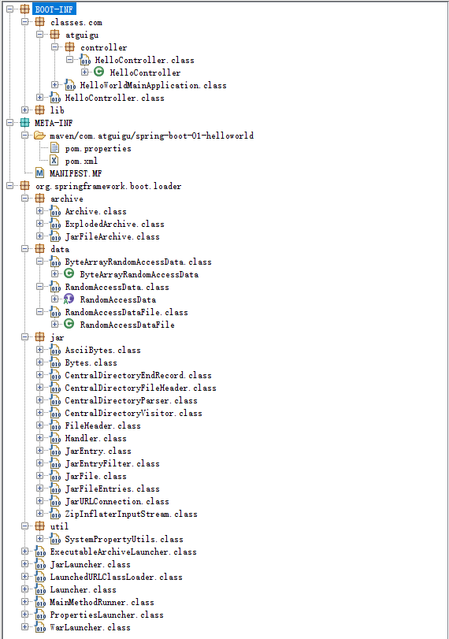

# SpringBoot入门

---

## 环境要求

| Springboot | JDK  |
| ---------- | ---- |
| 1.x        | 1.7+ |
| 2.x        | 1.8+ |

## Spring Boot 1.x

这里使用 `1.5.9.RELEASE` 。

### maven 插件

```xml
<build>
    <plugins>
        <!-- 这个插件，可以将应用打包成一个可执行的jar包；-->
        <plugin>
            <groupId>org.springframework.boot</groupId>
            <artifactId>spring-boot-maven-plugin</artifactId>
        </plugin>
    </plugins>
</build>
```

- 使用该插件，打的包可以直接用 `java -jar` 命令来执行， `jar` 包结构如下：

  

- 若不用该插件，打的包不能直接用 `java -jar` 命令来执行，会提示 `xxx.jar中没有主清单属性` 。

  

- 使用插件打包会比不使用插件打包，多 `lib` 和 `org.springframework.boot.loader` 目录，前者包含项目依赖，后者包含项目启动的相关类。

