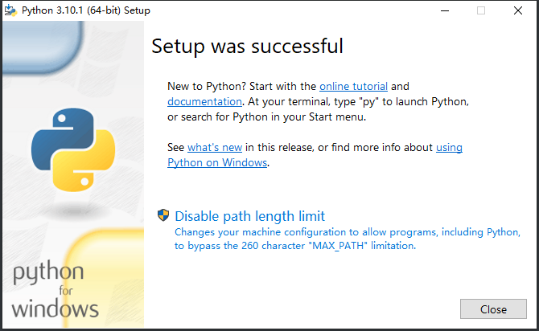

# Python入门

---

## 开发三件套

### 解释器

- Python 是解释型语言，即运行Python程序时，Python解释器将Python源代码一条一条先解释成机器码，再交给操作系统执行。
- 因此，Python为不同操作系统设计不同的解释器，即可实现跨平台。
- 我们通常说的安装Python，其实就是安装Python解释器。

### 编辑器

- 用于编写Python代码。

### 包管理工具

- 即管理Python库的工具。

### 最佳实践

- `Python 3.x + PyCharm + Miniconda`

## 执行Python程序方式

### Python解释器

- **解释器** 的种类：
  - `CPython` : 官方的用 `C` 语言编写的版本。
  - `Jython` : 用 `Java` 语言编写的可以运行在 `Java` 平台的版本。
  - `IronPython` : 可以运行在 `.NET` 和 `Mono` 平台。
  - `PyPy` : 用 `Python` 实现的，支持 `JIT` 即时编译。
- 直接编写文本文件，执行 Python 程序时，只需执行 `python xxx.py` (Python 2.x 及其以下版本) 或 `python3 xxx.py` (Python 3.x 版本)命令即可。

### 交互式方法

即 直接在 `Python Shell` 中执行 Python 的代码。

- 命令行输入 `python` 即可进入 `Python Shell` 。
- 执行 `exit()` 或者 `ctrl + z` 即可退出 `Python  Shell`

### IPython

## 安装Python

### Windows

1. 安装Python，自定义安装路径，一路next（最后我点击了 `Disable Path length limit` ）。

   

   

2. 配置环境变量。

   path 环境变量加上 Python 的安装路径。

   

3. 验证是否安装成功。

   ```shell
   # 命令行输入（注意 V 是大写）
   python -V
   # 输出
   Python 3.10.1
   ```

3. 设置pip镜像

   在 `C:\Users\xxx\pip\pip.ini` 下加入如下配置 ：
   
   ```sh
   [global] 
   index-url=http://pypi.douban.com/simple/
   [install]
   trusted-host=pypi.douban.com
   ```
   
   或执行： `pip config set global.index-url https://pypi.douban.com/simple/` 
   
   ```crystal
   常用镜像
   - 豆瓣 https://pypi.doubanio.com/simple/
   - 网易 https://mirrors.163.com/pypi/simple/
   - 阿里云 https://mirrors.aliyun.com/pypi/simple/
   - 清华大学 https://pypi.tuna.tsinghua.edu.cn/simple/
   ```

### macOS

1. 无脑下一步。

2. 配置环境变量。

   ```sh
   
   ```

   

3. 
