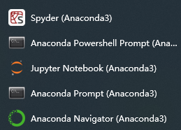

# 名词解释

**参考：**

```wiki
1. https://www.cnblogs.com/moyui/articles/12556700.html
2. https://www.cnblogs.com/blackcat-meow/p/10504680.html
3. https://www.cnblogs.com/mishdong123rousi/p/9646705.html
4. https://mp.weixin.qq.com/s?__biz=Mzg2NzYyNjg2Nw==&mid=2247490284&idx=1&sn=34931b236e7775285a6c9eecbb6d00f2&source=41#wechat_redirect
5. https://zhuanlan.zhihu.com/p/81025311
```


## Python

指 `Python` 语言。

```crystal
其中 Python2.x 和 Python3.x 差别很大， Python2.x 编写的程序可能无法在 Python3.x 环境下运行。
```


## pip

pip 是安装 Python 自带的 **包管理工具** ，但是 pip 不会自动处理包之间的依赖关系。

```crystal
1、pip 和 pip3 版本不同，但都位于 Scripts\ 目录下。
2、如果系统中只安装了 Python2 ，那么就只能使用 pip 。
3、如果系统中只安装了 Python3 ，那么既可以使用 pip 也可以使用 pip3 ，二者是等价的。
4、如果系统中同时安装了 Python2 和 Python3 ，则 pip 默认给 Python2 用，pip3 指定给 Python3 用。
5、重要：虚拟环境中，若只存在一个 Python 版本，可以认为 pip 和 pip3 命令都是相同的

# 镜像
https://pypi.tuna.tsinghua.edu.cn/simple/
```


## virtualenv

virtualenv 是一个 **环境管理工具** ，使用 virtualenv 可以创建一个完全隔离的环境，但 virtualenv 只能创建基于 **本机已存在的 Python 版本** 的虚拟环境。


## pipenv

相当于 `pip` + `virtualenv` ，但是 `pipenv` 的 依赖管理能力强于 `pip` ，比 `pip` 更方便。


## Poetry

1. Poetry 和 Pipenv 类似，是一个 Python 虚拟环境和依赖管理工具。
2. 另外它还提供了包管理功能，比如打包和发布。
3. 可以把它看做是 Pipenv 等类似工具的超集。
4. Poetry 可以同时管理 Python 库和 Python 程序。


## conda

1. 可以把 `conda` 看作是 `pip` + `virtualenv` + `PVM (Python Version Manager)` + 一些必要的底层库，也就是一个更完整也更大的集成管理工具。
2. conda 是一个 **包管理工具** ，可以安装多种语言（包括 Python ）的包，它具有完美的包依赖关系处理能力，不用过分地去手动处理包之间的依赖关系。
3. conda 也是一个 **环境管理工具** ，可以创建 **任意 Python 版本** 的虚拟隔离环境。

```yaml
# 镜像
https://mirrors.tuna.tsinghua.edu.cn/anaconda/pkgs/main/
https://mirrors.tuna.tsinghua.edu.cn/anaconda/pkgs/free/
```


## Anaconda

Anaconda 是一个开源的 Python 发行版本，其包含了 conda、Python 等软件包，以及 numpy、pandas（数据分析）、scipy等科学计算包。


## Miniconda

Miniconda 功能等同于 Anaconda ，但它只包含 Anaconda 最基本的内容—— python 与 conda ，以及必要的依赖项，所占空间小于 Anaconda 。


## Pycharm

Python 软件的开发工具。

# 安装Python

1. 安装Python，自定义安装路径，一路next（最后我点击了 `Disable Path length limit` ）。

   

   

2. 配置环境变量。

   path 变量后面加上 Python 的安装路径。

   

3. 验证是否安装成功。

   ```shell
   # 命令行输入（注意 V 是大写）
   python -V
   # 输出
   Python 3.10.1
   ```

   

# 安装Anaconda

1. 选择安装目录，无脑下一步。安装的软件如下：

   

2. 其中，Anaconda Navigator 是一个可视化面板，管理Anaconda已安装的软件。

   点击 Environments 可以管理 Python 的库。

   

3. Jupyter Notebook 是基于网页的用于交互计算的应用程序。其可被应用于全过程计算：开发、文档编写、运行代码（不止Python）和展示结果。

4. Spyder 是一个简单的集成开发环境。和其他的 Python 开发环境相比，它最大的优点就是模仿 MATLAB 的 “工作空间” 的功能，可以很方便地观察和修改数组的值。

# 安装PyCharm

选择安装目录，无脑下一步。

# 常用 PyPI 镜像

- 豆瓣 https://pypi.doubanio.com/simple/
- 网易 https://mirrors.163.com/pypi/simple/
- 阿里云 https://mirrors.aliyun.com/pypi/simple/
- 清华大学 https://pypi.tuna.tsinghua.edu.cn/simple/
