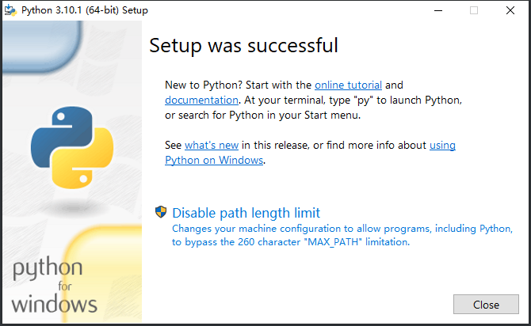

## 安装Python

1. 安装Python，自定义安装路径，一路next（最后我点击了 `Disable Path length limit` ）。

   

   

2. 配置环境变量。

   path 变量后面加上 Python 的安装路径。

   

3. 验证是否安装成功。

   ```shell
   # 命令行输入（注意 V 是大写）
   python -V
   # 输出
   Python 3.10.1
   ```

   

## 安装Anaconda

1. 选择安装目录，无脑下一步。安装的软件如下：

   

2. 其中，Anaconda Navigator 是一个可视化面板，管理Anaconda已安装的软件。

   点击 Environments 可以管理 Python 的库。

   

3. Jupyter Notebook 是基于网页的用于交互计算的应用程序。其可被应用于全过程计算：开发、文档编写、运行代码（不止Python）和展示结果。

4. Spyder 是一个简单的集成开发环境。和其他的 Python 开发环境相比，它最大的优点就是模仿 MATLAB 的 “工作空间” 的功能，可以很方便地观察和修改数组的值。

## 安装PyCharm

选择安装目录，无脑下一步。


## 设置镜像

### 常用镜像

- 豆瓣 https://pypi.doubanio.com/simple/
- 网易 https://mirrors.163.com/pypi/simple/
- 阿里云 https://mirrors.aliyun.com/pypi/simple/
- 清华大学 https://pypi.tuna.tsinghua.edu.cn/simple/

### 设置pip镜像

在 `C:\Users\xxx\pip\pip.ini` 下加入如下配置 ：

```sh
[global] 
index-url=http://pypi.douban.com/simple/
[install]
trusted-host=pypi.douban.com
```

或执行： `pip config set global.index-url https://pypi.douban.com/simple/` 
