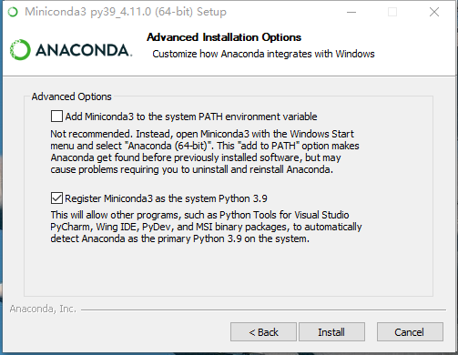

# Conda入门

---

## 安装

### Windows

#### 安装Anaconda

1. 具体安装步骤参考Miniconda。安装后包括的软件如下：

   

2. 其中，Anaconda Navigator 是一个可视化面板，管理Anaconda已安装的软件。

   点击 Environments 可以管理 Python 的库。

   

3. Jupyter Notebook 是基于网页的用于交互计算的应用程序。其可被应用于全过程计算：开发、文档编写、运行代码（不止Python）和展示结果。

4. Spyder 是一个简单的集成开发环境。和其他的 Python 开发环境相比，它最大的优点就是模仿 MATLAB 的 “工作空间” 的功能，可以很方便地观察和修改数组的值。


#### 安装MiniConda

1. 到此地址下载 `MiniConda Installer` ：https://docs.conda.io/en/latest/miniconda.html 。

2. 双击安装，选择安装位置，到这里取消勾选两个复选框。

   

   这里如果勾选了这个两个复选框，则会在系统环境变量 `path` 中加入如下几项：

   ```sh
   E:\devtools\sdk\conda\miniconda4.11.0 # 此项是把conda自带的python加入环境变量
   E:\devtools\sdk\conda\miniconda4.11.0\Library\mingw-w64\bin
   E:\devtools\sdk\conda\miniconda4.11.0\Library\usr\bin
   E:\devtools\sdk\conda\miniconda4.11.0\Library\bin
   E:\devtools\sdk\conda\miniconda4.11.0\Scripts # 此项可以把conda加入环境变量
   ```

   - 如果不加此项：`E:\devtools\sdk\conda\miniconda4.11.0\Library\bin` ，则下载依赖包时，会报如下的错误。
   - 因为下载依赖包时，需要用到此目录中的 `libcrypto-1_1-x64.dll` 和 `libssl-1_1-x64.dll` 两个文件；如果不加此项，需要将这两个文件复制进 `\DLLs` 目录中。

   ```sh
   PS E:\codes\python\start\EIN-SELD> conda env create -f environment.yml
   Collecting package metadata (repodata.json): failed
   
   CondaHTTPError: HTTP 000 CONNECTION FAILED for url <https://conda.anaconda.org/pytorch/win-64/repodata.json>
   Elapsed: -
   
   An HTTP error occurred when trying to retrieve this URL.
   HTTP errors are often intermittent, and a simple retry will get you on your way.
   'https://conda.anaconda.org/pytorch/win-64'
   ```

3. 添加环境变量。

   ```properties
   # 新增 CONDA_HOME 
   CONDA_HOME = E:\devtools\sdk\conda\miniconda4.11.0
   
   # 在 Path 中新增如下几项：
   %CONDA_HOME%\Scripts
   %CONDA_HOME%\Library\bin
   %CONDA_HOME%\Library\mingw-w64\bin
   %CONDA_HOME%\Library\usr\bin
   ```

4. 添加镜像：在 `C:\Users\nigre\.condarc` 中加入如下配置（如果没有则新建该文件）。

   - 配置后执行 `conda clean --i` 以清除索引缓存，保证用的是镜像站提供的索引。
   - 下载依赖时可能需要多试几次（可能要关闭代理）。
   - 下面配置参见清华镜像：https://mirrors.tuna.tsinghua.edu.cn/help/anaconda/

   ```yaml
   channels:
     - defaults
   show_channel_urls: true
   default_channels:
     - https://mirrors.tuna.tsinghua.edu.cn/anaconda/pkgs/main
     - https://mirrors.tuna.tsinghua.edu.cn/anaconda/pkgs/r
     - https://mirrors.tuna.tsinghua.edu.cn/anaconda/pkgs/msys2
   custom_channels:
     conda-forge: https://mirrors.tuna.tsinghua.edu.cn/anaconda/cloud
     msys2: https://mirrors.tuna.tsinghua.edu.cn/anaconda/cloud
     bioconda: https://mirrors.tuna.tsinghua.edu.cn/anaconda/cloud
     menpo: https://mirrors.tuna.tsinghua.edu.cn/anaconda/cloud
     pytorch: https://mirrors.tuna.tsinghua.edu.cn/anaconda/cloud
     simpleitk: https://mirrors.tuna.tsinghua.edu.cn/anaconda/cloud
   ```

5. 配置代理，在 `C:\Users\nigre\.condarc` 中加入如下配置：

   ```yaml
   proxy_servers: {http: http://localhost:7890, https: http://localhost:7890}
   ```

   若使用代理，而不使用镜像，则配置文件最终可以这样：
   
   ```yaml
   channels:
     - anaconda
     - conda-forge
     - msys2
     - bioconda
     - menpo
     - pytorch
     - simpleitk
     - defaults
   
   proxy_servers: {http: http://localhost:7890, https: http://localhost:7890}
   ```
   
   

## Conda 官方包

https://anaconda.org/
