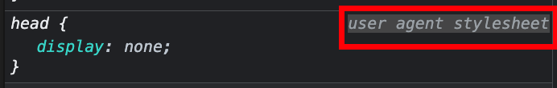

# 概念

---

## 什么是CSS

- **[CSS](https://developer.mozilla.org/en-US/docs/Glossary/CSS)** (Cascading Style Sheets)

## CSS的作用

- `document` : 指 HTML , SVG , XML 等标记语言构建的文件。
- `presenting` :  意味着将 `document` 转换成受众可用的形式，这就是 **浏览器** 的作用
- **浏览器** 通常被称为 `user agent` (即代表人的计算机程序)；除了 **浏览器** 外，如那些将 HTML  和 CSS 转换成 PDF 的工具也可以被称为 `user agent` 。
- CSS的作用：
  - **基础样式** ，如颜色、尺寸等
  - **布局**
  - **效果** ，如动画

## 关于默认样式

### 解释

- 之所以不 **显式** 使用 `CSS` 浏览器就能为不同的元素渲染不同的样式，是因为浏览器使用了 **默认样式** 。
- `browser defaults` , `user agent styles` , `UA styles` , `UA styles sheets` 这几个词都是表示浏览器的 **默认样式** 。
- **默认样式** 通常长时间内不会改变，不过我们可以使用 [reset.css](https://meyerweb.com/eric/tools/css/reset/) 或者 [normalizer.css](https://github.com/necolas/normalize.css/) 等工具去覆盖 **默认样式** 。

### 查看默认样式

- inspector 带有 `user agent stylesheet` 字样的样式即为 **默认样式**



- [各浏览器的默认样式文件](https://stackoverflow.com/a/6867287)

## CSS语法

### 解释

- CSS 是一个 **rule-based** 语言 ：通过指定应用于网页上 **特定元素或元素组** 的 **样式组** 来定义规则。

### 语法

```css
h1 {
  color: red;
  font-size: 5em;
}
```

- 以 `selector` 开头。
- 以 `{}` 包裹多个 `属性: 值` 对，以 `;` 分隔多个样式。

### 属性值

- 不同的属性，可选的值不同。
  - 比如 `color` 只能使用颜色; `font-size` 只能使用不同单位的尺寸。
- 可以在这里查看可以使用的CSS属性:  [CSS reference](https://developer.mozilla.org/en-US/docs/Web/CSS/Reference)
- 可以通过搜索引擎搜索 `mdn css-feature-name` 来搜索相应的属性，如 `mdn color`

## CSS specifications

- CSS 规范，由 W3C 的 CSS Working Group 维护，它由 **浏览器厂商** 、 **一些对CSS感兴趣的公司** 和 **特邀专家** 组成。
- 新的CSS特性被开发，通常有以下几种情况：
  - 某个浏览器厂商，对一些新能力感兴趣。
  - web设计者和开发者想要新功能。
  - 工作组本身确定了一个新需求。
- 关于CSS规范一个关键的事情是：新版规范不应该打破原来的规则。
- CSS规范主要是作为 user agent 实现功能的参考，不是为我们开发者准备的。
- 不同浏览器对CSS的支持情况不同，我们可以在  [CSS reference](https://developer.mozilla.org/en-US/docs/Web/CSS/Reference) 查看各浏览器对属性的支持情况。

---

## 参考

1. MDN : [What is CSS?](https://developer.mozilla.org/en-US/docs/Learn/CSS/First_steps/What_is_CSS)