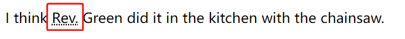

# HTML文本

---

## 网页文本结构

### `<hn>` 层级结构最佳实践

1. 一个页面只有一个 `<h1>` 。
2. 要按层级顺序来使用 `<hn>` ，例如不应该将 `<h2>` 作为 `<h3>` 的子级。
3. 六个 `<hn>` 标签，在一个页面中，最多只用到第三层，其他更深层的内容最好在其他页面展示。

### 为什么我们需要一个好的文本结构

1. 便于用户查看内容。
2. 利于 SEO (Search Engine Optimization) 。
3. 便于视障人士找到他想要的内容 (否则他可能需要听完整个网页的内容)。
4. 便于 css 和 js 的使用。

### 为什么要使用语义化的标签

同样在页面呈现一个 **标题** ，我们可以有一下两种做法：

1. 使用 `<h1>` 标签。

   ```html
   <h1>This is a top level heading</h1>
   ```

   

2. 使用 `<span>` + css 。

   ```html
   <span style="font-size: 32px; margin: 21px 0; display: block;">Is this a top level heading?</span>
   ```

- 虽然最终实现的效果一致，但是第一种方式更友好，因为更易于人类和机器阅读。
- 所以尽量使用 **语义化** 的标签。

## lang 属性

### `<html>`

- 用于指定网页使用的主要语言。
- **作用：**
  - 可用于正确地显示文字。
  - 可以用于 **网页阅读器** 为 **视障用户** 读出正确的读音（比如法语和英语中都有six，但读音不同）。
- 可选值：zh-CN、en-US

```html
<html lang="zh-CN">
  …
</html>
```

### 其他标签

```html
<p>Japanese example: <span lang="ja">ご飯が熱い。</span>.</p>
```

## 强调

### `<em>`

- 用 **斜体** 表示 强调; **screen reader** 会用不一样的语气读这个标签中的内容。
- 注：如果仅仅是要使用 **斜体** ，最好用 `<span>` +  `css` 或者 `<i>` 标签。

### `<strong>`

- 用 **粗体** 表示 强调; **screen reader** 会用不一样的语气读这个标签中的内容。
- 注：如果仅仅是要使用 **粗体** ，最好用 `<span>` +  `css` 或者 `<b>` 标签。

### `<mark>`

- 给文字加黄色背景(黄色马克笔效果)

## presentational elements(表象元素)

- 仅仅影响 **样式** ，而没有 **语义** 的元素。

### 种类

- `<b>` : 加粗。
- `<i>` : 斜体。
- `<u>` : 下划线。(建议仅将下划线用于链接，因为人们已经认为有下划线的文字是个链接)

## 不常用文本元素

### `<dl>` 描述列表

可用于 **名词解释** ；也可用于 **问答** 。

- `<dl>` : description list 描述列表
- `<dt>` : description term 描述项
- `<dd>` : description details 描述详情，会有 **缩进** 的效果。

```html
<dl>
  <dt>soliloquy</dt>
  <dd>
    In drama, where a character speaks to themselves, representing their inner
    thoughts or feelings and in the process relaying them to the audience (but
    not to other characters.)
  </dd>
  <dt>monologue</dt>
  <dd>
    In drama, where a character speaks their thoughts out loud to share them
    with the audience and any other characters present.
  </dd>
  <dt>aside</dt>
  <dd>
    In drama, where a character shares a comment only with the audience for
    humorous or dramatic effect. This is usually a feeling, thought, or piece of
    additional background information.
  </dd>
</dl>
```

**一个 `<dt>` 对应多 `<dd>`**

```html
<dl>
  <dt>aside</dt>
  <dd>
    In drama, where a character shares a comment only with the audience for
    humorous or dramatic effect. This is usually a feeling, thought, or piece of
    additional background information.
  </dd>
  <dd>
    In writing, a section of content that is related to the current topic, but
    doesn't fit directly into the main flow of content so is presented nearby
    (often in a box off to the side.)
  </dd>
</dl>
```

### `<blockquote>` 块引用

- 引用的内容会有 **缩进** 的效果。
- `cite` : 指定引用内容的链接。

```html
<p>Here is a blockquote:</p>
<blockquote cite="https://developer.mozilla.org/en-US/docs/Web/HTML/Element/blockquote">
  <p>
    The <strong>HTML <code>&lt;blockquote&gt;</code> Element</strong> (or
    <em>HTML Block Quotation Element</em>) indicates that the enclosed text is
    an extended quotation.
  </p>
</blockquote>
```

### `<q>` 行内引用

- 引用的内容会被 **引号** 引起来。
- `cite` : 指定引用内容的链接。

```html
<p>
    The quote element — <code>&lt;q&gt;</code> — is
    <q cite="https://developer.mozilla.org/en-US/docs/Web/HTML/Element/q">
        intended for short quotations that don't require paragraph breaks.
    </q>
</p>
```

### `<cite>` 引文

- 被引用的文字会以 **斜体** 显示。

```html
<cite>MDN blockquote page</cite>
```

- `<blockquote>` 和 `<q>` 的 `cite` 属性都无法被 **浏览器** 或者 **screen readers** 等读到，所以好像并未起任何作用。
- 所以可以通过加 `<a>` 标签的方式使用 `<cite>` 标签 (会呈现一个 **斜体** 的 **超链接** )

```html
<a href="/en-US/docs/Web/HTML/Element/blockquote">
    <cite>
        MDN blockquote page
    </cite>
</a>
```

### `<abbr>` 缩写

- `abbreviation` : 缩略语，如 HTML, Hypertext Markup Language
- `acronym` : 首字母缩略词，如 Rev. , Reverend
- `<abbr>` : 可以用于表明这是一个 abbreviation 或 acronym
- `title` 属性 : 会有 **下滑点线** 的显示效果； **鼠标悬浮** 会显示 title 属性的值。
  - 

```html
<p>
    We use <abbr>HTML</abbr>, Hypertext Markup Language, to structure our web
    documents.
</p>

<p>
    I think <abbr title="Reverend">Rev.</abbr> Green did it in the kitchen
    with the chainsaw.
</p>
```

- 曾经存在 `<acronym>` 专门展示 acronym，现已废除。

