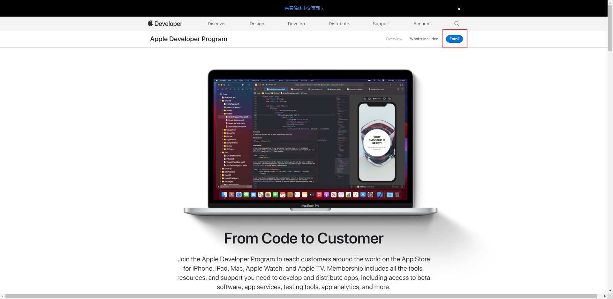
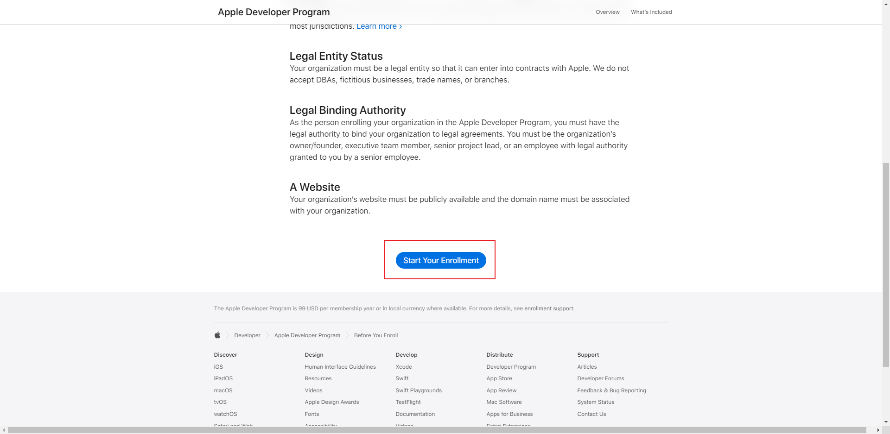
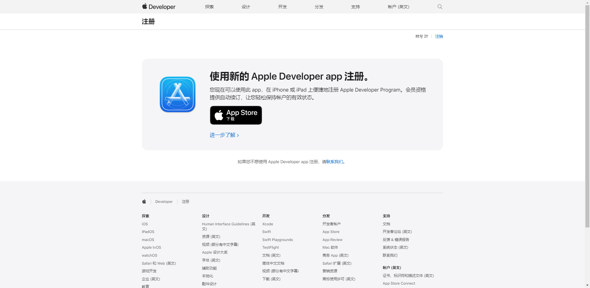
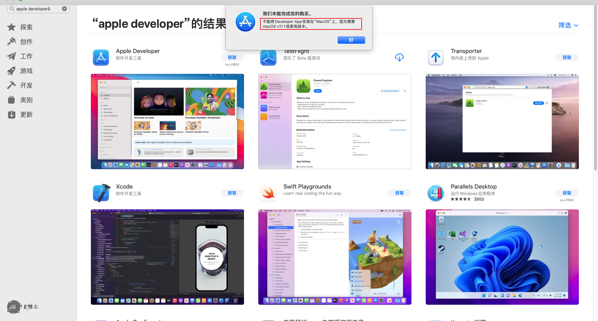

# 开发前准备

---

## Windows 环境下开发

**参考：**

1. 申请ios证书：https://www.cnblogs.com/lzzxm/p/14750409.html

---

1. 在 **VMware** 上，安装 `macOS` 系统，参见：[安装macOS](/常用工具/虚拟机工具/VMware/安装macOS)

2. 在虚拟机上，访问此网页：https://developer.apple.com/programs/，点击 `Enroll` ，即 **注册** 。

   

3. 点击 `Start Your Enrollment` 。

   

4. 提示需要从 `App Store` 安装 `Apple Developer app` 。

   

5. 由于虚拟机安装的 macOS 版本过低，无法安装。

   

2. 此时，我们可以选择安装更高版本的 `macOS` ，也可以在 `iPhone` 上安装 `Apple Developer app` 进行注册。