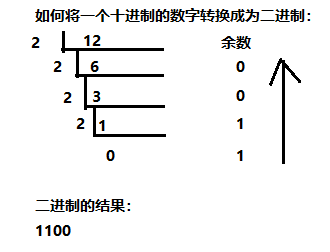
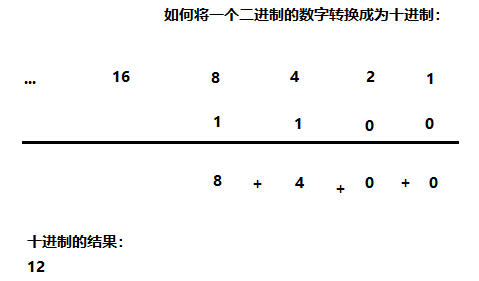

# 数据的表示和运算

---

## 二进制

> 二进制只包含0、1两个数，逢二进一，1+1=10。每一个0或者每一个1就是一个位，叫做一个bit（比特）。

**① 十进制数据转成二进制数据：** 

使用除以2获取余数的方式



**② 二进制数据转成十进制数据：** 

使用8421编码的方式



### 存储单位

> 字节是我们常见的计算机中最小存储单元。计算机存储任何的数据，都是以字节的形式存储。8个bit（二进制位）表示为1个字节，写成 **1 byte** 或者 **1 B** 。

```java
8 bit = 1 B
1024 B = 1 KB
1024 KB = 1 MB
1024 MB = 1 GB
1024 GB = 1 TB
PB、EB、ZB、YB、BB、NB、DB
```

