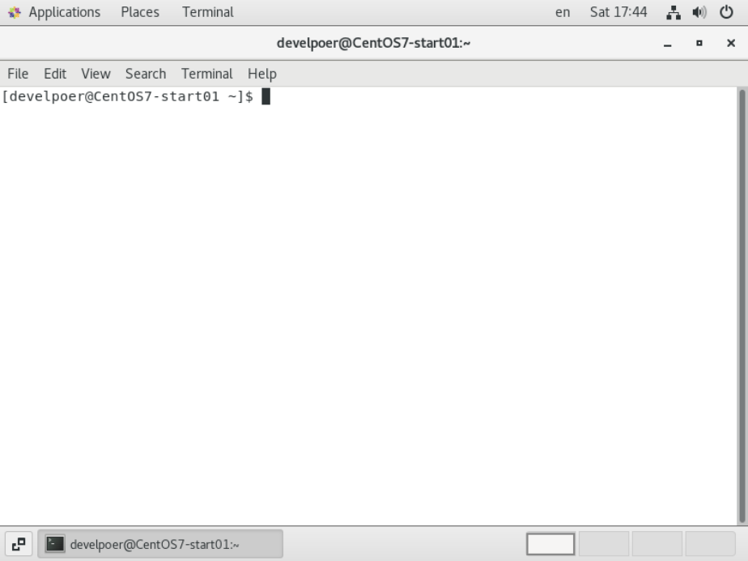
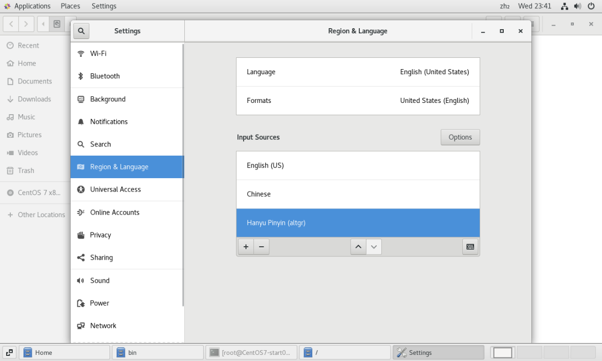
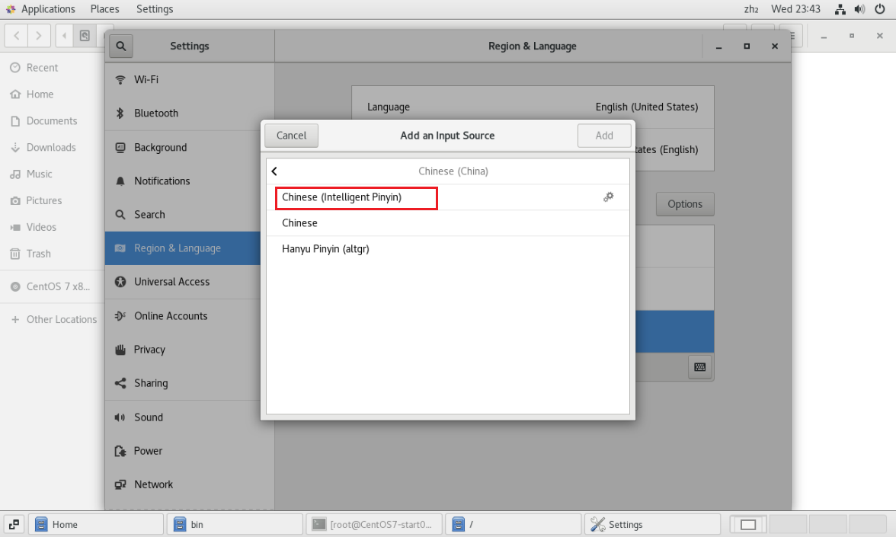
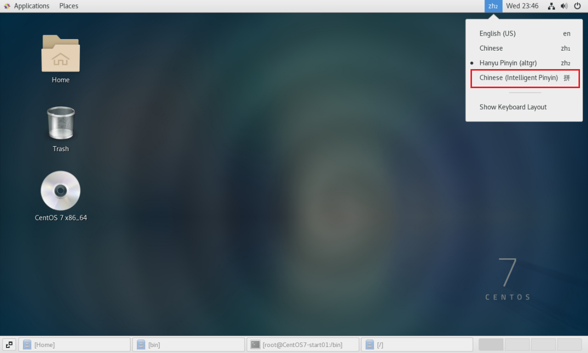
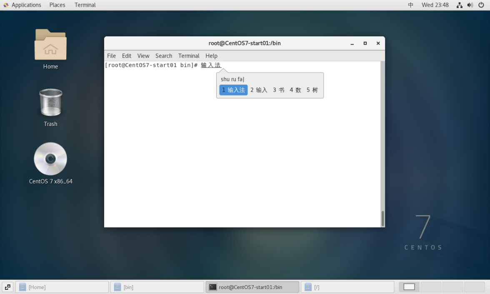

# CentOS系统相关

---

## 桌面与终端

- 一种是桌面右键菜单中的终端。
- 一种是Linux系统原始的终端。

### 桌面与原始终端的切换

#### ubuntu

- 按 `ctrl + alt + Fn` 可以新建 `shell` 终端（n 的范围是 [1, 6]）
- 按 `ctrl + alt + F7` 可以回到桌面 

#### CentOS

- 按 `ctrl + alt + Fn` 可以新建 `shell` 终端（n 的范围是 [2, 6]）
- 按 `ctrl + alt + F1` 可以回到桌面 

### 终端介绍

```sh
[develpoer@CentOS7-start01 ~]$ 
```

- `develpoer` 用户名
- `CentOS7-start01` 主机名
- `~` 当前目录
- 普通用户是 `$` ，root 用户是 `#` 



## 配置

### 设置中文输入法

- 依次单击 `Applications` -> `System Tools` -> `Settings` -> `Region & Language` 

  

- 依次点击 `+` -> `Chinese (China)` -> `Chinese (Intelligent Pinyin)` -> 右上角 `Add` 

  注意：貌似只有 `Chinese (Intelligent Pinyin)` 才能正常使用拼音输入。

  

- 使用快捷键 `Super + Space` ，或系统界面右上角的输入法，即可更换输入法。

  

- 使用效果如下图所示：

  

  
