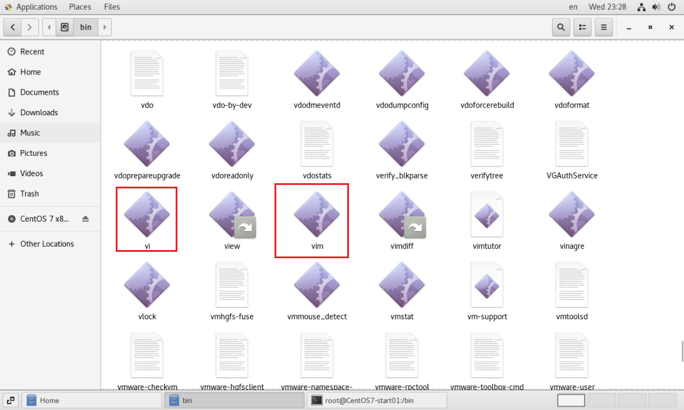
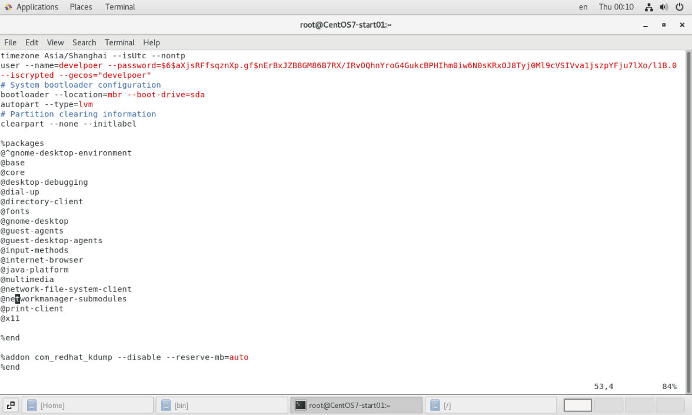
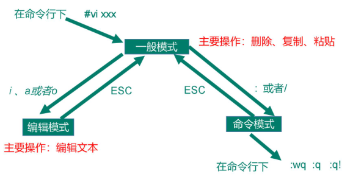

# VIM编辑器

---

## 什么是 VIM

- VIM 编辑器发展自 VI ，VIM 与 VI 编辑器完全兼容。

- VI 是 Unix 操作系统和类 Unix 操作系统中最通用的文本编辑器。

- VIM 有语法高亮，而 VI 没有。

- 在 `/bin` 目录下，我们可以看到 `VI` 和 `VIM` 同时存在。

  

## VIM 界面

- 右下角三个字符分别表示 **行数** **列数**  **滚动条滑过的百分比** (未滑动过，则显示 **TOP** ；滑到底，则显示 **BOT** )

  

## 三种模式

### 图示

### 一般模式

#### 进入编辑模式

- `i` 
- `a`
- `o`

#### 编辑

- `u` 撤回到你此次打开VIM后的上一次保存。

### 编辑模式

- 

### 命令模式

- `w`
- 

## VIM 命令
