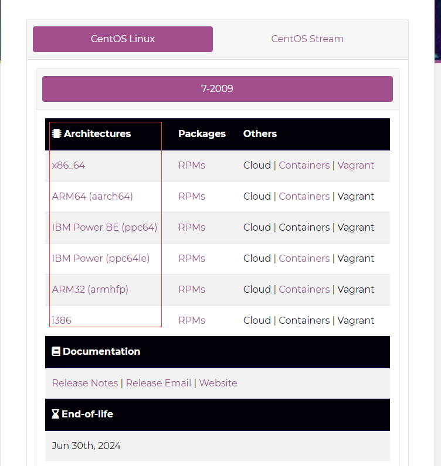
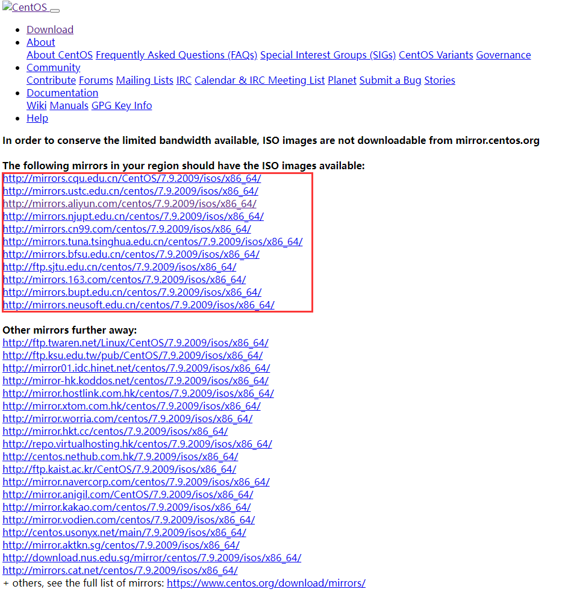
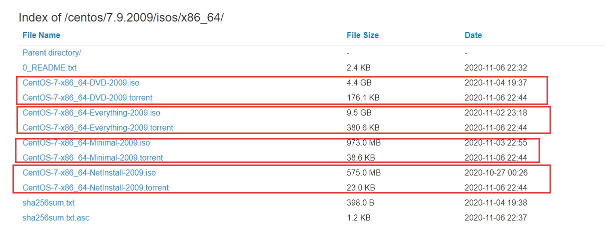

# 下载Linux

---

## 下载CentOS

### 阿里云镜像

- http://mirrors.aliyun.com/centos/7.9.2009/isos/x86_64/

### 官网下载

1. 访问官方下载地址：https://www.centos.org/download/

2. 点击相应的架构。

   

3. 选择任何一个镜像去下载。

   

   

### 版本

- CentOS 7 将支持到2024年，而 CentOS 8 在2021年底已停止支持。
- 将来 CentOS Linux 将被 CentOS Stream 代替。

### 安装包

- 有DVD、Everything、Minimal、NetInstall四种体量的安装包。