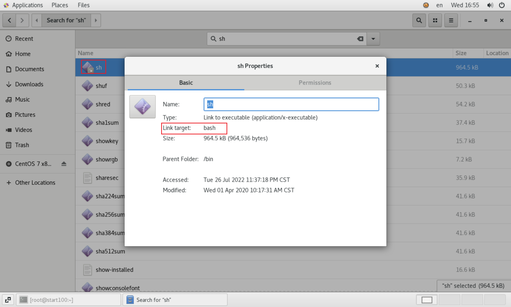

# 常用命令

---

## 关于shell

### 不同实现

- 在不同的Linux系统中，有不同的shell 。
- 如 Linux 默认的 bash、 debian 的 dash等。
- bash (Bourne-Again SHell) 源自 UNIX 的 Bourne shell 。

### sh

- 打开 shell 其实就是执行了 `/bin` 目录中的 sh 命令

- 我们查看 CentOS 下的 `sh` 命令的属性，可以看到它链接到了同目录下的 `bash` 命令。

  

## 命令分类

- shell 命令可分为 **内置命令** 和 **外部命令** 。

### 内置命令 (built-in)

- 直接 **内嵌** 在 shell 中，系统加载启动之后会随着 shell 一起加载， **常驻系统内存** 中 的一部分 **基础功能** 命令。
- 如 `cd` `exit` 等

### 外部命令

- 区别于 **内置命令** 的命令

### type

- 用于查看命令属于 **内置命令** 还是 **外置命令**

```sh
[root@start100 ~]# type cd
cd is a shell builtin
[root@start100 ~]# type exit
exit is a shell builtin
[root@start100 ~]# type ls
ls is aliased to `ls --color=auto'
[root@start100 ~]# type useradd
useradd is /usr/sbin/useradd
[root@start100 ~]# type history
history is a shell builtin
```

### 原生命令

- 我们使用 `type` 命令时，可以看到有些命令是 **命令本身加了参数** 的 **别名** ，比如 `ls` : 

  ```sh
  [root@start100 ~]# type ls
  ls is aliased to `ls --color=auto'
  ```

- 而在命令前加上 `\` 执行，则可以执行 **不加任何参数的原生命令** 。

  - 比如执行 `\ls` ，则展示的内容没有颜色进行区分。

### alias

- 使用 `alias` 命令可以展示所有使用 **别名** 的命令。

```sh
[root@start100 /]# alias
alias cp='cp -i'
alias egrep='egrep --color=auto'
alias fgrep='fgrep --color=auto'
alias grep='grep --color=auto'
alias l.='ls -d .* --color=auto'
alias ll='ls -l --color=auto'
alias ls='ls --color=auto'
alias mv='mv -i'
alias rm='rm -i'
alias which='alias | /usr/bin/which --tty-only --read-alias --show-dot --show-tilde'
```

## 帮助命令

### man

#### 解释

- 即 `manual` ，手册; 获得帮助信息
- `man [命令或配置文件]`

执行 `man ls` 

```sh
LS(1)                            User Commands                           LS(1)

NAME
       ls - list directory contents

SYNOPSIS
       ls [OPTION]... [FILE]...

DESCRIPTION
       List  information  about  the FILEs (the current directory by default).
       Sort entries alphabetically if none of -cftuvSUX nor --sort  is  speci‐
       fied.

       Mandatory  arguments  to  long  options are mandatory for short options
       too.

       -a, --all
              do not ignore entries starting with .

       -A, --almost-all
              do not list implied . and ..

       --author

```

| 信息        | 描述                     |
| ----------- | ------------------------ |
| NAME        | 命令的名称和单行描述     |
| SYNOPSIS    | 如何使用命令             |
| DESCRIPTION | 命令功能的详细描述       |
| EXAMPLES    | 使用命令的例子           |
| SEE ALSO    | 相关主题（通常是手册页） |

#### 查看内置命令

- 查看 **外部命令** 可以像上面那样，但是查看 **内置命令** 需要使用 `man -f 命令名`

```sh
[root@start100 ~]# man -f cd
cd (1)               - bash built-in commands, see bash(1)
cd (1p)              - change the working directory
```

- 我们可以看到有两行信息，这是表明在这两个文档中都有它的解释。

- 执行 `man 1 cd` 或 `man 1p cd` 即可进入相应的解释中。

- 执行 `man 1 cd` 进入的是 `bash` 命令的通用解释中，这与直接执行 `man cd` 效果一致。

  ```sh
  BASH_BUILTINS(1)            General Commands Manual           BASH_BUILTINS(1)
  
  NAME
         bash,  :,  .,  [, alias, bg, bind, break, builtin, caller, cd, command,
         compgen, complete, compopt,  continue,  declare,  dirs,  disown,  echo,
         enable,  eval,  exec, exit, export, false, fc, fg, getopts, hash, help,
         history, jobs, kill, let, local, logout, mapfile, popd, printf,  pushd,
         pwd,  read, readonly, return, set, shift, shopt, source, suspend, test,
         times, trap, true, type, typeset, ulimit, umask, unalias, unset, wait -
         bash built-in commands, see bash(1)
  
  BASH BUILTIN COMMANDS
         Unless otherwise noted, each builtin command documented in this section
         as accepting options preceded by - accepts -- to signify the end of the
         options.   The  :, true, false, and test builtins do not accept options
         and do not treat -- specially.  The exit, logout, break, continue, let,
         and  shift builtins accept and process arguments beginning with - with‐
         out requiring --.  Other builtins that accept  arguments  but  are  not
         specified  as accepting options interpret arguments beginning with - as
         invalid options and require -- to prevent this interpretation.
         : [arguments]
                No effect; the command does nothing beyond  expanding  arguments
                and  performing any specified redirections.  A zero exit code is
  
  ```

- 执行 `man 1p cd` 即可查看 `cd` 的详细解释。

  ```sh
  CD(1P)                     POSIX Programmer's Manual                    CD(1P)
  
  PROLOG
         This  manual  page is part of the POSIX Programmer's Manual.  The Linux
         implementation of this interface may differ (consult the  corresponding
         Linux  manual page for details of Linux behavior), or the interface may
         not be implemented on Linux.
  
  NAME
         cd - change the working directory
  
  SYNOPSIS
         cd [-L | -P] [directory]
  
         cd -
  
  DESCRIPTION
         The cd utility shall change the working directory of the current  shell
         execution  environment  (see Shell Execution Environment ) by executing
         the following steps in sequence. (In the following  steps,  the  symbol
         curpath  represents an intermediate value used to simplify the descrip‐
         tion of the algorithm used by cd. There is no requirement that  curpath
         be made visible to the application.)
  
  ```

#### `man man`

- `man man` 可以用于查看 man 命令本省的解释。

### help

#### 内置命令

- 执行 `help 内置命令名称` 可以查看 **内置命令** 的帮助文档，比 man 更简洁一些。

如执行  `help cd`

```sh
[root@start100 ~]# help cd
cd: cd [-L|[-P [-e]]] [dir]
    Change the shell working directory.
    
    Change the current directory to DIR.  The default DIR is the value of the
    HOME shell variable.
    
    The variable CDPATH defines the search path for the directory containing
    DIR.  Alternative directory names in CDPATH are separated by a colon (:).
    A null directory name is the same as the current directory.  If DIR begins
    with a slash (/), then CDPATH is not used.
    
    If the directory is not found, and the shell option `cdable_vars' is set,
    the word is assumed to be  a variable name.  If that variable has a value,
    its value is used for DIR.
    
    Options:
        -L	force symbolic links to be followed
        -P	use the physical directory structure without following symbolic
    	links
        -e	if the -P option is supplied, and the current working directory
    	cannot be determined successfully, exit with a non-zero status
    
    The default is to follow symbolic links, as if `-L' were specified.
    
    Exit Status:
    Returns 0 if the directory is changed, and if $PWD is set successfully when
    -P is used; non-zero otherwise.

```

#### 外部命令

- 执行 `外部命令名 --help` 。

如执行 `ls --help`

```sh
[root@start100 ~]# ls --help
Usage: ls [OPTION]... [FILE]...
List information about the FILEs (the current directory by default).
Sort entries alphabetically if none of -cftuvSUX nor --sort is specified.

Mandatory arguments to long options are mandatory for short options too.
  -a, --all                  do not ignore entries starting with .
  -A, --almost-all           do not list implied . and ..
      --author               with -l, print the author of each file
  -b, --escape               print C-style escapes for nongraphic characters
      --block-size=SIZE      scale sizes by SIZE before printing them; e.g.,
                               '--block-size=M' prints sizes in units of
                               1,048,576 bytes; see SIZE format below
  -B, --ignore-backups       do not list implied entries ending with ~
  -c                         with -lt: sort by, and show, ctime (time of last
                               modification of file status information);
                               with -l: show ctime and sort by name;
                               otherwise: sort by ctime, newest first
  -C                         list entries by columns
      --color[=WHEN]         colorize the output; WHEN can be 'never', 'auto',
                               or 'always' (the default); more info below
  -d, --directory            list directories themselves, not their contents
  -D, --dired                generate output designed for Emacs' dired mode
  -f                         do not sort, enable -aU, disable -ls --color
  -F, --classify             append indicator (one of */=>@|) to entries
      --file-type            likewise, except do not append '*'
      --format=WORD          across -x, commas -m, horizontal -x, long -l,
                               single-column -1, verbose -l, vertical -C
      --full-time            like -l --time-style=full-iso
  -g                         like -l, but do not list owner
      --group-directories-first
                             group directories before files;
                               can be augmented with a --sort option, but any
                               use of --sort=none (-U) disables grouping
  -G, --no-group             in a long listing, don't print group names
  -h, --human-readable       with -l, print sizes in human readable format
                               (e.g., 1K 234M 2G)
      --si                   likewise, but use powers of 1000 not 1024
  -H, --dereference-command-line
                             follow symbolic links listed on the command line
      --dereference-command-line-symlink-to-dir
                             follow each command line symbolic link
                               that points to a directory
      --hide=PATTERN         do not list implied entries matching shell PATTERN
                               (overridden by -a or -A)
      --indicator-style=WORD  append indicator with style WORD to entry names:
                               none (default), slash (-p),
                               file-type (--file-type), classify (-F)
  -i, --inode                print the index number of each file
  -I, --ignore=PATTERN       do not list implied entries matching shell PATTERN
  -k, --kibibytes            default to 1024-byte blocks for disk usage
  -l                         use a long listing format
  -L, --dereference          when showing file information for a symbolic
                               link, show information for the file the link
                               references rather than for the link itself
  -m                         fill width with a comma separated list of entries
  -n, --numeric-uid-gid      like -l, but list numeric user and group IDs
  -N, --literal              print raw entry names (don't treat e.g. control
                               characters specially)
  -o                         like -l, but do not list group information
  -p, --indicator-style=slash
                             append / indicator to directories
  -q, --hide-control-chars   print ? instead of nongraphic characters
      --show-control-chars   show nongraphic characters as-is (the default,
                               unless program is 'ls' and output is a terminal)
  -Q, --quote-name           enclose entry names in double quotes
      --quoting-style=WORD   use quoting style WORD for entry names:
                               literal, locale, shell, shell-always, c, escape
  -r, --reverse              reverse order while sorting
  -R, --recursive            list subdirectories recursively
  -s, --size                 print the allocated size of each file, in blocks
  -S                         sort by file size
      --sort=WORD            sort by WORD instead of name: none (-U), size (-S),
                               time (-t), version (-v), extension (-X)
      --time=WORD            with -l, show time as WORD instead of default
                               modification time: atime or access or use (-u)
                               ctime or status (-c); also use specified time
                               as sort key if --sort=time
      --time-style=STYLE     with -l, show times using style STYLE:
                               full-iso, long-iso, iso, locale, or +FORMAT;
                               FORMAT is interpreted like in 'date'; if FORMAT
                               is FORMAT1<newline>FORMAT2, then FORMAT1 applies
                               to non-recent files and FORMAT2 to recent files;
                               if STYLE is prefixed with 'posix-', STYLE
                               takes effect only outside the POSIX locale
  -t                         sort by modification time, newest first
  -T, --tabsize=COLS         assume tab stops at each COLS instead of 8
  -u                         with -lt: sort by, and show, access time;
                               with -l: show access time and sort by name;
                               otherwise: sort by access time
  -U                         do not sort; list entries in directory order
  -v                         natural sort of (version) numbers within text
  -w, --width=COLS           assume screen width instead of current value
  -x                         list entries by lines instead of by columns
  -X                         sort alphabetically by entry extension
  -1                         list one file per line

SELinux options:

  --lcontext                 Display security context.   Enable -l. Lines
                             will probably be too wide for most displays.
  -Z, --context              Display security context so it fits on most
                             displays.  Displays only mode, user, group,
                             security context and file name.
  --scontext                 Display only security context and file name.
      --help     display this help and exit
      --version  output version information and exit

SIZE is an integer and optional unit (example: 10M is 10*1024*1024).  Units
are K, M, G, T, P, E, Z, Y (powers of 1024) or KB, MB, ... (powers of 1000).

Using color to distinguish file types is disabled both by default and
with --color=never.  With --color=auto, ls emits color codes only when
standard output is connected to a terminal.  The LS_COLORS environment
variable can change the settings.  Use the dircolors command to set it.

Exit status:
 0  if OK,
 1  if minor problems (e.g., cannot access subdirectory),
 2  if serious trouble (e.g., cannot access command-line argument).

GNU coreutils online help: <http://www.gnu.org/software/coreutils/>
For complete documentation, run: info coreutils 'ls invocation'
```

## shell快捷键

| 快捷键 / 命令 | 功能                                                        |
| ------------- | ----------------------------------------------------------- |
| `ctrl + c`    | 停止进程                                                    |
| `ctrl+l`      | 非完全清屏，只是将窗口显示的内容向上移；相当于 `clear` 命令 |
| `tab`         | 提示                                                        |
| 上下键        | 查找执行过的命令                                            |

## 清屏命令

| 快捷键 命令 | 功能                                                         |
| ----------- | ------------------------------------------------------------ |
| `clear`     | 非完全清屏，只是将窗口显示的内容向上移；相当于快捷键 `ctrl+l` |
| `reset`     | 完全清屏                                                     |

## 文件目录命令

### pwd 

- 即 `print working directory` , 打印 **当前工作目录(绝对路径)** 。
- 内置命令。
- `pwd -P`  : 显示实际路径（而不是软链接路径）

### ls

- 即 `list` 列出当前工作目录下的内容。

| 参数    | 功能                                                         |
| ------- | ------------------------------------------------------------ |
| `ls -a` | 列出目录下所有内容, 包括隐藏文件( 即以 `.` 开头的文件)       |
| `ls -l` | 列出目录下所有内容的详细信息，文件的属性与权限等；等价于 `ll` |

```sh
# 列出的信息依次为
# 文件类型与权限 链接数 文件属主 文件属组 文件大小(byte) 创建或最近修改时间 名称
[root@start100 /]# ll
total 28
lrwxrwxrwx.   1 root root    7 Jul  4 03:17 bin -> usr/bin
dr-xr-xr-x.   5 root root 4096 Jul  4 03:21 boot
drwxr-xr-x.  19 root root 3280 Aug 15 23:06 dev
drwxr-xr-x. 144 root root 8192 Jul 27 00:44 etc
drwxr-xr-x.   3 root root   23 Jul  4 03:21 home
lrwxrwxrwx.   1 root root    7 Jul  4 03:17 lib -> usr/lib
lrwxrwxrwx.   1 root root    9 Jul  4 03:17 lib64 -> usr/lib64
drwxr-xr-x.   2 root root    6 Apr 11  2018 media
drwxr-xr-x.   2 root root    6 Apr 11  2018 mnt
drwxr-xr-x.   3 root root   16 Jul  4 03:19 opt
dr-xr-xr-x. 270 root root    0 Aug 15 23:06 proc
dr-xr-x---.  16 root root 4096 Aug 15 23:12 root
drwxr-xr-x.  41 root root 1220 Aug 15 23:09 run
lrwxrwxrwx.   1 root root    8 Jul  4 03:17 sbin -> usr/sbin
drwxr-xr-x.   2 root root    6 Apr 11  2018 srv
dr-xr-xr-x.  13 root root    0 Aug 15 23:06 sys
drwxrwxrwt.  29 root root 4096 Aug 15 23:08 tmp
drwxr-xr-x.  13 root root  155 Jul  4 03:17 usr
drwxr-xr-x.  21 root root 4096 Jul  4 03:22 var

[root@start100 ~]# ll
total 8
-rw-------. 1 root root 1749 Jul  4 03:21 anaconda-ks.cfg
drwxr-xr-x. 2 root root    6 Jul  4 03:32 Desktop
drwxr-xr-x. 2 root root    6 Jul  4 03:32 Documents
drwxr-xr-x. 2 root root    6 Jul  4 03:32 Downloads
-rw-r--r--. 1 root root 1797 Jul 14 00:26 initial-setup-ks.cfg
drwxr-xr-x. 2 root root    6 Jul  4 03:32 Music
drwxr-xr-x. 2 root root    6 Jul  4 03:32 Pictures
drwxr-xr-x. 2 root root    6 Jul  4 03:32 Public
drwxr-xr-x. 2 root root    6 Jul  4 03:32 Templates
drwxr-xr-x. 2 root root    6 Jul  4 03:32 Videos
```

- 其中 【文件类型与权限】 列：
  - 如果以 `d` 开头，则表示 **普通目录** ；
  - 如果以 `-` 开头，则表示 **文件** ；
  - 如果以 `l` 开头，则表示 **链接目录** 或 **链接文件** 。

### cd

- **语法** : `cd [参数]`

| 参数          | 功能                                 |
| ------------- | ------------------------------------ |
| `cd 绝对路径` | 切换路径                             |
| `cd 相对路径` | 切换路径                             |
| `cd ~` / `cd` | 回到自己的家目录                     |
| `cd -`        | 回到上一次所在目录                   |
| `cd ..`       | 回到当前目录的上一级目录             |
| `cd -P 路径`  | 跳转到实际物理路径，而非快捷方式路径 |

解释一下 `cd -P 路径` :

```sh
[root@start100 bin]# cd /bin
[root@start100 bin]# pwd
/bin
[root@start100 ~]# cd -P /bin
[root@start100 bin]# pwd
/usr/bin
```

- 可以看到加了 `-P` 参数后, 进入的是 **物理目录** , 而非 **链接目录** 。

### mkdir

- 即 `Make directory` 创建目录。

| 参数                               | 功能                                                     |
| ---------------------------------- | -------------------------------------------------------- |
| `mkdir 目录路径`                   | 创建 **一个** 目录                                       |
| `mkdir 目录路径1 目录路径2 ...`    | 创建 **多个** 目录                                       |
| `mkdir -p 目录路径`                | 创建 **一个** 多层目录(即如果路径中有目录不存在，则创建) |
| `mkdir -p 目录路径1 目录路径2 ...` | 创建 **多个** 多层目录(即如果路径中有目录不存在，则创建) |

### rmdir

- 即 `Remove directory` 移除 **空目录** (注意：只能是空目录)。

| 参数                               | 功能                                                         |
| ---------------------------------- | ------------------------------------------------------------ |
| `rmdir 目录路径`                   | 删除 **一个** 空目录                                         |
| `rmdir 目录路径1 目录路径2 ...`    | 删除 **多个** 空目录                                         |
| `rmdir -p 目录路径`                | 删除 **一个** 多层空目录(即如果删除目录后，其父目录为空，则也会被删除) |
| `rmdir -p 目录路径1 目录路径2 ...` | 删除 **多个** 多层空目录(即如果删除目录后，其父目录为空，则也会被删除) |

```sh
[root@start100 /]# rmdir /a
rmdir: failed to remove ‘/a’: Directory not empty
[root@start100 /]# rmdir -p /a
rmdir: failed to remove ‘/a’: Directory not empty
[root@start100 /]# rmdir -p a/apple/s
```

- 注意：使用绝对路径 `rmdir -p /a/apple/s` 执行删除时，会试图判断 `/` 目录是否可以删除。

- ```sh
  [root@start100 /]# rmdir -p /a/apple/s
  rmdir: failed to remove directory ‘/’: Device or resource busy
  ```

### touch

- 创建文件
- **语法** : `touch 文件路径` 
- 使用 `vim 文件路径` 在保存之后，也可以创建新文件。

### cp

- 即 `copy` 复制文件或目录。
- **语法** : `cp [选项] source dest` 

| 选项 | 功能               |
| ---- | ------------------ |
| `-r` | 递归复制整个文件夹 |

| 参数     | 功能                                                         |
| -------- | ------------------------------------------------------------ |
| `source` | 源路径；可以是 **文件路径** ，也可以是 **目录路径** (这种情况必须使用 `-r` 选项) |
| `dest`   | 目标路径；如果是 **目录路径** ，则表示将 **源文件/目录** 复制到目标目录下；如果是 **文件路径** ，则表示将源文件内容写入目标文件中；如果目标文件已存在，则会出现是否覆盖目标文件原有内容的提示：y 覆盖，n 取消 |

- 使用 **原生命令** `\cp` ，在出现覆盖时，不会出现是否覆盖的提示。

### rm

- 即 `remove` 
- **语法** : `rm [选项] 文件路径/目录路径` 

| 选项 | 功能                                   |
| ---- | -------------------------------------- |
| `-r` | 递归删除目录中所有内容                 |
| `-f` | 强制执行删除操作，而不提示用于进行确认 |
| `-v` | 显示指令的详细执行过程                 |

#### 删除一个目录及其所有子内容

```sh
[root@start100 /]# rm -rf /a
```

#### 删除一个目录下所有子内容

```sh
[root@start100 /]# ls /g
a  b  h
[root@start100 /]# rm -rf /g/*
```

#### 删除根目录下所有内容

```sh
rm -rf /*
```

### mv

- 即 `move` 移动文件与目录或重命名

| 语法                   | 功能                              |
| ---------------------- | --------------------------------- |
| `mv 文件路径 目录路径` | 将文件移动到指定目录下            |
| `mv 文件路径 文件路径` | 将文件移动到指定路径并 **重命名** |
| `mv 目录路径 目录路径` | 将目录移动到指定目录下            |

### cat

- 即 `catch` 从 **第一行** 开始显示文件 **所有** 内容。
- **语法** : `cat [选项] 文件路径`

| 选项 | 功能                               |
| ---- | ---------------------------------- |
| `-n` | 显示所有行的 **行号** ，包括空行。 |

### more

- 文件内容 **分屏** 查看器
- `more` 指令是一个基于 VI 编辑器的 **文本过滤器**
- 它以 **全屏幕** 的方式， **按页显示** 文本文件的内容
- **语法** : `more 文件路径`

#### 快捷键

| 快捷键     | 功能                                        |
| ---------- | ------------------------------------------- |
| `Space`    | 向下翻 **一页**                             |
| `Enter`    | 向下翻 **一行**                             |
| `q`        | 退出                                        |
| `Ctrl + f` | 向下滚动一屏                                |
| `f`        | 跳过后面的内容，退出；会显示 **跳过的行数** |
| `b`        | 返回上一屏                                  |
| `=`        | 输出当前 **已滚动过** 的行数                |
| `:f`       | 输出 **文件名** 和当前 **已滚动过** 的行数  |

### less

- **分屏** 查看文件内容，功能与 `more` 类似，但更强大：
  - `less` 支持 **各种显示终端**
  - `less` 并不是 **一次将整个文件加载** 之后才显示，而是 **根据显示需要** 加载内容，对于显示 **大型文件** 具有 **较高的效率** 。
- **语法** : `less 文件路径`

| 快捷键                     | 功能                                         |
| -------------------------- | -------------------------------------------- |
| `space` / `pagedown` / `f` | 向下翻 **一页**                              |
| `pageup` / `b`             | 向上翻 **一页**                              |
| `/字符串`                  | 向下搜索字符串: **n：向下查找；N：向上查找** |
| `?字符串`                  | 向上搜索字符串: **n：向上查找；N：向下查找** |
| `=`                        | 当前页数信息                                 |
| `g`                        | 跳到 **开头**                                |
| `shift + G`                | 跳到 **结尾**                                |
| `q`                        | 退出                                         |

### echo

- 输出内容到控制台
- **语法** : `echo [选项] [输出内容]`
- 输出内容最好用 **引号** 

| 选项 | 功能         |
| ---- | ------------ |
| `-e` | 输出转义字符 |

- `echo` 可以输出系统的 **环境变量** , 如 `echo $HOME` , 输入 `$` 后, 可以按 `tab` 补全

### head

- 显示文件的开头内容, 默认 **前10行** , 即 `head 文件路径`
- **语法** : `head [选项] 文件路径`

| 选项      | 功能           |
| --------- | -------------- |
| `-n 行数` | 指定显示的行数 |

### tail

- 显示文件的尾部内容, 默认 **后10行** , 即 `tail 文件路径`
- **语法** : `tail [选项] 文件路径`

| 选项      | 功能                                                         |
| --------- | ------------------------------------------------------------ |
| `-n 行数` | 指定显示的行数                                               |
| `-f`      | 实时显示文件新增；按 `ctrl + s` 可以 **暂停** 实时显示，按 `ctrl + q` 可以 **继续** 实时显示 |

### `>` 与 `>>` 

- 输出重定向，将命令输出的内容写入文件中。
- **语法** : `命令表达式 > 文件路径` 或 `命令表达式 >> 文件路径`
- `>` 表示 **覆盖写入** , `>>` 表示 **追加写入** 。

### ln

#### 软链接与硬连接

- Linux  系统中，每一个硬盘上的物理文件，都带有一个存储文件 **元数据** 的 **inode** 
- 创建 **硬链接** 即创建了一个指向文件 **inode** 的 **链接**
- 而创建 **软链接** 则创建了一个 **链接文件** ，存储了文件 **inode** 的地址。

#### 创建软链接

- 创建 **软链接** 的 **语法** : `ln -s [文件路径或目录路径] [软链接路径]` 
- **软链接** , 也称为 **符号链接** , 类似于 windows 中的 **快捷方式** , 有自己的 **数据块** , 主要存放 **文件的实际路径**

#### 删除软链接

- ` rm -rf 软链接路径` , 而不是 ` rm -rf 软链接路径/` 。
- 如果使用后者，会把软链接对应的 **真实目录** 下内容删掉（ **真实目录** 本身还存在）；因为其实不管是 **文件** 的 **软链接** , 还是 **目录** 的 **软链接** , 它都是被视为一个特殊的 **文件** 。

#### 创建硬链接

- **语法** : `ln [文件路径] [硬链接路径]` 

## history 命令

- 查看 **历史命令** 

| 语法           | 功能                    |
| -------------- | ----------------------- |
| `history`      | 查看 历史命令           |
| `history 数字` | 查看 最近几条历史命令   |
| `!数字`        | 查看 指定行数的历史命令 |
| `history -c`   | **清除** 历史命令       |

```sh
[root@start100 ~]# history 10
  346  ls -a
  347  cd ~
  348  more anaconda-ks.cfg
  349  man more
  350  more anaconda-ks.cfg
  351  poweroff
  352  ln --help
  353  type ln
  354  history
  355  history 10
```

## 时间日期类命令

