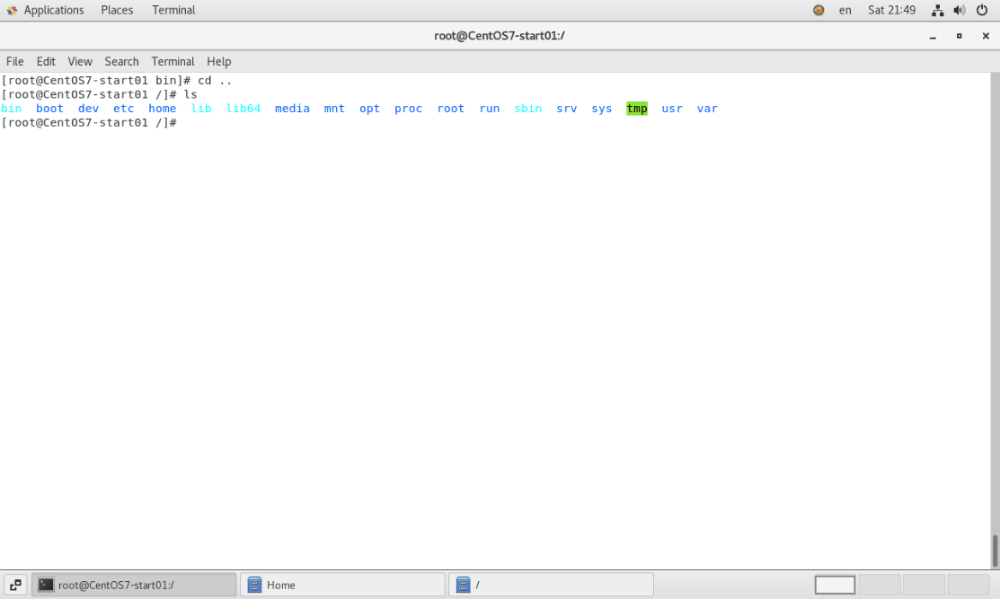
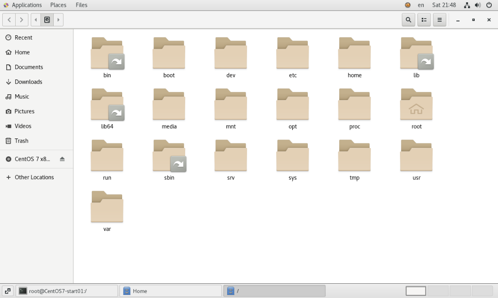
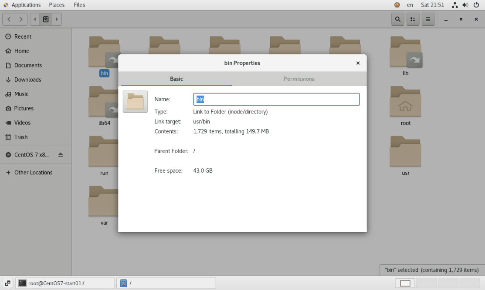
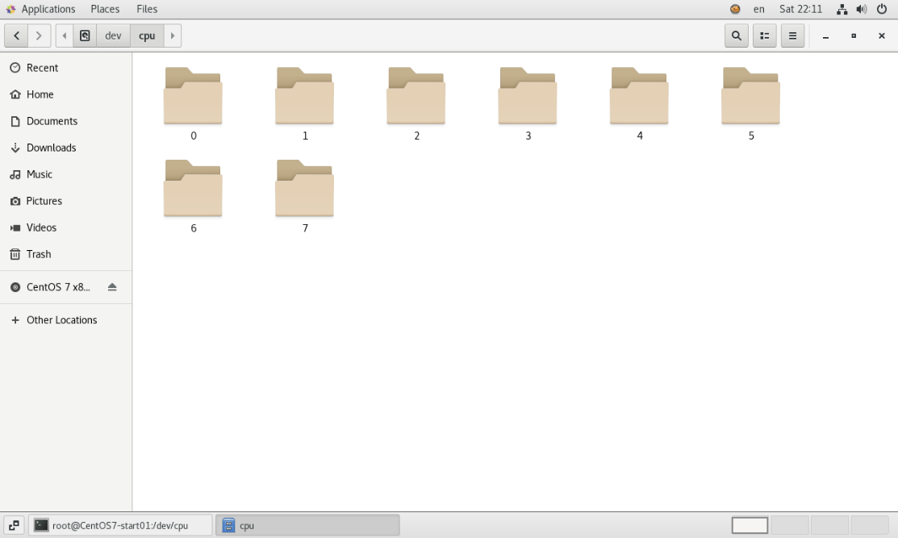
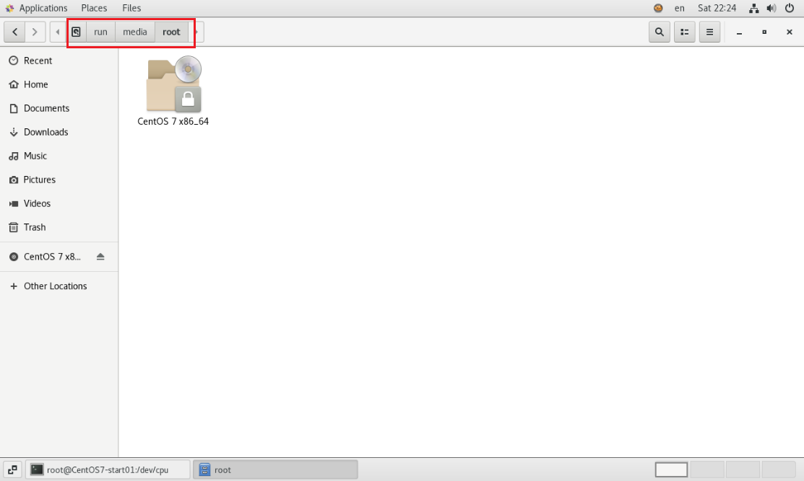

# 文件系统

---

> 以 CentOS 7 为例

## 一切皆文件

- Linux 系统中，一切皆文件。

## 目录结构

## 目录介绍

### 常用目录

#### 链接目录

- 在 `/` 目录下，我们可以看到 `/bin` , `lib` , `lib64` 和 `sbin` 这个几个目录颜色和其他目录不一样，这是因为他们并非真实的目录，而是链接目录，相当于 Windows 中的快捷方式

- 可以看到在图形化界面中，他们的图标有个跳转的标志。

- 右击 `bin` 目录，选择 `properties` 可以看到这个 `Link target` 是 `usr/bin` ，我们进入到  `/usr/bin` 和进入 `/bin` 是一样的。

##### /bin

- Binary 的缩写，存放着经常使用的命令。

##### /sbin

- s 是 Super User 的意思，这里存放的是 **系统管理员** 使用的 **系统管理程序** 。

##### /lib

- 系统运行所需要的库，类似于 Windows 中的 DLL 文件，该目录类似于 Windows 的 `C:\Windows\System32` 目录。
- 几乎所有的应用程序都要用到这个目录下的库。

##### /lib64

- 系统运行所需要的 64位的 特殊的库，该目录类似于 Windows 的 `C:\Windows\System` 目录。

#### /usr

- 存放用户所有的应用程序和文件，相当于 Windows 的 Program Files 目录 。
- 上述的四个链接目录，都实际存放在 `/usr` 目录下。

#### /boot

- 存放启动 Linux 时使用的一些核心文件，包括一些 **链接文件** 和 **镜像文件** 。

#### /dev

- 即 devices ，设备目录，把所有的硬件用文件的形式存储。

- 比如我们进入 `/dev/cpu` ，可以发现有 `0 ~ 7` 8个目录，对应着我们安装虚拟机时指定的8个核心。

  

#### /etc

- 存放系统管理所需要的 **配置文件** 与 **子目录** 。

#### /home

- 存放所有普通用户的主目录，目录名称即账号名称。

#### /root

- root 用户的主目录。

#### /opt

- 即 optional，存放第三方软件的目录，默认是空的。比如 mysql 。

### 不常用但不要去动的目录

#### /media

- Linux CentOS 6 系统会自动识别一些设备，如 U盘、光驱等；当识别后，Linux会把识别的设备挂载到这个目录下。

- 而 CentOS 7，把这个目录迁移到 `/run/media` 。

- 我们进入 `/run/medis/root` 目录后，可以看到我们安装系统所使用的 iso 文件被挂载到了这个目录下。

  

#### /mnt

- Linux 系统提供该目录是为了让用户临时挂载 **别的文件系统** 的，我们可以将外部的存储挂载到 `/mnt` 目录下，然后进入该目录就可以查看存储设备里的内容了。

#### /proc

- 即 process ，进程目录。这是一个虚拟的目录，它是系统内存的映射，访问这个目录可以获取 **系统信息** 。

#### /run

- 运行目录，系统运行的实时信息，系统关闭后数据不会保留。

#### /srv

- 即 service，存放一些服务启动之后需要提取的数据。

#### /sys

- Linux 2.6 内核的一个大变化。该目录安装了 2.6 内核中新出现的文件系统 sysfs 。

### 不常用可以动的目录

#### /tmp

- 临时文件目录。

#### /var

- 存放一些不断扩充的东西。我们通常将日志文件放在这个目录下。