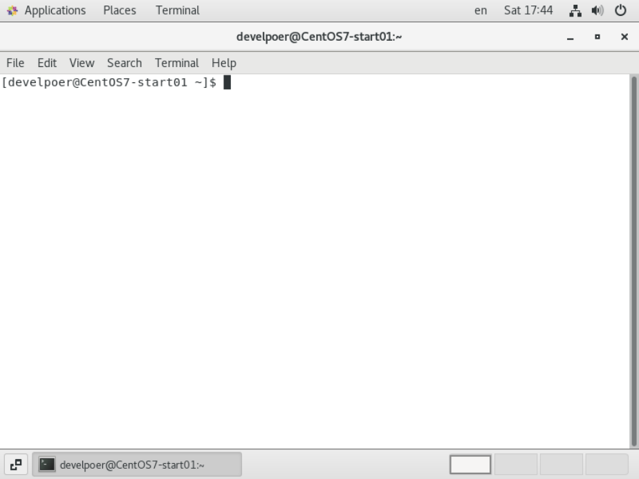

# 桌面和终端基本操作

## 两种终端

- 一种是桌面右键菜单中的终端。
- 一种是Linux系统原始的终端。

## 桌面与原始终端的切换

### ubuntu

- 按 `ctrl + alt + Fn` 可以新建 `shell` 终端（n 的范围是 [1, 6]）
- 按 `ctrl + alt + F7` 可以回到桌面 

### CentOS

- 按 `ctrl + alt + Fn` 可以新建 `shell` 终端（n 的范围是 [2, 6]）
- 按 `ctrl + alt + F1` 可以回到桌面 

## 终端介绍

```sh
[develpoer@CentOS7-start01 ~]$ 
```

- `develpoer` 用户名
- `CentOS7-start01` 主机名
- `~` 当前目录
- 普通用户是 `$` ，root 用户是 `#` 


