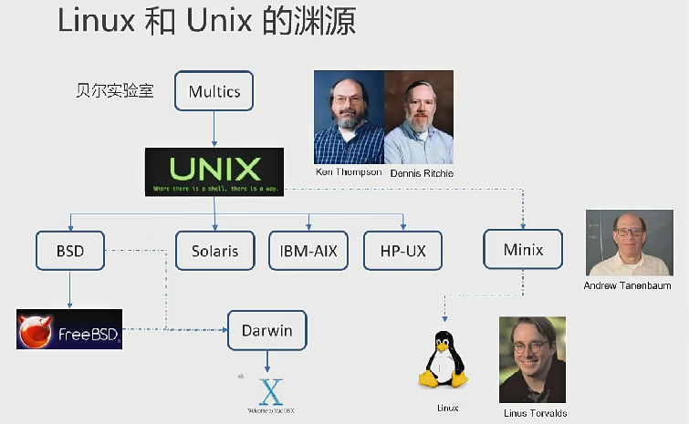
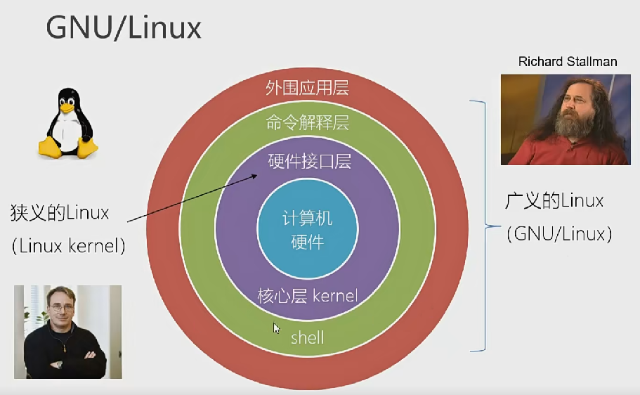

# 概念

---

## Linux与Unix

- Unix 后来是闭源的，荷兰教授 Andrew Tanenbaum 仿照 Unix 开发了 Minix 用于教学，并开源。
- Linus 基于 Minix 开发了 Linux 。

## GNU/Linux

- 狭义的 `Linux` 只是指 `Linux kernel` 。
- 广义的 `Linux` 是指在使用 `Linux kernel` 的基础上，开发自己的 `shell` 和 `外围应用程序` 的完整的操作系统，即 `GMU/Linux` ，也即 **Linux的发行版本** 。
- 我们常说的安装 `Linux` ，就是指 **广义的Linux** 。

## 常见的Linux发行版

- Red Hat 系列
  - Red Hat Enterprise Linux ( **企业版本** ，简写为 RHEL)
  - fedora ( **测试版本** ，更新很快，不够稳定；功能稳定后会添加到 **企业版本** )
  - CentOS (基于已经发布的 **企业版本** ，除去商标信息、有版权的代码等内容， **免费** )
- debian 系列 （社区类 Linux 典范，最遵循 GNU 规范的 Linux 系统；debian 有是三个分支： stable、testing 和 unstable）
  - ubuntu ( 基于 unstable 分支，做一些改进优化；有最新的软件包，bug较多；对 debian 的桌面进行了优化，桌面很漂亮； **免费** )
    - mint (基于 ubuntu，外观像早期Windows)
  - deepin (国产)
- SUSE ( **企业版本** ，简写为 SEL ，号称世界最华丽的操作系统，桌面使用漂亮的KDE)
  - open SUSE (社区版，免费)
- gentoo Linux
- arch Linux
  - manjaro

> 国内使用最多的是 CentOS 和 ubuntu 。

---

**参考：**

1. 尚硅谷Linux课程