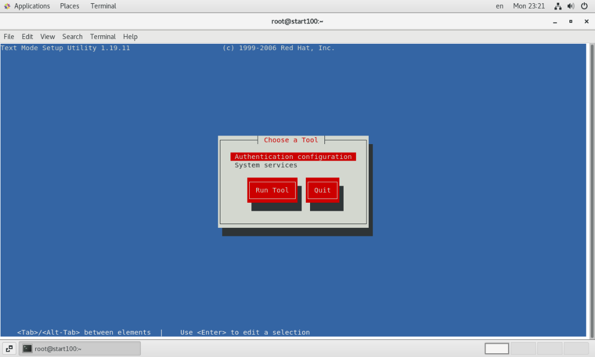
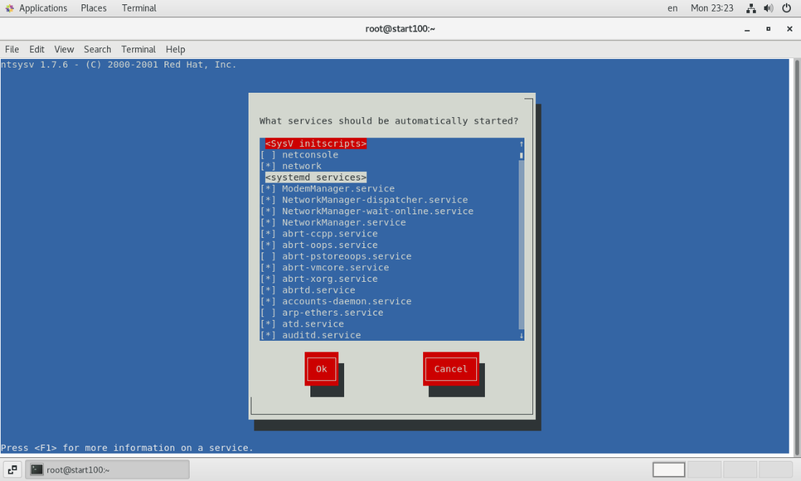

# 系统管理

---

## 进程与服务

- **进程(process)** : 一个正在执行的程序或命令。
- **服务(service)** : 启动之后一直存在、常驻内存的进程。 
- **系统服务** : 系统运行所需要的服务。
- **守护进程(daemon)** : 具体执行 **系统服务** 的进程

## 服务状态管理

### service 命令(CentOS6)

#### 基本语法

`service 服务名 start|stop|restart|status`

#### 查看所有服务

- CentOS 6 版本中，在 `/etc/init.d`  目录下保存了 service 命令可以操作的所有服务。
- 我们看到这里服务其实只有 netconsole 和 network (它们都是可执行文件) ，因为 CentOS 7 做了改动，改用 systemctl 命令，但仍兼容了 service 命令。

````sh
[root@start100 ~]# cd /etc/init.d/
[root@start100 init.d]# ls -a
.  ..  functions  netconsole  network  README
````

### systemctl 命令(CentOS7)

#### 基本语法

- 即 `system control`

`systemctl start|stop|restart|status 服务名` 

#### 查看所有服务

- CentOS 7 版本中，在 `/usr/lib/systemd/system` 目录下有着各种系统服务

  ```sh
  [root@start100 init.d]# ls /usr/lib/systemd/system
  abrt-ccpp.service                        plymouth-quit-wait.service
  abrtd.service                            plymouth-read-write.service
  abrt-oops.service                        plymouth-reboot.service
  abrt-pstoreoops.service                  plymouth-start.service
  abrt-vmcore.service                      plymouth-switch-root.service
  ........
  ```


## 系统运行级别

### Linux启动步骤


### 运行级别(CentOS6)

- 级别越高，支持的功能越丰富(6除外) 。
- Linux 系统有 7 种运行级别(runlevel)，常用的是 3 和 5 。
- 不同的运行级别，本质上就是开机自动启动的服务不同。

| 运行级别 | 描述                                                         |
| -------- | ------------------------------------------------------------ |
| 0        | 系统 **停机状态** ; 系统 **默认运行级别** 不能设置为 0，否则无法正常启动 |
| 1        | **单用户** 工作状态; **root 权限** ; 用于 **系统维护** ; 禁止远程登录 ; 只能在物理机上操作，多用于系统维护 |
| 2        | **多用户** 工作状态; 没有 **NFS(Network File System 网络文件系统)** ; 不支持网络 |
| 3        | **完全的多用户** 工作状态; 有 **NFS** ; 登录后进入 **命令行模式** |
| 4        | 系统未使用，保留                                             |
| 5        | X11 控制台，登录后进入图形GUI模式                            |
| 6        | 系统 **正常关闭并重启** ; 系统 **默认运行级别** 不能设置为 6，否则无法正常启动 |

### 运行级别(CentOS7)

由于运行级别 3 和 5 是最常用的，所以 CentOS7对运行级别进行了简化。

- `target` 等价于原运行级别 0
- `rescue.target` 等价于原运行级别 1
- `multi-user.target` 等价于原运行级别 3（多用户有网，无图形界面）
- `graphical.target` 等价于原运行级别 5（多用户有网，有图形界面）
- `reboot.target` 等价于原运行级别 6

### 运行级别命令(CentOS6)

#### 查看默认运行级别

- 配置在 `/etc/inittab` 文件中 ，CentOS7已弃用。

#### 设置当前运行级别

- 执行 `init 3` / `init 5` 可以立即更换系统运行级别

### 运行级别命令(CentOS7)

#### 查看默认运行级别

- `systemctl get-default`

  ```sh
  [root@start100 ~]# systemctl get-default
  graphical.target
  ```

#### 设置当前运行级别

- 执行 `systemctl isolate xxx.target` 可以立即更换系统运行级别

#### 设置默认运行级别

- `systemctl set-default xxx.target` 
- 重启系统生效。

## 各个概念关系总结

- Linux 系统有多个运行级别
- Linux 系统有多个服务，包括系统服务和用户自己部署的服务
- 我们可以设置系统启动的默认运行级别，也可以立即转换到不同的运行级别
- 每个运行级别对应的默认自启服务不同
- 我们可以通过 setup 图形化界面 与 chkconfig 、systemctl disable/enable 自定义某个级别的默认自启服务
- 我们也可以立即控制某个服务的开启和关闭

## 服务自启管理

### chkconfig(CentOS6)

| 命令                                    | 功能                                                         |
| --------------------------------------- | ------------------------------------------------------------ |
| `chkconfig 服务名 off`                  | 关闭指定服务的自启状态（针对所有相关的 **运行级别** ）       |
| `chkconfig 服务名 on`                   | 开启指定服务的自启状态（针对所有相关的 **运行级别** ）       |
| `chkconfig --level 指定级别 服务名 off` | 关闭指定级别且指定服务的自启状态                             |
| `chkconfig --level 指定级别 服务名 on`  | 开启指定级别且指定服务的自启状态                             |
| `chkconfig --list`                      | 查看所有服务(所有 chkconfig 能管理的服务)的自启状态（针对所有相关的 **运行级别** ） |
| `chkconfig 服务名 --list`               | 查看指定服务的自启状态（针对所有相关的 **运行级别** ）       |

- 我们可以看到 `chkconfig` 只能管理 `netconsole` 和 `network` 两个服务的自启状态，其他的服务被 CentOS 7的 `systemctl` 命令管理。

```sh
[root@start100 ~]# chkconfig --list

Note: This output shows SysV services only and does not include native
      systemd services. SysV configuration data might be overridden by native
      systemd configuration.

      If you want to list systemd services use 'systemctl list-unit-files'.
      To see services enabled on particular target use
      'systemctl list-dependencies [target]'.

netconsole     	0:off	1:off	2:off	3:off	4:off	5:off	6:off
network        	0:off	1:off	2:on	3:on	4:on	5:on	6:off

```

### setup

setup 可以在图形化界面设置各个服务的自启状态（针对所有相关的 **运行级别** ）

- 执行 `setup` 命令 可以进入图形化设置界面。

  

- 选择 `System services` 可以进入系统服务配置界面，这个界面可以配置 **开机自启** 的 **服务** 。

  

- 有 `*` 表示勾选，没有代表未勾选；按下空格键可以 **勾选** 或 **取消勾选** ；按 `tab` 键可以选择下方的红色按钮。

- `SysV initscripts` 是 CentOS 6版本的; `systemd services` 是 CentOS 7 版本的。

### systemctl(CentOS7)

#### 命令大全

| 命令                          | 功能                                                         |
| ----------------------------- | ------------------------------------------------------------ |
| `systemctl list-unit-files`   | 查看所有服务(所有 systemctl 能管理的服务)的自启状态（针对所有相关的 **运行级别** ） |
| `systemctl is-enabled 服务名` | 查看指定服务的自启状态（针对所有相关的 **运行级别** ）       |
| `systemctl disable 服务名 `   | 关闭指定服务的自启状态（针对所有相关的 **运行级别** ）       |
| `systemctl enable 服务名 `    | 开启指定服务的自启状态（针对所有相关的 **运行级别** ）       |

#### `systemctl list-unit-files`

- `enabled` / `disabled` 表示服务服务是否自启
- `static` 表示服务是其他服务启动时连带启动的

```sh
[root@start100 ~]# systemctl list-unit-files
UNIT FILE                                     STATE   
proc-sys-fs-binfmt_misc.automount             static  
dev-hugepages.mount                           static  
dev-mqueue.mount                              static  
proc-fs-nfsd.mount                            static  
proc-sys-fs-binfmt_misc.mount                 static  
run-vmblock\x2dfuse.mount                     disabled
sys-fs-fuse-connections.mount                 static  
sys-kernel-config.mount                       static  
sys-kernel-debug.mount                        static  
tmp.mount                                     disabled
var-lib-nfs-rpc_pipefs.mount                  static  
brandbot.path                                 disabled
cups.path                                     enabled 
systemd-ask-password-console.path             static  
systemd-ask-password-plymouth.path            static  
..........
```

#### `systemctl is-enabled 服务名`

```sh
[root@start100 ~]# systemctl is-enabled NetworkManager
enabled
```

#### `systemctl disable/enable 服务名`

```sh
[root@start100 ~]# systemctl disable NetworkManager
Removed symlink /etc/systemd/system/multi-user.target.wants/NetworkManager.service.
Removed symlink /etc/systemd/system/dbus-org.freedesktop.nm-dispatcher.service.
Removed symlink /etc/systemd/system/network-online.target.wants/NetworkManager-wait-online.service.
```

- 除了可以使用 `systemctl is-enabled 服务名` 命令查看服务自启状态，执行 `systemctl status 服务名` 也可以看到。
- 下面第3行的 `/usr/lib/systemd/system/NetworkManager.service; disabled` 就表示 **自启状态** 已关闭；而 `vendor preset: enabled` 则表示 **厂商预设值** ，即默认值。

```sh
[root@start100 ~]# systemctl status NetworkManager
● NetworkManager.service - Network Manager
   Loaded: loaded (/usr/lib/systemd/system/NetworkManager.service; disabled; vendor preset: enabled)
   Active: active (running) since Wed 2022-07-27 00:44:53 CST; 1h 3min ago
     Docs: man:NetworkManager(8)
 Main PID: 4759 (NetworkManager)
   CGroup: /system.slice/NetworkManager.service
           └─4759 /usr/sbin/NetworkManager --no-daemon

Jul 27 00:44:53 start100 NetworkManager[4759]: <info>  [1658853893.4560] device (ens33): Activation: successful, device activated.
Jul 27 00:44:53 start100 NetworkManager[4759]: <info>  [1658853893.4563] manager: NetworkManager state is now CONNECTED_GLOBAL
Jul 27 00:44:53 start100 NetworkManager[4759]: <info>  [1658853893.4567] manager: startup complete
Jul 27 00:44:53 start100 NetworkManager[4759]: <warn>  [1658853893.5422] ifcfg-rh:     missing PREFIX, assuming 192.168.253.100/24
Jul 27 00:44:53 start100 NetworkManager[4759]: <warn>  [1658853893.6716] ifcfg-rh:     missing PREFIX, assuming 192.168.253.100/24
Jul 27 00:45:04 start100 NetworkManager[4759]: <info>  [1658853904.1474] agent-manager: req[0x7f2c20001d20, :1.66/org.gnome.Shell....istered
Jul 27 00:45:04 start100 NetworkManager[4759]: <info>  [1658853904.3820] bluez: use BlueZ version 5
Jul 27 00:45:04 start100 NetworkManager[4759]: <info>  [1658853904.3837] bluez5: NAP: added interface 00:93:37:CC:82:5A
Jul 27 00:45:12 start100 NetworkManager[4759]: <info>  [1658853912.5157] bluez5: NAP: removed interface 00:93:37:CC:82:5A
Jul 27 01:18:15 start100 NetworkManager[4759]: <info>  [1658855895.7763] agent-manager: req[0x55ce85355000, :1.178/org.gnome.Shell...istered
Hint: Some lines were ellipsized, use -l to show in full.
```

## 防火墙自启与状态管理

- 防火墙服务名为 `firewalld` 或者 `firewalld.service`
- 接下来就可以执行 `systemctl` 的相关命令


---

**参考：**

1. 尚硅谷官方课程。
