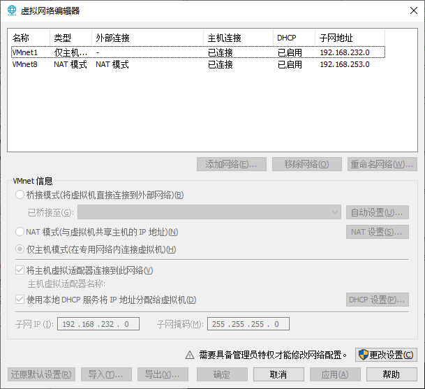
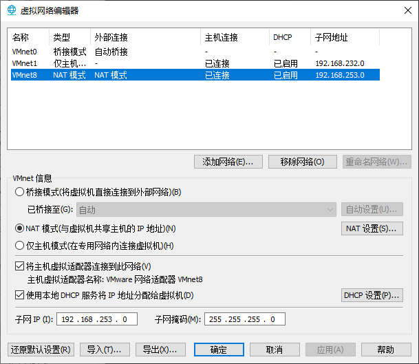
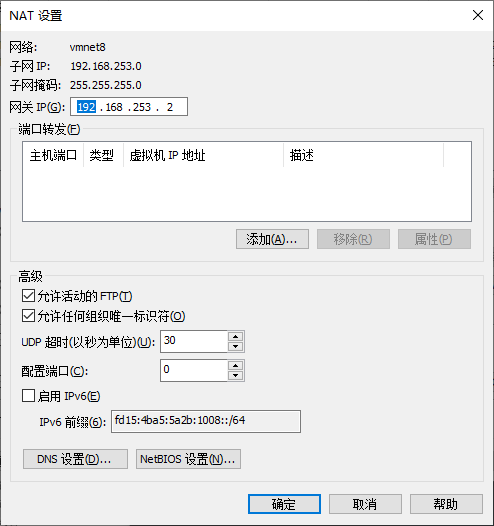

# 网络配置

---

## 查看网络信息

执行 `ifconfig` 意为 `network interface configure `

```crystal
[root@CentOS7-start01 ~]# ifconfig
ens33: flags=4163<UP,BROADCAST,RUNNING,MULTICAST>  mtu 1500
        inet 192.168.253.128  netmask 255.255.255.0  broadcast 192.168.253.255
        inet6 fe80::bded:ead1:8b6f:73ee  prefixlen 64  scopeid 0x20<link>
        ether 00:0c:29:7c:12:ab  txqueuelen 1000  (Ethernet)
        RX packets 191  bytes 46989 (45.8 KiB)
        RX errors 0  dropped 0  overruns 0  frame 0
        TX packets 164  bytes 18760 (18.3 KiB)
        TX errors 0  dropped 0 overruns 0  carrier 0  collisions 0

lo: flags=73<UP,LOOPBACK,RUNNING>  mtu 65536
        inet 127.0.0.1  netmask 255.0.0.0
        inet6 ::1  prefixlen 128  scopeid 0x10<host>
        loop  txqueuelen 1000  (Local Loopback)
        RX packets 48  bytes 4080 (3.9 KiB)
        RX errors 0  dropped 0  overruns 0  frame 0
        TX packets 48  bytes 4080 (3.9 KiB)
        TX errors 0  dropped 0 overruns 0  carrier 0  collisions 0

virbr0: flags=4099<UP,BROADCAST,MULTICAST>  mtu 1500
        inet 192.168.122.1  netmask 255.255.255.0  broadcast 192.168.122.255
        ether 52:54:00:83:33:a7  txqueuelen 1000  (Ethernet)
        RX packets 0  bytes 0 (0.0 B)
        RX errors 0  dropped 0  overruns 0  frame 0
        TX packets 0  bytes 0 (0.0 B)
        TX errors 0  dropped 0 overruns 0  carrier 0  collisions 0

```

- `ens33` 即是这台虚拟机与外部连接的 IP 。
- `lo` 是 **回环地址** ：127.0.0.1 。
- `virbr0` 是 Linux 自己创建的虚拟网络，可以套娃接入其他虚拟设备。
- 安装此 **虚拟机** 时，已指定了网络连接模式为 **NAT** 。

## VMware 三种网络连接模式

### 桥接模式

- 此模式下， **宿主机** 起到了 **网桥** 的作用， **虚拟机** 与 **宿主机** 是 **同级** 关系
- 所以 **虚拟机** 和 **外部网络** 可以 **互相访问** (这里的 **外部网络** 是指 **宿主机所在网络** 及其接入的互联网，下同)
- **缺点** ： **虚拟机** 需要占用 **局域网 IP** 。

### NAT模式

- 即 `Network address translation` 。

- 此模式下， **宿主机** 与 **虚拟机** 构建了一个 **专用网络** ，并通过 **虚拟网络地址转换(NAT)设备** 对IP进行转换。

- 这样 **虚拟机** 就可以通过共享 **宿主机** IP 而访问 **外部网络** ，但 **外部网络** 无法访问 **虚拟机** 。

- 这里 VMware 创建了 VMnet8 192.168.253.1 ，可以与 Linux 的 `ens33` 之间互相访问；然后通过 NAT 访问 **外部网络** 。

  

### 仅主机模式

- **虚拟机** 与 **宿主机** 共享一个 **专有网络**

- **外部网络** 无法访问 **虚拟机** ， **虚拟机** 也无法访问 **外部网络** ；绝对安全。

- 这里 VMware 默认 创建了 VMnet1 192.168.232.1 ，用于 **仅主机模式** 。

  

## 设置静态IP

### 为什么

- 由于虚拟机默认使用 `DHCP` 动态分配IP，所以每次启动时，虚拟机IP会变更，所以需要设置静态IP。

### 怎么做

#### 查看当前的网络配置

1. 依次点击 VMware 界面的 `编辑 -> 虚拟网络编辑器` 。

   

2. 点击右下角 `更改设置` ，并选中我们虚拟机目前使用的网络 `VMnet8` 。

   

3. 点击 `NAT设置` 

   

4. 由此我们可以得知，虚拟机目前处于 `192.168.253.0/24` 子网中，网关IP为 `192.168.253.2` 。

#### 更改虚拟机配置文件

1. 执行 `vim /etc/sysconfig/network-scripts/ifcfg-ens33` 编辑网络配置文件；默认配置如下：

   ```properties
   TYPE="Ethernet"
   PROXY_METHOD="none"
   BROWSER_ONLY="no"
   BOOTPROTO="dhcp"
   DEFROUTE="yes"
   IPV4_FAILURE_FATAL="no"
   IPV6INIT="yes"
   IPV6_AUTOCONF="yes"
   IPV6_DEFROUTE="yes"
   IPV6_FAILURE_FATAL="no"
   IPV6_ADDR_GEN_MODE="stable-privacy"
   NAME="ens33"
   UUID="dcd60a18-2b94-46dd-9660-5b3654fc891c"
   DEVICE="ens33"
   ONBOOT="yes"
   ```

2. 将 `BOOTPROTO="dhcp"` 修改为 `BOOTPROTO="static"` ，并在文件末尾添加如下配置：

   - `GATEWAY` 和 `DNS` 都使用上面查到的网关IP `192.168.253.2`
   - `IPADDR` 使用 `192.168.253.0/24` 网络中除了 `192.168.253.0` 、`192.168.253.255` 的任何值

   ```properties
   # IP地址
   IPADDR=192.168.253.100
   # 网关
   GATEWAY=192.168.253.2
   # 域名解析服务器
   DNS1=192.168.253.2
   ```

   - 这里没有配置 **子网掩码** ，是因为子网掩码默认为 `255.255.255.0` 。
   - 这里 `DNS1` 后面有个 1 ，是因为可以配置多个 DNS，如 DNS2 、DNS3

   **修改后文件如下：**

   ```properties
   TYPE="Ethernet"
   PROXY_METHOD="none"
   BROWSER_ONLY="no"
   BOOTPROTO="static"
   DEFROUTE="yes"
   IPV4_FAILURE_FATAL="no"
   IPV6INIT="yes"
   IPV6_AUTOCONF="yes"
   IPV6_DEFROUTE="yes"
   IPV6_FAILURE_FATAL="no"
   IPV6_ADDR_GEN_MODE="stable-privacy"
   NAME="ens33"
   UUID="dcd60a18-2b94-46dd-9660-5b3654fc891c"
   DEVICE="ens33"
   ONBOOT="yes"
   # IP地址
   IPADDR=192.168.253.100
   # 网关
   GATEWAY=192.168.253.2
   # 域名解析服务器
   DNS1=192.168.253.2
   ```

3. 执行 `service network restart` 重启网络。

   ```sh
   [root@CentOS7-start01 ~]# service network restart
   Restarting network (via systemctl):                        [  OK  ]
   ```

4. 可以在虚拟机执行 `ifconfig` 查看新的IP地址，并分别在宿主机和虚拟机上执行ping命令，看是否互通。

   - ping 宿主机所在的局域网IP，成功

     ```sh
     [root@CentOS7-start01 ~]# ping 192.168.1.111
     PING 192.168.1.111 (192.168.1.111) 56(84) bytes of data.
     64 bytes from 192.168.1.111: icmp_seq=1 ttl=128 time=0.754 ms
     64 bytes from 192.168.1.111: icmp_seq=2 ttl=128 time=0.482 ms
     64 bytes from 192.168.1.111: icmp_seq=3 ttl=128 time=0.511 ms
     ```

   - ping 外网，成功

     ```sh
     [root@CentOS7-start01 ~]# ping www.baidu.com
     PING www.a.shifen.com (182.61.200.7) 56(84) bytes of data.
     64 bytes from 182.61.200.7 (182.61.200.7): icmp_seq=1 ttl=128 time=51.7 ms
     64 bytes from 182.61.200.7 (182.61.200.7): icmp_seq=2 ttl=128 time=48.5 ms
     64 bytes from 182.61.200.7 (182.61.200.7): icmp_seq=3 ttl=128 time=48.9 ms
     ```

   - ping 宿主机在它与虚拟机所在的专有网络的IP，失败，半天没反应；这时需要将宿主机系统的防火墙关掉，才能正常访问。

     ```sh
     [root@CentOS7-start01 ~]# ping 192.168.253.1
     PING 192.168.253.1 (192.168.253.1) 56(84) bytes of data.
     ```

## 配置主机名

### 两种方式

#### 编辑 hostname 文件

1. 执行 `vim /etc/hostname` 编辑即可（执行命令后显示如下，只有一行）

   ```sh
   CentOS7-start01
   ```

2. 执行 `hostname` 命令查看并未修改成功，需要重启系统才能生效。

#### hostnamectl

1. 执行 `hostnamectl` 查看系统相关信息

   ```sh
   [root@CentOS7-start01 ~]# hostnamectl
      Static hostname: CentOS7-start01
            Icon name: computer-vm
              Chassis: vm
           Machine ID: xxxxxx
              Boot ID: xxxxxx
       Virtualization: vmware
     Operating System: CentOS Linux 7 (Core)
          CPE OS Name: cpe:/o:centos:centos:7
               Kernel: Linux 3.10.0-1160.el7.x86_64
         Architecture: x86-64
   ```

2. 执行 `hostnamectl set-hostname strat100 ` 可以修改 主机名

3. 再次执行 `hostnamectl` 可以发现 hostname 已经修改；查看 `/etc/hostname` 发现，文件也同步修改了。

## 修改hosts文件

- 在 **虚拟机** 执行 `vim /etc/hosts` ，可以添加相关联的主机名称与ip的映射关系：

  ```sh
  192.168.253.100 start100
  192.168.253.101 start101
  192.168.253.102 start102
  192.168.253.103 start103
  192.168.253.104 start104
  ```

- Windows 系统 hosts 文件在 `C:\Windows\System32\drivers\etc` 目录下，添加上面的配置即可。
- 这样就可以执行通过 `ping start100` 访问相应的主机。

---

**参考：**

1. 尚硅谷官方课程。