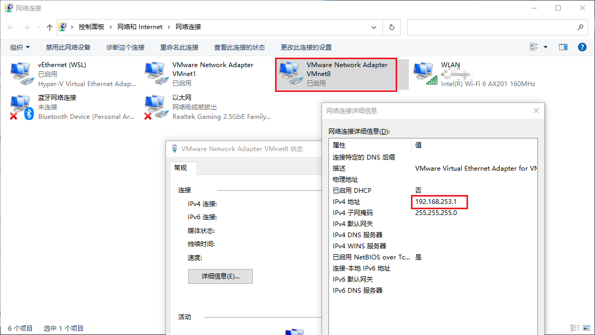
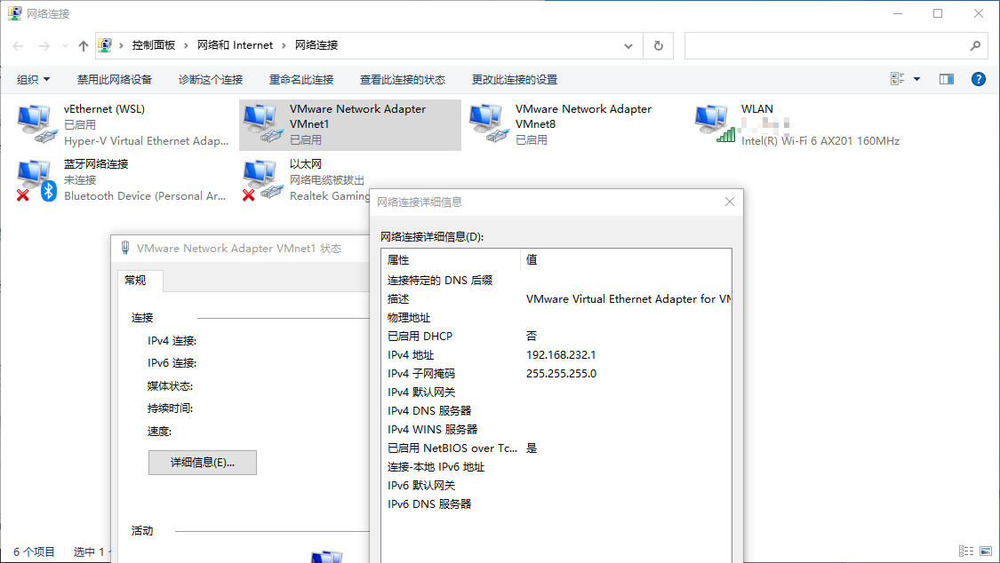

# 网络配置

---

## 查看网络信息

执行 `ifconfig` 意为 `network interface configure `

```crystal
[root@CentOS7-start01 ~]# ifconfig
ens33: flags=4163<UP,BROADCAST,RUNNING,MULTICAST>  mtu 1500
        inet 192.168.253.128  netmask 255.255.255.0  broadcast 192.168.253.255
        inet6 fe80::bded:ead1:8b6f:73ee  prefixlen 64  scopeid 0x20<link>
        ether 00:0c:29:7c:12:ab  txqueuelen 1000  (Ethernet)
        RX packets 191  bytes 46989 (45.8 KiB)
        RX errors 0  dropped 0  overruns 0  frame 0
        TX packets 164  bytes 18760 (18.3 KiB)
        TX errors 0  dropped 0 overruns 0  carrier 0  collisions 0

lo: flags=73<UP,LOOPBACK,RUNNING>  mtu 65536
        inet 127.0.0.1  netmask 255.0.0.0
        inet6 ::1  prefixlen 128  scopeid 0x10<host>
        loop  txqueuelen 1000  (Local Loopback)
        RX packets 48  bytes 4080 (3.9 KiB)
        RX errors 0  dropped 0  overruns 0  frame 0
        TX packets 48  bytes 4080 (3.9 KiB)
        TX errors 0  dropped 0 overruns 0  carrier 0  collisions 0

virbr0: flags=4099<UP,BROADCAST,MULTICAST>  mtu 1500
        inet 192.168.122.1  netmask 255.255.255.0  broadcast 192.168.122.255
        ether 52:54:00:83:33:a7  txqueuelen 1000  (Ethernet)
        RX packets 0  bytes 0 (0.0 B)
        RX errors 0  dropped 0  overruns 0  frame 0
        TX packets 0  bytes 0 (0.0 B)
        TX errors 0  dropped 0 overruns 0  carrier 0  collisions 0

```

- `ens33` 即是这台虚拟机与外部连接的 IP 。
- `lo` 是 **回环地址** ：127.0.0.1 。
- `virbr0` 是 Linux 自己创建的虚拟网络，可以套娃接入其他虚拟设备。
- 安装此 **虚拟机** 时，已指定了网络连接模式为 **NAT** 。

## VMware 三种网络连接模式

### 桥接模式

- 此模式下， **宿主机** 起到了 **网桥** 的作用， **虚拟机** 与 **宿主机** 是 **同级** 关系
- 所以 **虚拟机** 和 **外部网络** 可以 **互相访问** (这里的 **外部网络** 是指 **宿主机所在网络** 及其接入的互联网，下同)
- **缺点** ： **虚拟机** 需要占用 **局域网 IP** 。

### NAT模式

- 即 `Network address translation` 。

- 此模式下， **宿主机** 与 **虚拟机** 构建了一个 **专用网络** ，并通过 **虚拟网络地址转换(NAT)设备** 对IP进行转换。

- 这样 **虚拟机** 就可以通过共享 **宿主机** IP 而访问 **外部网络** ，但 **外部网络** 无法访问 **虚拟机** 。

- 这里 VMware 创建了 VMnet8 192.168.253.1 ，可以与 Linux 的 `ens33` 之间互相访问；然后通过 NAT 访问 **外部网络** 。

  

### 仅主机模式

- **虚拟机** 与 **宿主机** 共享一个 **专有网络**

- **外部网络** 无法访问 **虚拟机** ， **虚拟机** 也无法访问 **外部网络** ；绝对安全。

- 这里 VMware 默认 创建了 VMnet1 192.168.232.1 ，用于 **仅主机模式** 。

  

---

**参考：**

1. 尚硅谷官方课程。