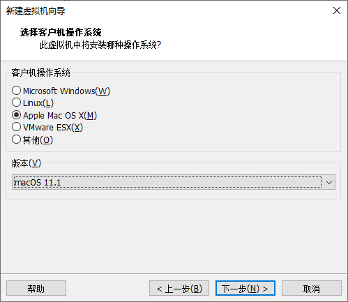

安装MacOS

---

参考：

1. VM安装MacOS教程：https://blog.csdn.net/Simon_477/article/details/110252233
2. 

## 安装包准备

1. 

## 解锁VMware

**参考：**

1.  Auto-Unlocker使用教程：https://www.beiwangshan.com/1033.html
2.  Auto-Unlocker下载地址：https://github.com/paolo-projects/auto-unlocker/releases/

- 因为 `VMware` 默认是不支持 `MacOS` 的，所以我们需要解锁，让其支持我们安装 `MacOS` 。

- 打开 `VMware` --> 文件 --> 新建虚拟机 --> 选择“典型” --> 下一步 --> 选择“稍后安装操作系统” --> 下一步。这里可以看到目前支持安装的系统。

  

- 从 github 上下载 Auto-Unlocker ，解压后，双击 `Unlocker.exe` ，程序自动识别 VMware 安装位置，我们点击 Patch 按钮即可，等待其执行完成。

  

- 再按上述步骤 **新建虚拟机** 时，发现已经新增了 `MacOS` 。

  

## 新建虚拟机

参考：

1. Apple镜像文件下载地址：https://www.beiwangshan.com/1032.html
2. Apple镜像文件下载地址：https://www.beiwangshan.com/1347.html

- 打开 `VMware` --> 文件 --> 新建虚拟机 --> 选择“典型” --> 下一步 --> 指定iso文件位置（此时有如下警告出现） --> 下一步。

  

- 选择 Apple Mac OS 11.1 版本（这里最高只用 `11.1` ）--> 下一步。

  

- 选择安装位置 --> 下一步。

  

- 默认 --> 下一步。

  

- 默认 --> 完成。

  

- 编辑 `E:\vms\macos\macOS 11.2.3.vmx` ，在最后一行加上 `smc.version = 0` ，保存。

## 安装 MacOS

- 开启刚创建的虚拟机。

- 选择语言。

  

- 选择 `磁盘工具` --> 点击 `继续` 。

  

- 选择 `VMware Virtual SATA Hard Drive Media` ，点击 `抹掉` 。 

  

- 随便起个名字，点击 `抹掉` ，这里不要选 `APFS` ，选 `Mac OS 扩展（日志式）` 。

  

- 点击 `完成` 。

  

- 点击 `分区` 。

  

- 点击 `+`  ，点击 `添加分区` 。

  

- 为新建的分支命名（这样就有两个分区了：software 和 MacOS），然后点击 `应用` ，点击 `分区` ，点击 `完成` 。

  

- 点击 `退出磁盘工具` 。

  

- 选择 `安装 macOS Big Sur` ，点击 `继续` 。

  

- 点击 `继续` --> 点击 `同意` --> 点击 `同意` 。

- 选择一个分区安装 MacOS，点击 `继续` 。

  

- 等待其安装完成（要等好久）。

  

- 安装完成后会重启系统进行一些必要设置，我们无脑下一步即可（期间有提示我们无法连接网络，我们点 `继续` ，之后再处理）。

## 配置虚拟机

- 关闭已打开的 MacOS 虚拟机。

- 修改 `网络适配器` 为 `桥接模式` 。

  

- 选择 `使用物理驱动器` 以使用 `VMware Tools` 。

  

- 虚拟机开机状态，右击侧边栏列表中的虚拟机，可以点击 `安装 VMware Tools` 。