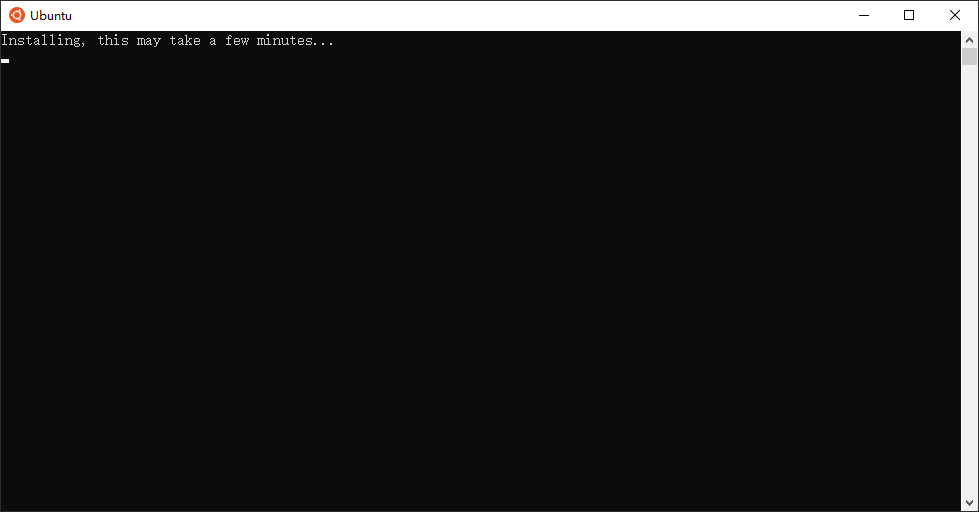
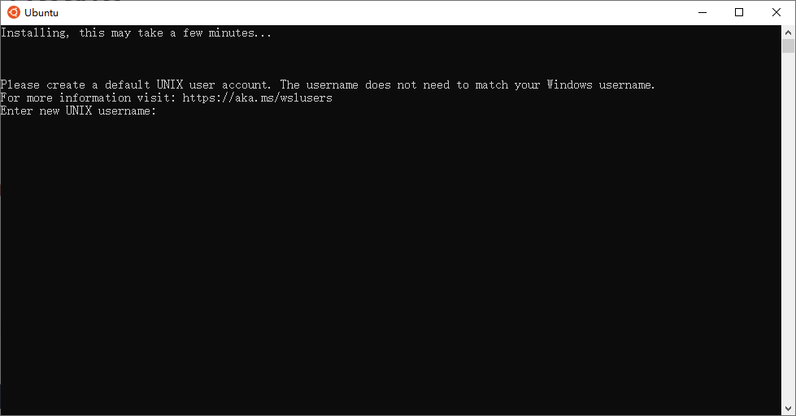
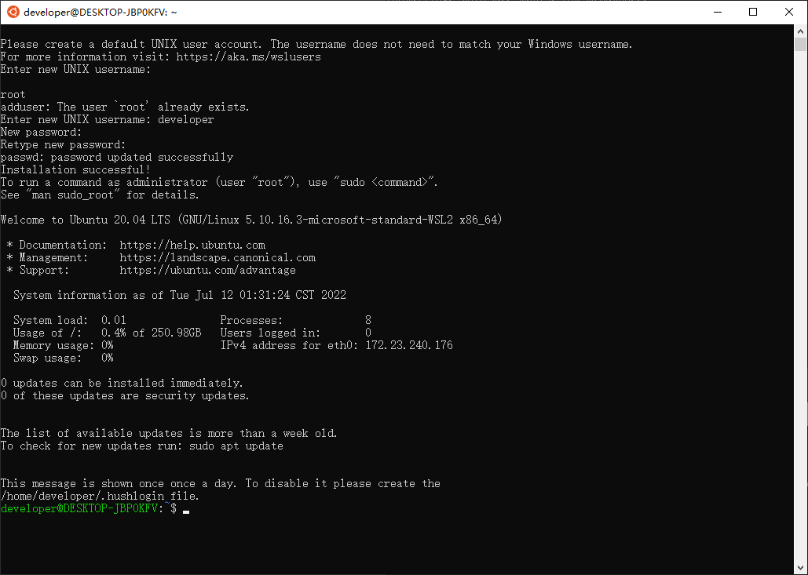

# WSL

---

## Concept

- WSL，即 Windows Subsystem for Linux。
- WSL可以让我们使用如：Bash 、Grep 等 Linux 工具。

## Install WSL

参考：https://docs.microsoft.com/en-us/windows/wsl/install

1. 以管理员身份打开 PowerShell ，执行 `wsl --install` 。

2. 重启系统。

3. 系统重启后，会出现一个窗口，等待安装完成。

   

4. 创建一个非 `root` 用户。

   

   

## Access WSL

- 执行 `powershell -c bash ~` 可进入 WSL。
- 执行 `exit` 可退出 WSL 。

---

**参考：**

1. 微软官方文档：https://docs.microsoft.com/en-us/windows/wsl/